# 木马生成器改造（一）

### 前置阅读

[如何实现一款 shellcodeLoader](https://paper.seebug.org/1413/)

Shellcode加载器免杀调试

### 特征查找

首先使用前篇文章提到的syscall方式写入内存来加载shellcode（确定至少在申请内存、写入shellcode和执行相应内存块过程中不会触发火绒、360、df的动态查杀）

根据作者的工程参数设置cpp生成相应的DAT模板文件。加入文件头，设置输出目录，输出文件格式

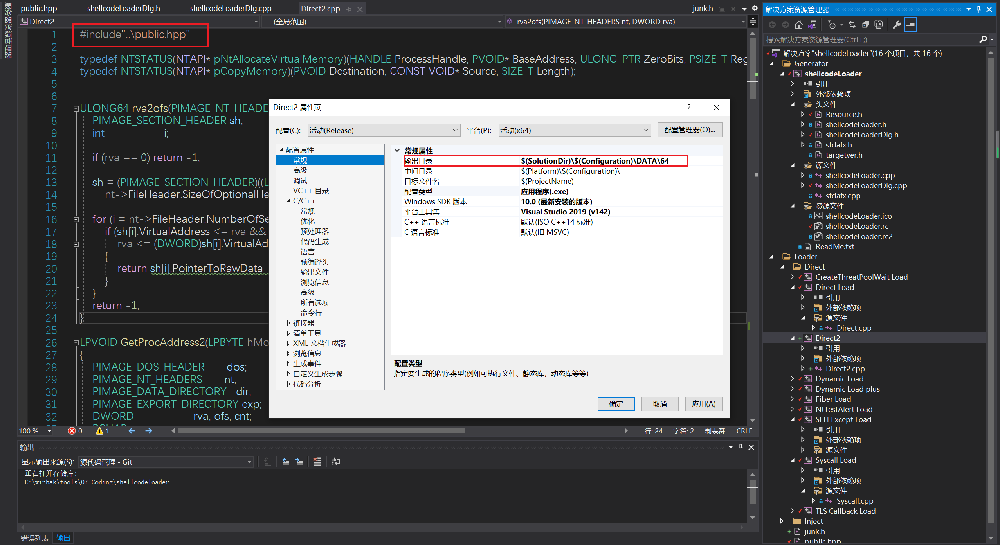

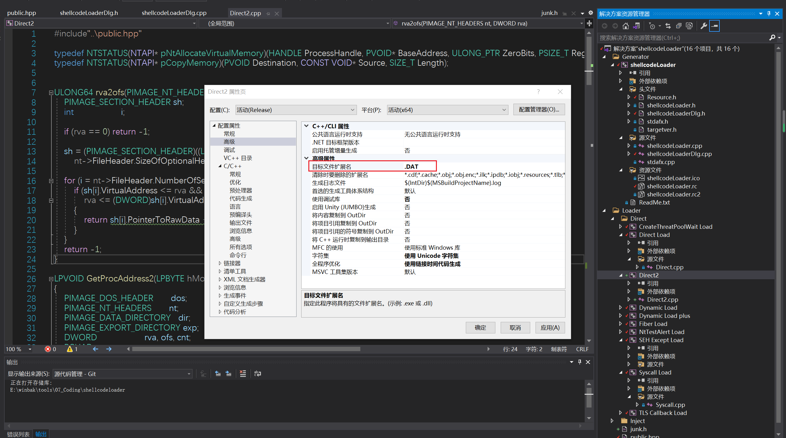

发现360静态查杀HEUR/QVM202.0.6240.Malware.Gen，这个只能说明是Microsoft Visual Studio或者VC编译的木马，实际告警没什么有用信息。

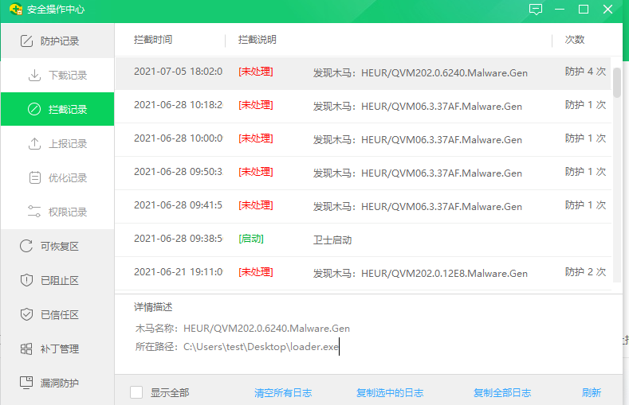

发现火绒静态查杀：VirTool/W64.Obfuscator.af

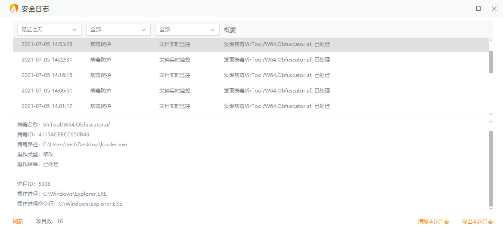

Obfus即为混淆部分被识别为特征，查看工程发现在生成exe时使用的128bit随机密钥进行异或，运行时从exe内部资源文件中读取config结构中的key变量来解密。

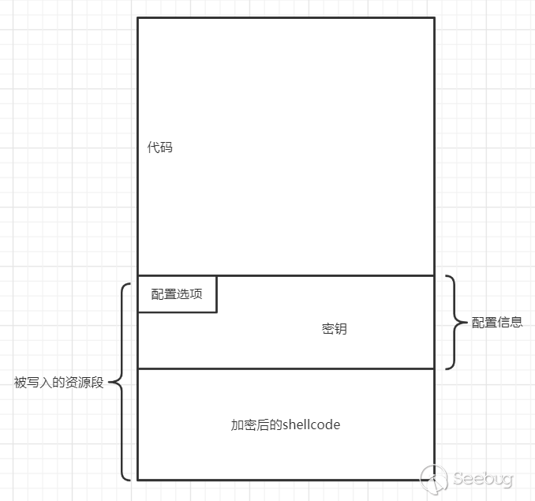

此处shellcodeLoaderDlg.cpp中的StreamCrypt为生成exe时的加密环节（即Shellcode存储），相关声明放在shellcodeLoaderDlg.h头文件

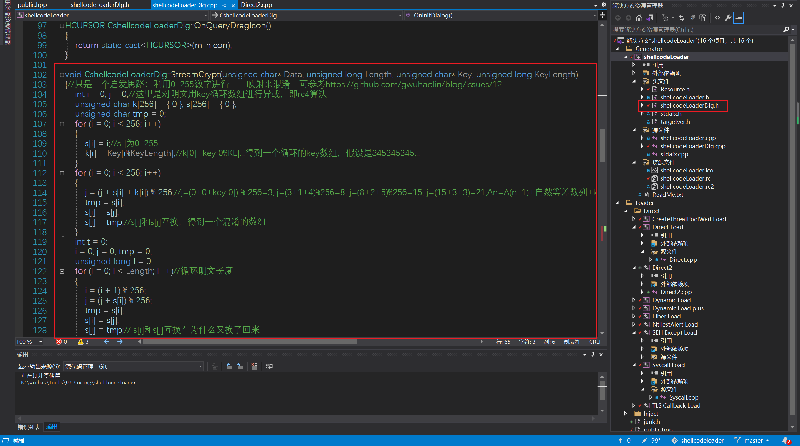

DAT（即内存加载模板）编译时依赖的public.hpp头文件中定义了解密函数StreamCrypt，由于是采用异或混淆，从而加密和解密函数不需要分开编写、

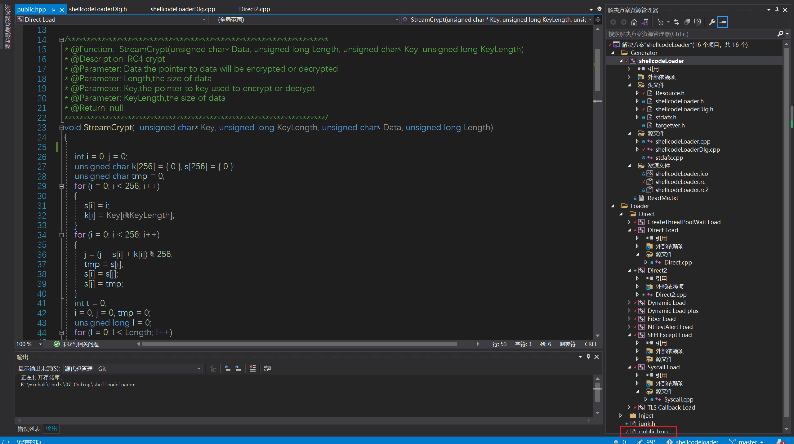

### 对加密解密函数动个小手术（加花）

利用网上一个师傅给出的花指令头文件代码进行加花

[纯手工混淆C/C++代码（下）](https://zhuanlan.zhihu.com/p/39020918)

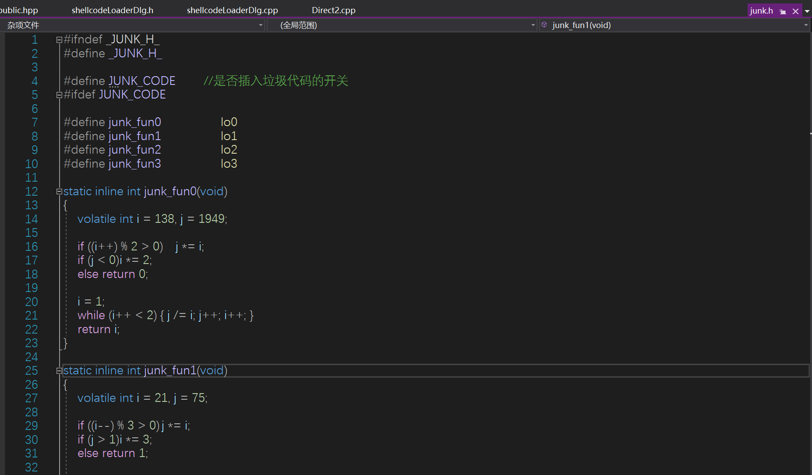

不知道是不是加的方式不对，总之还是不行

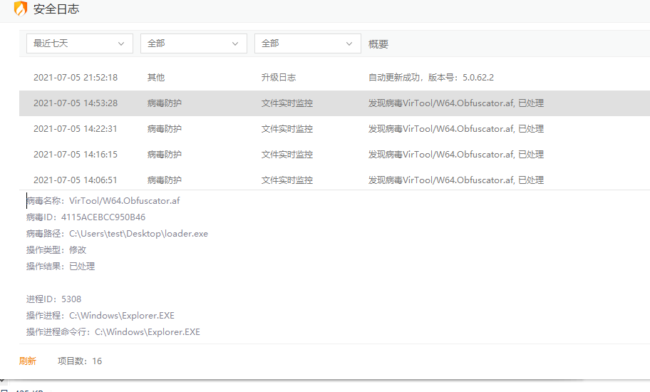

### 自实现加密解密函数

看来只能自己编写加密解密函数了。好在作者结构设计明细，整体程序结构小巧灵活。

加密思路是获得一个随机值tmpfirst，存入config中；根据Shellcode获取第一个字节保存在config.first中；对Shellcode进行异或后，替换第一个字节为tmpfirst（即解密异或回来第一字节是00）。

解密思路是程序运行时Shellcode异或config.tmpfirst，并通过config.first写入Shellcode的内存空间中，获得完整的shellcode。

---

先从生成器部分入手，对shellcodeLoaderDlg.h中增加新声明的加密函数，对config结构进行修改。

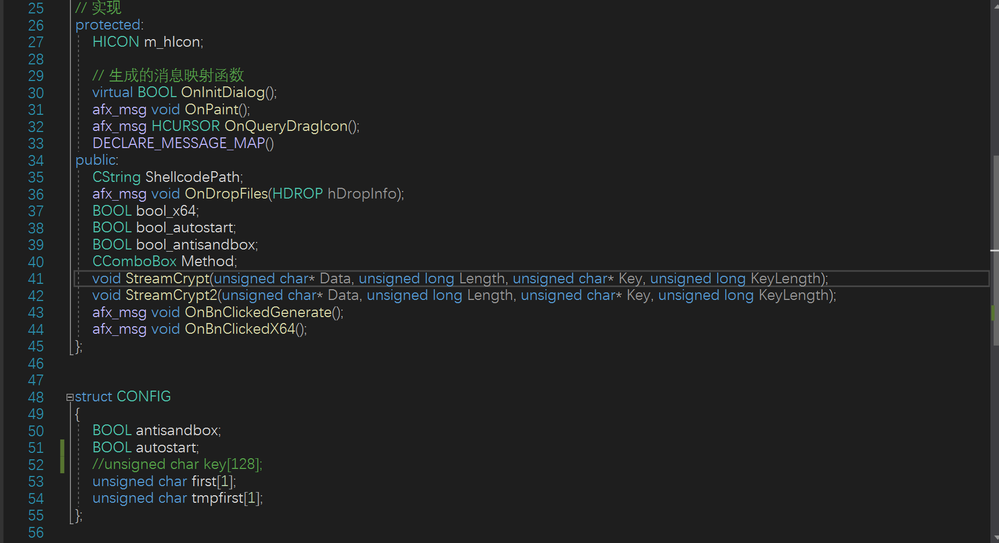

shellcodeLoaderDlg.cpp中实现新的加密函数（简单的异或）。

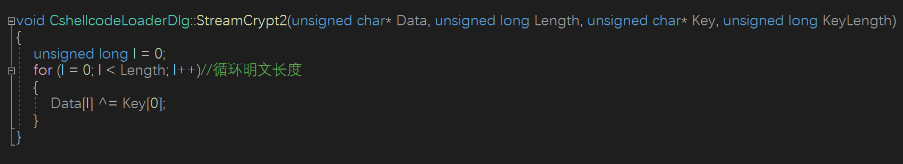

shellcodeLoaderDlg.cpp中修改加密流程

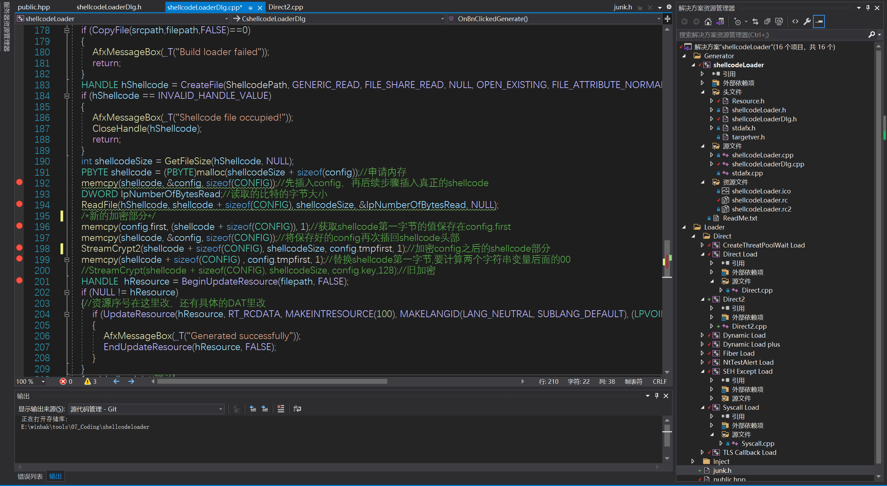

修改调试参数，下断点。先启动程序，再点击调试。

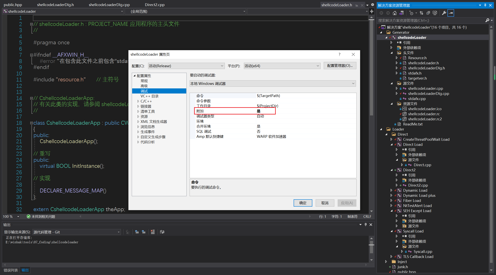

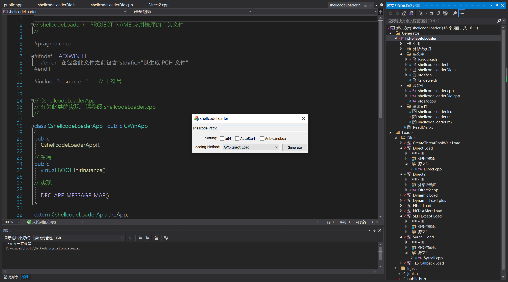

---

紧接着修改解密部分public.hpp的config结构声明，解密函数定义

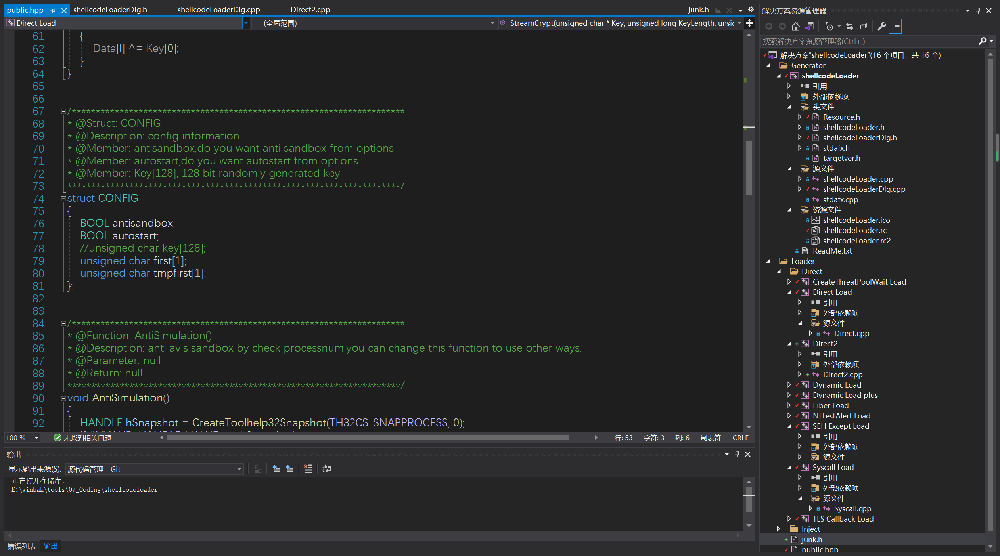

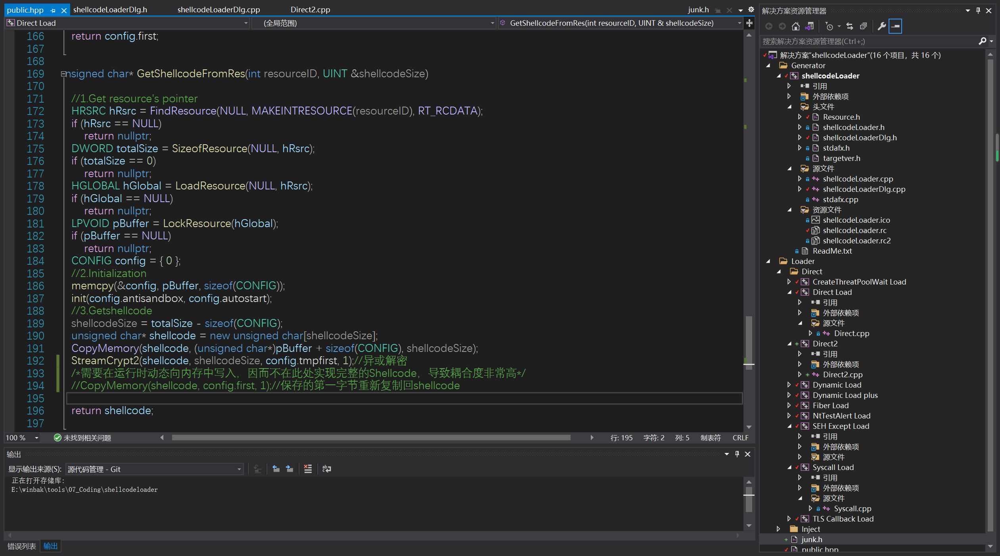

最后生成DAT时的cpp模板也需要修改

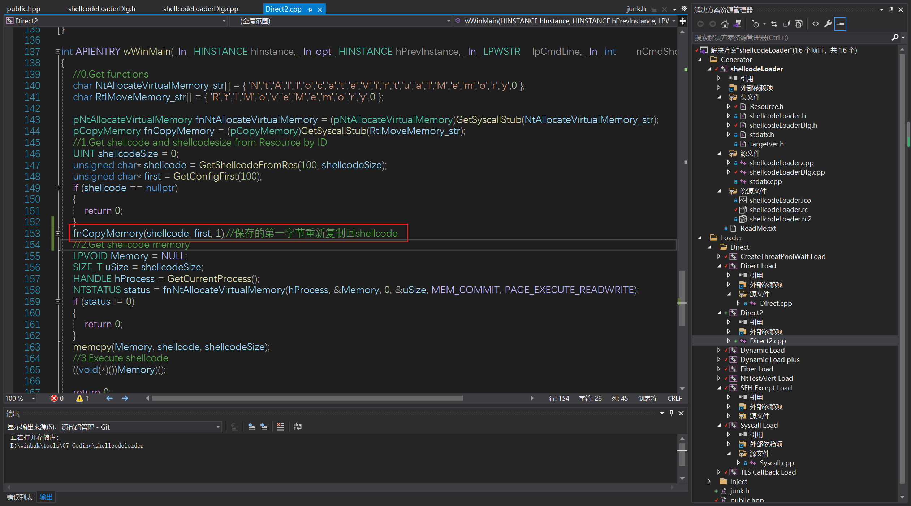

### 大功告成

静态动态均免杀360、火绒。df动态免杀，静态不免，想要全免把加密函数弄复杂些或者传入HEX即可。（我们下期再会）

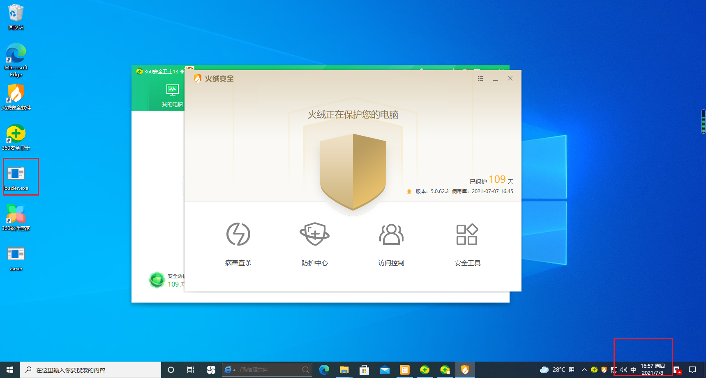

