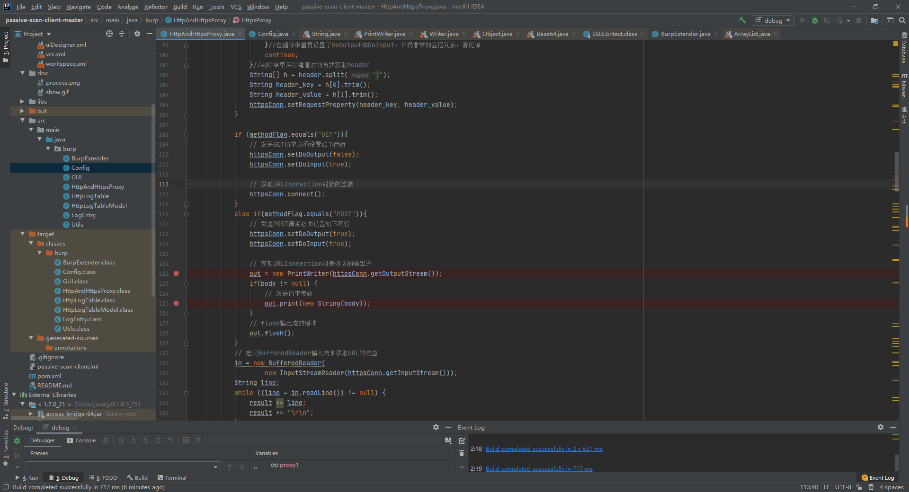

# burp插件——记一次修复Bug之旅

## 配置调试参数

burp插件的话，由于依赖Burp运行，所以需要调成远程调试模式。配置如下：

设为jdk5-8，输入`-agentlib:jdwp=transport=dt_socket,server=y,suspend=n,address=5005`

启动要注意，因为高版本的burp需要用jdk13以上，所以调试会出bug，因此要用低版本burp进行测试。

`java -Xbootclasspath/p:burp-loader-keygen-jas502n.jar -agentlib:jdwp=transport=dt_socket,server=y,suspend=n,address=5005  -jar burpsuite_pro_v2.0.11beta.jar`

## 修复Bug

Passive Scan Client这个插件原本v0.2版本是有Bug的，因为红框处配置了setDoOutput(true);当POST的时候需要配置为true，而GET时必须配置为false；此处配置导致GET包都被当作POST包发送而对扫描器产生错误。

详见参考https://blog.csdn.net/sbc1232123321/article/details/79334130

因此我们需要在这里添加一个逻辑来判断是否需要开关setDoOutput，然后进行设置就好了。

## 调试环节

在这里进行调试测试，发现post包又不行了。

往下翻可以看到在原逻辑上直接加判断，在判断内进行设置setDoOutput开关会导致报错。原因是httpsConn.setRequestProperty是在原逻辑判断的语句下面才执行的；而这个方法的正确调用方式是，必须先执行httpsConn.setRequestProperty后才能设置setDoOutput。

因此，我们在设置属性时先进行一个flag的设置，在设置属性结束后，也就是httpsConn.setRequestProperty执行完后，再加一个判断来设置就好了。

再次打断点调试

可以看到，已经解决了。

## 再起波澜

有一天，我看到一个开发者提了个pr，才发现我只在HttpsProxy方法里做的判断修复bug，而HttpProxy没有。chen1sheng提到的情况反了，但不影响我真的粗心大意。继续在HttpProxy方法对应的地方修复代码，加入的逻辑同上。

另外在chen1sheng提交的另一个pr里，解决了另一个bug。也就是设置属性时的异常截断问题。

在代码里加一个空格就解决了。

