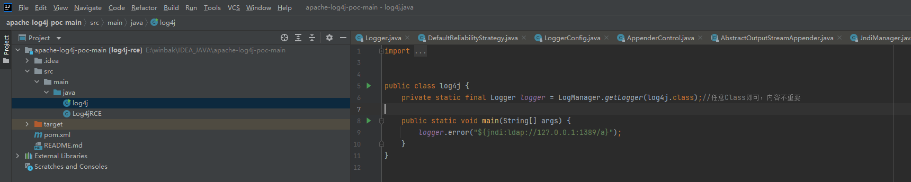
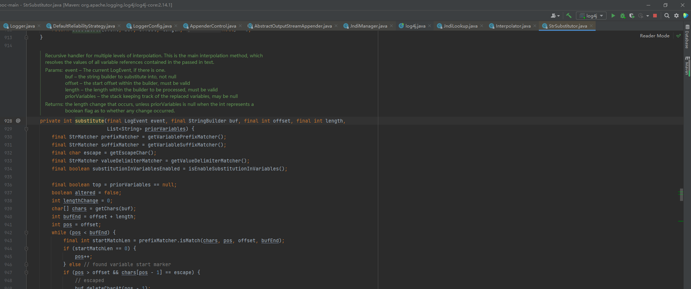
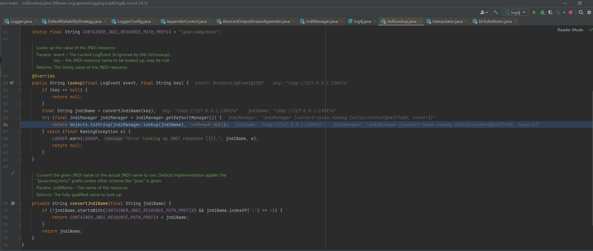
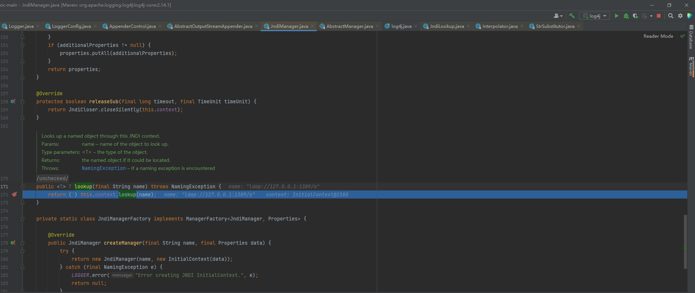

# log4j漏洞分析

### 漏洞POC

### 漏洞断点

在org\apache\logging\log4j\log4j-core\2.14.1\log4j-core-2.14.1.jar!\org\apache\logging\log4j\core\net\JndiManager.class处下断点

处理字符串

org.apache.logging.log4j.core.lookup.JndiLookup#lookup用于获取字符串形式的JNDI资源，

进一步会调用org.apache.logging.log4j.core.net.JndiManager#getDefaultManager()获取JndiManager实例，

JndiManager实例调用自己的方法org.apache.logging.log4j.core.net.JndiManager#lookup

org.apache.logging.log4j.core.net.JndiManager#lookup

实际上是去调用javax.naming.Context#lookup(java.lang.String)

最终指向JDNI服务器获取资源

