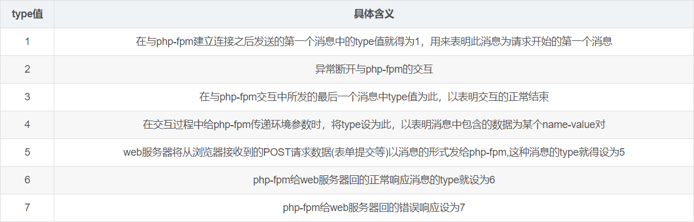

# 浅谈Apache/Nginx 与 PHP-CGI 之间的关系

---

## 前言

本文主要援引以下两篇文章，用以进一步解释 LFI + pearcmd 在漏洞利用过程中的执行细节，用于对旧文《tp6多语言模块RCE漏洞利用分析》的补充。

[Fastcgi协议分析 && PHP-FPM未授权访问漏洞 && Exp编写](https://www.leavesongs.com/PENETRATION/fastcgi-and-php-fpm.html)

[浅谈PHP-FPM安全](http://www.mi1k7ea.com/2019/08/25/%E6%B5%85%E8%B0%88PHP-FPM%E5%AE%89%E5%85%A8)

这两篇文章中谈到了Apache/Nginx与PHP-CGI之间具体传递的协议和数据内容。

---

## 执行细节分析

我们以phpstudy的环境为例，详细讲一下LFI+pearcmd执行时的具体细节：

通常情况下环境为 apche + php x.x.x nts ，这里的nts指的是使用fastcgi模式。

[**Mi1k7ea**](http://www.mi1k7ea.com/)师傅已经在博客中详细引用和解释了fastcgi传递的东西，这里不再解释。

> 下面我们看下FastCGI协议的record结构是怎样的，这里的直接引用自P牛博客的内容：
>
> > 和HTTP头不同，record的头固定8个字节，body是由头中的contentLength指定，其结构如下：
> >
> > ```
> > > typedef struct {
> > >   /* Header */
> > >   unsigned char version; // 版本
> > >   unsigned char type; // 本次record的类型
> > >   unsigned char requestIdB1; // 本次record对应的请求id
> > >   unsigned char requestIdB0;
> > >   unsigned char contentLengthB1; // body体的大小
> > >   unsigned char contentLengthB0;
> > >   unsigned char paddingLength; // 额外块大小
> > >   unsigned char reserved; 
> > > 
> > >   /* Body */
> > >   unsigned char contentData[contentLength];
> > >   unsigned char paddingData[paddingLength];
> > > } FCGI_Record;
> > >
> > ```
>
> > 头由8个uchar类型的变量组成，每个变量1字节。其中，`requestId`占两个字节，一个唯一的标志id，以避免多个请求之间的影响；`contentLength`占两个字节，表示body的大小。
> >
> > 语言端解析了fastcgi头以后，拿到`contentLength`，然后再在TCP流里读取大小等于`contentLength`的数据，这就是body体。
> >
> > Body后面还有一段额外的数据（Padding），其长度由头中的paddingLength指定，起保留作用。不需要该Padding的时候，将其长度设置为0即可。
> >
> > 可见，一个fastcgi record结构最大支持的body大小是`2^16`，也就是65536字节。
>
> **type**
>
> > type就是指定该record的作用。因为FastCGI一个record的大小是有限的，作用也是单一的，所以我们需要在一个TCP流里传输多个record。通过type来标志每个record的作用，用requestId作为同一次请求的id。
> >
> > 也就是说，每次请求，会有多个record，他们的requestId是相同的。
>
> 主要的几种type类型如下图：
>
> 
>
> 服务器中间件和PHP-FPM通信的第一个数据包是type为1的record，而后续通信的type为4、5、6、7的record，结束时发送type为2、3的record。
>
> 这里我们重点关注type为4的record，因为后面的漏洞利用涉及到这块。
>
> > 当后端语言接收到一个`type`为4的record后，就会把这个record的body按照对应的结构解析成key-value对，这就是环境变量。环境变量的结构如下：
> >
> > ```
> > > typedef struct {
> > >   unsigned char nameLengthB0;  /* nameLengthB0  >> 7 == 0 */
> > >   unsigned char valueLengthB0; /* valueLengthB0 >> 7 == 0 */
> > >   unsigned char nameData[nameLength];
> > >   unsigned char valueData[valueLength];
> > > } FCGI_NameValuePair11;
> > > 
> > > typedef struct {
> > >   unsigned char nameLengthB0;  /* nameLengthB0  >> 7 == 0 */
> > >   unsigned char valueLengthB3; /* valueLengthB3 >> 7 == 1 */
> > >   unsigned char valueLengthB2;
> > >   unsigned char valueLengthB1;
> > >   unsigned char valueLengthB0;
> > >   unsigned char nameData[nameLength];
> > >   unsigned char valueData[valueLength
> > >           ((B3 & 0x7f) << 24) + (B2 << 16) + (B1 << 8) + B0];
> > > } FCGI_NameValuePair14;
> > > 
> > > typedef struct {
> > >   unsigned char nameLengthB3;  /* nameLengthB3  >> 7 == 1 */
> > >   unsigned char nameLengthB2;
> > >   unsigned char nameLengthB1;
> > >   unsigned char nameLengthB0;
> > >   unsigned char valueLengthB0; /* valueLengthB0 >> 7 == 0 */
> > >   unsigned char nameData[nameLength
> > >           ((B3 & 0x7f) << 24) + (B2 << 16) + (B1 << 8) + B0];
> > >   unsigned char valueData[valueLength];
> > > } FCGI_NameValuePair41;
> > > 
> > > typedef struct {
> > >   unsigned char nameLengthB3;  /* nameLengthB3  >> 7 == 1 */
> > >   unsigned char nameLengthB2;
> > >   unsigned char nameLengthB1;
> > >   unsigned char nameLengthB0;
> > >   unsigned char valueLengthB3; /* valueLengthB3 >> 7 == 1 */
> > >   unsigned char valueLengthB2;
> > >   unsigned char valueLengthB1;
> > >   unsigned char valueLengthB0;
> > >   unsigned char nameData[nameLength
> > >           ((B3 & 0x7f) << 24) + (B2 << 16) + (B1 << 8) + B0];
> > >   unsigned char valueData[valueLength
> > >           ((B3 & 0x7f) << 24) + (B2 << 16) + (B1 << 8) + B0];
> > > } FCGI_NameValuePair44;
> > >
> > ```
>
> > 这其实是4个结构，至于用哪个结构，有如下规则：
> >
> > 1. key、value均小于128字节，用`FCGI_NameValuePair11`
> > 2. key大于128字节，value小于128字节，用`FCGI_NameValuePair41`
> > 3. key小于128字节，value大于128字节，用`FCGI_NameValuePair14`
> > 4. key、value均大于128字节，用`FCGI_NameValuePair44`
>
> 举个例子，用户访问`http://127.0.0.1/index.php?a=1&b=2`，如果web目录是`/var/www/html`，那么Nginx会将这个请求变成如下key-value对，即此时FastCGI协议包record的type为4：
>
> ```
> {
>     'GATEWAY_INTERFACE': 'FastCGI/1.0',
>     'REQUEST_METHOD': 'GET',
>     'SCRIPT_FILENAME': '/var/www/html/index.php',
>     'SCRIPT_NAME': '/index.php',
>     'QUERY_STRING': '?a=1&b=2',
>     'REQUEST_URI': '/index.php?a=1&b=2',
>     'DOCUMENT_ROOT': '/var/www/html',
>     'SERVER_SOFTWARE': 'php/fcgiclient',
>     'REMOTE_ADDR': '127.0.0.1',
>     'REMOTE_PORT': '12345',
>     'SERVER_ADDR': '127.0.0.1',
>     'SERVER_PORT': '80',
>     'SERVER_NAME': "localhost",
>     'SERVER_PROTOCOL': 'HTTP/1.1'
> }
> ```
>
> > 这个数组其实就是PHP中`$_SERVER`数组的一部分，也就是PHP里的环境变量。但环境变量的作用不仅是填充`$_SERVER`数组，也是告诉fpm：“我要执行哪个PHP文件”。
> >
> > PHP-FPM拿到fastcgi的数据包后，进行解析，得到上述这些环境变量。然后，执行`SCRIPT_FILENAME`的值指向的PHP文件，也就是`/var/www/html/index.php`。
>
> 有个注意点，就是PHP 5.3.9之后加入了FPM增加了security.limit_extensions选项，这个选项默认只解析.php文件。

我们在LFI+pearcmd的案例`http://127.0.0.1/public/index.php?lang=../../../../../../../../usr/local/lib/php/pearcmd&+config-create+/<?=phpinfo()?>+/tmp/hello.php`中：

Apache向PHP-CGI传递的内容应该如下（Nginx和Apache传递的内容是一样的，因为必须要符合FastCGI/1.0的接口通讯规定）

```
{
    'GATEWAY_INTERFACE': 'FastCGI/1.0',
    'REQUEST_METHOD': 'GET',
    'SCRIPT_FILENAME': 'D:/phpstudy_pro/WWW/thinkphp_5.0.10_full/public/index.php',
    'SCRIPT_NAME': '/index.php',
    'QUERY_STRING': '?lang=../../../../../../../../usr/local/lib/php/pearcmd&+config-create+/<?=phpinfo()?>+/tmp/hello.php',
    'REQUEST_URI': '/index.php?lang=../../../../../../../../usr/local/lib/php/pearcmd&+config-create+/<?=phpinfo()?>+/tmp/hello.php',
    'DOCUMENT_ROOT': 'D:/phpstudy_pro/WWW/thinkphp_5.0.10_full',
    'SERVER_SOFTWARE': 'php/fcgiclient',
    'REMOTE_ADDR': '127.0.0.1',
    'REMOTE_PORT': '12345',
    'SERVER_ADDR': '127.0.0.1',
    'SERVER_PORT': '80',
    'SERVER_NAME': "localhost",
    'SERVER_PROTOCOL': 'HTTP/1.1'
}
```

这些键值对会被传递到Fast-CGI中，Fast-CGI的子进程PHP-CGI把这些`键值对数组`以`$_SERVER`的环境变量形式以及对应的PHP文件，再传递给启动的PHP解释器。

这里PHP解释器会先解释`index.php`，要解释`index.php`还得加载thinkphp框架，thinkphp框架会从`$_SERVER`中的`QUERY_STRING`获取多语言变量`lang`从而触发LFI漏洞，更进一步的调用`pearcmd.php`。

作一个不太严谨的简单解释，可以类比函数调用：`index.php` → `thinkphp` → `pearcmd.php`

在这个过程中，也就是PHP解释器的进程上下文中，PHP脚本始终可以从`$_SERVER`中的获取需要的环境变量。也就是说 `pearcmd.php`依然通过`$_SERVER`中的`QUERY_STRING`获取被视为命令行参数的输入。具体代码如下：

> pear中获取命令行argv的函数：
>
> ```
> public static function readPHPArgv()
> {
>     global $argv;
>     if (!is_array($argv)) {
>         if (!@is_array($_SERVER['argv'])) {
>             if (!@is_array($GLOBALS['HTTP_SERVER_VARS']['argv'])) {
>                 $msg = "Could not read cmd args (register_argc_argv=Off?)";
>                 return PEAR::raiseError("Console_Getopt: " . $msg);
>             }
>             return $GLOBALS['HTTP_SERVER_VARS']['argv'];
>         }
>         return $_SERVER['argv'];
>     }
>     return $argv;
> }
> ```
>
> 先尝试`$argv`，如果不存在再尝试`$_SERVER['argv']`，后者我们可通过query-string控制。也就是说，我们通过Web访问了pear命令行的功能，且能够控制命令行的参数。

当 `pearcmd.php`的`config-create`被执行完成后，逐级返回： `pearcmd.php` → `thinkphp` → `index.php` 

到这一步对`index.php`的请求才处理完成，PHP-CGI进程把结果通过Fast-CGI协议响应给Apache，Apache以http形式响应用户浏览器。至此一次请求才算结束（不算超时的情况）。