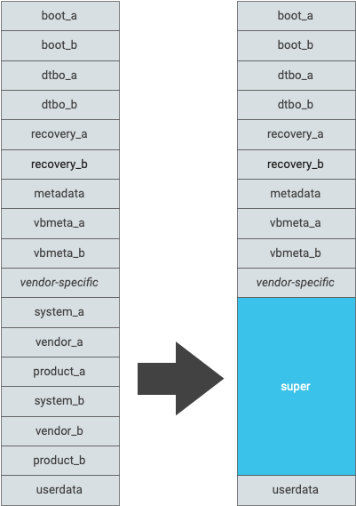

# Android 10分区的一些知识

## 安卓的各个分区详解

安卓各个分区

- **boot**：包含通过 `mkbootimg` 组合在一起的kernel镜像和 ramdisk。使能system-as-root后，该分区仅存放kernel镜像。
- **system**：主要包含 Android 框架。使能system-as-root后，该分区会包含原始 system.img 和 ramdisk.img 的合并内容。
- **recovery**：用于存储在 OTA 升级时使用的recovery系统。如果设备支持A/B更新，OTA升级可以通过ramdisk执行，该分区可以不需要。
- **cache**：用于存储临时数据，OTA升级包也会下载到这个分区。如果设备使用 A/B 更新，则可以不要此分区。
- **misc**：分区供recovery使用，存储空间不能小于 4KB。
- **userdata**：存储用户安装的应用和数据。
- **metadata**：如果设备被加密，则需要使用该分区，分区的存储空间不能小于 16MB。
- **vendor**：包含所有不可分发给 Android 开源项目 (AOSP) 的二进制文件。如果没有专有信息，可以不要该分区。
- **radio**：包含无线装置映像。只有包含无线装置的设备才需要此分区。
- **tos**：用于存储 Trusty 操作系统的二进制映像文件，仅在设备包含 Trusty 时使用。
- **product**：用于存放产品专用的配置和应用，以便OEM定制自己的系统。Android 9 及更高版本支持该分区。product分区是对system分区的扩展，必须同时升级这两个分区。
- **odm**：用于ODM自定义自己的板级支持包。Android 10 开始支持该分区。odm分区是对vendor分区的扩展，必须同时升级这两个分区。

## 在新设备上实现的动态分区

#### 分区更改

对于搭载 Android 10 的设备，请创建名为 `super` 的分区。`super` 分区在内部处理 A/B 槽位，因此 A/B 设备不需要单独的 `super_a` 和 `super_b` 分区。引导加载程序未使用的所有只读 AOSP 分区都必须是动态的，并且必须从 GUID 分区表 (GPT) 中移除。供应商专用分区则可以不是动态的，并且可以放在 GPT 中。

支持的动态分区包括：system、vendor、product、system、odm。下图显示转换为动态分区前后变化，

