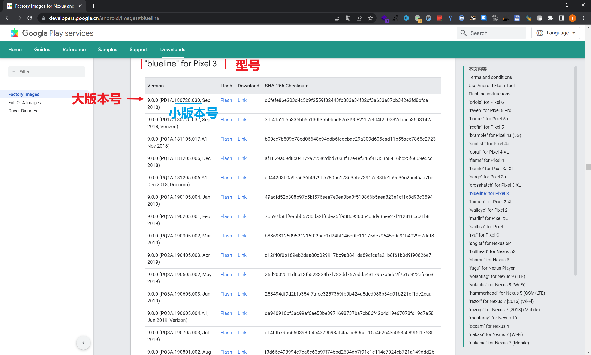
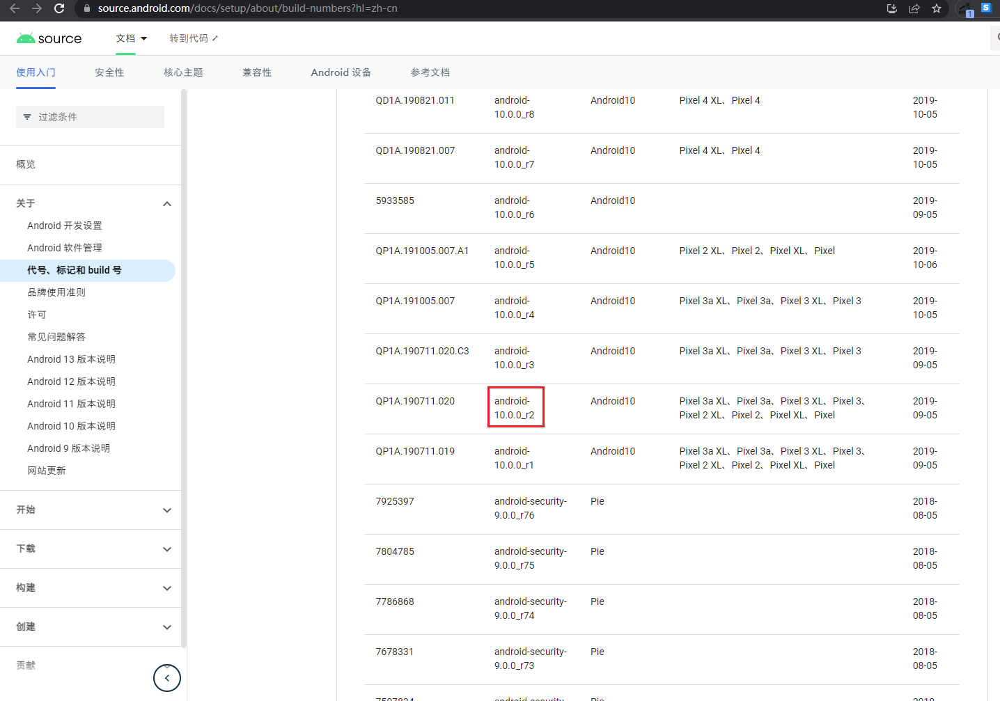
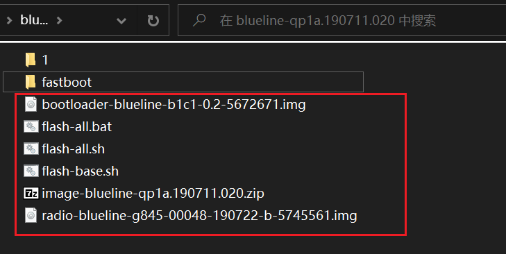
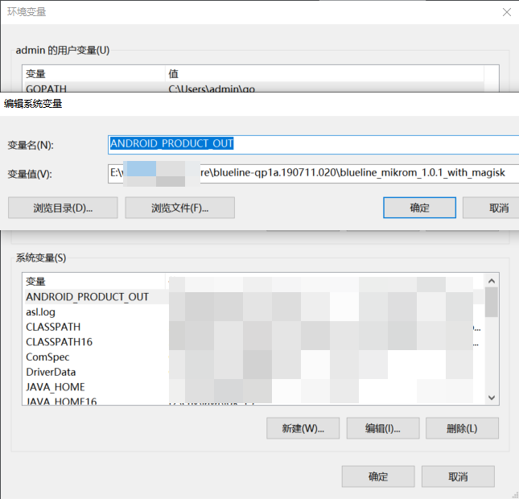
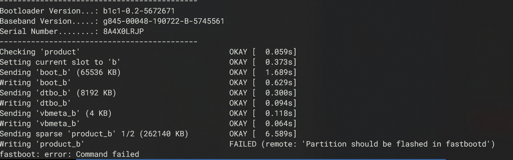
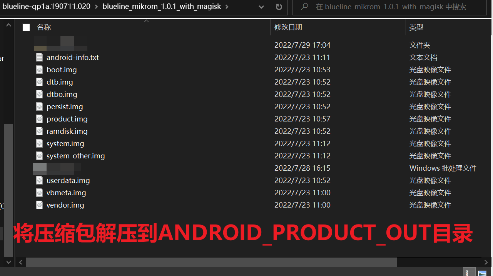
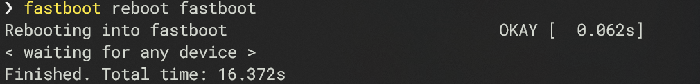
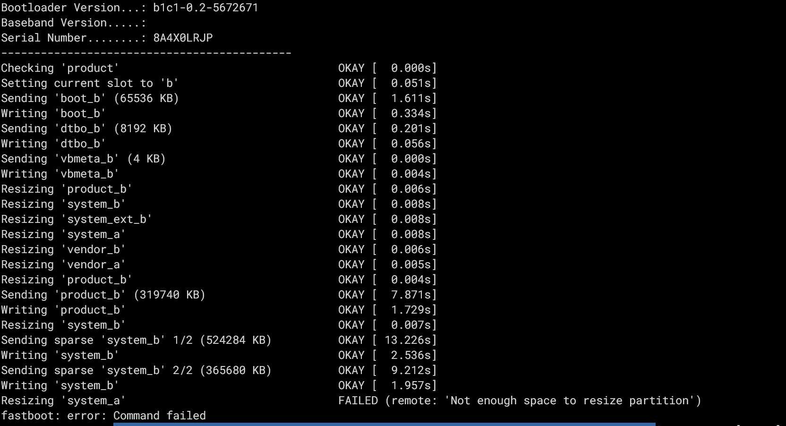
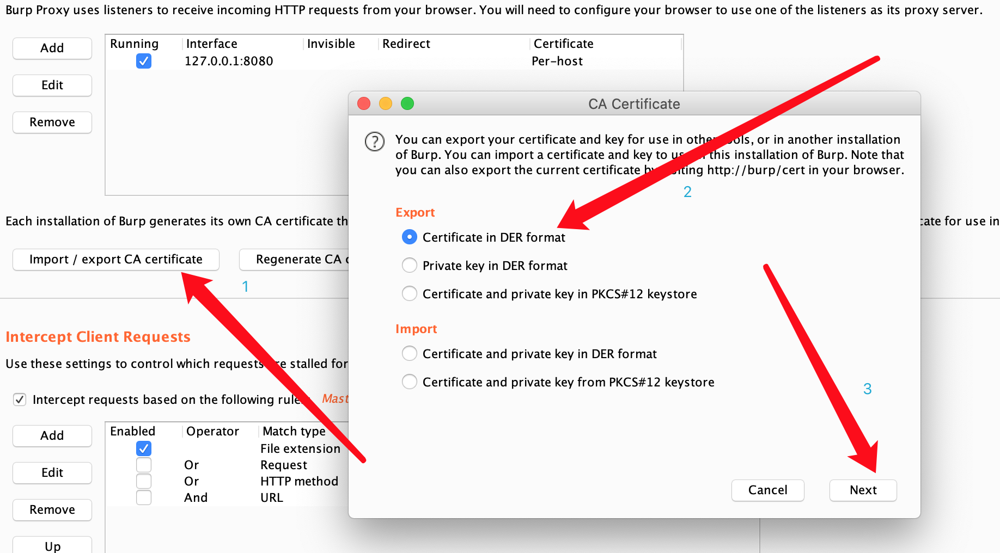
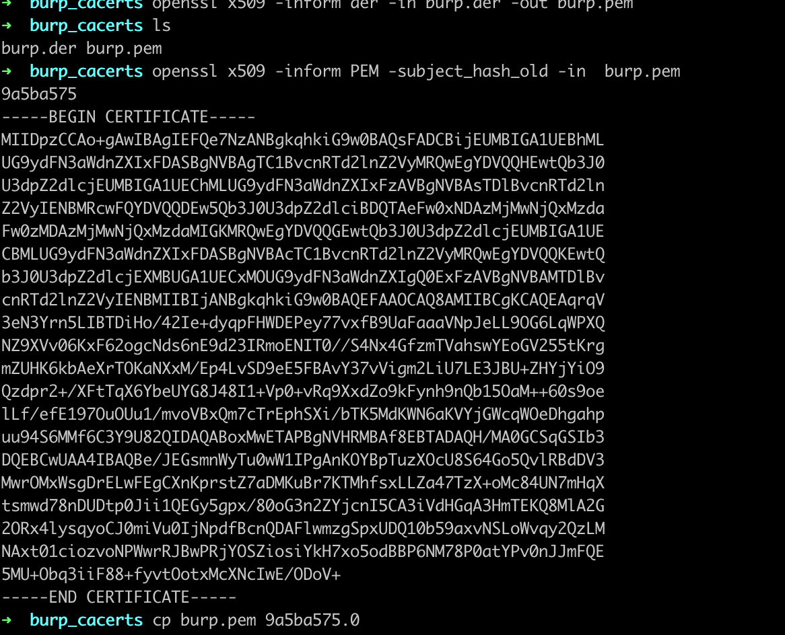

# Android 10 简明刷机与救砖教程

### 刷机和救砖教程

（可以参考https://blog.csdn.net/Ender_Zhao/article/details/109903166）

1.确保自己是最新版本的usb驱动和sdk(包含adb和fastboot)

https://developer.android.google.cn/studio/run/win-usb

https://developer.android.google.cn/studio/releases/platform-tools

2.确定自己刷机的方式 （务必确定自己手机已解锁BL）

安卓通用刷机方式：

2.1. 卡刷（TWRP）：通过进入TWRP（bootloader）界面中进行刷机，需要刷机包.zip 或者 刷机包.bin。（多出现在pixel1以及更早的机器上）

2.2. 线刷：通过usb连接，进入bootloader或者fastboot下，运行脚本或输入指令进行刷机。（在比较新的机器上，通常都是使用线刷）

3.这里以线刷为例，https://developers.google.cn/android/images 访问后根据自己型号和需要的版本来选择，点击Link下载 刷机包.zip



这里插一嘴，AOSP类型的系统，有独特的命名方式比如aosp10R2版本实际上指的是QP1A.190711.020，可以在这里查到

https://source.android.com/docs/setup/about/build-numbers?hl=zh-cn




解压后通常都有以下文件




bootloader: 包含启动引导等

radio: 包含基带、驱动等

image.zip: 刷机所需的system、boot等镜像组成的压缩包。

flash-all.bat: 刷机脚本


配置本机path变量  ANDROID_PRODUCT_OUT



进入fastboot模式后，先用flash-all.bat刷写基带固件。

```shell
./flash-all.bat
```

如果出现报错，请看下面。

#### 潜在的坑点

如果遇到Partition should be flashed in fastbootd的报错。是因为动态分区的设备上，aosp要求rec提供用户空间fastboot（fastbootd） (可以理解为一个可以挂载super分区并修改其中动态分区内容的fastboot加强版)



重新配置本机path变量  ANDROID_PRODUCT_OUT 到一个新的路径


下载好的image-blueline-qp1a.190711.020.zip 解压到该目录



进入fastbootd模式

```shell
#安卓10需要进入fastbootd模式
fastboot reboot fastboot
#和上述一样
fastboot flashall -w
```



使用命令**fastboot flashall -w**

如果还发现存在譬如`Resizing 'system_a'                                FAILED (remote: 'Not enough space to resize partition')`的问题，可能是slot设定为b引起的。（关于动态分区详细可以阅读[Android 10分区的一些知识](./Android 10分区的一些知识.md)以及https://blog.xzr.moe/archives/28/）



```shell
fastboot set_active a
fastboot flashall -w
```


---

### 添加证书教程

#### 电脑端处理

注意：如果使用magisk手动修补boot.img再重新刷入的方式获得ROOT会在挂载系统目录后丢失，取消系统目录挂载即可恢复。

具体冲突案例如下（大量内容复制自[安装burp证书到安卓系统根证书](https://blog.njcit.me/2020/08/21/%E3%80%90%E8%80%81%E6%96%87%E7%AB%A0%E3%80%91%E5%AE%89%E8%A3%85burp%E8%AF%81%E4%B9%A6%E5%88%B0%E5%AE%89%E5%8D%93%E7%B3%BB%E7%BB%9F%E8%B7%9F%E8%AF%81%E4%B9%A6/)）

首先导出Burp的证书：


打开终端，将der证书转为pem证书：

```
openssl x509 -inform der -in burp.der -out burp.pem  
```

生成pem证书的hash：

```
openssl x509 -inform PEM -subject_hash_old -in  burp.pem
```

重命名/复制证书:

```
cp burp.pem 9a5ba575.0
```

如果你上面的过程没有错的话，生成的证书hash以及文件内容应该是和我一样的。


#### 手机端处理

手机连接电脑并开启adb调试：

推送证书到手机并复制到相应的目录

```shell
adb push 9a5ba575.0 /data/local/tmp
adb shell
su
mount -o remount,rw /system #注意此处android 10会报错，导致后续无法执行，解决见下文
cd /data/local/tmp
cp 9a5ba575.0 /system/etc/security/cacerts/
cd /system/etc/security/cacerts
chmod 644 9a5ba575.0
reboot
```

需要先解锁verity

```shell
$ adb root
#restarting adbd as root
$ adb remount
#dm_verity is enabled on the system partition.
#Use "adb disable-verity" to disable verity.
#If you do not, remount may succeed, however, you will still not be able to write to these volumes.
remount succeeded
$ adb disable-verity
#Verity disabled on /system
#Now reboot your device for settings to take effect
$ adb reboot
$ adb root
#restarting adbd as root
$ adb remount
#remount succeeded
```

解锁后一样的流程

```shell
cd /data/local/tmp
cp 9a5ba575.0 /system/etc/security/cacerts/
cd /system/etc/security/cacerts
chmod 644 9a5ba575.0
reboot
```

然后，为了防止丢失ROOT，需要再次启用verity锁定

```shell
$ adb root
$ adb remount
#remount succeeded
$ adb enable-verity
$ adb reboot
$ adb root
$ adb remount
#remount disable
```

