# pine框架与Mikrom2.0的使用（一）


## 前言

该系列文章主要是使用和测试Mikrom2.0版本如何操作Pine框架，本文记录通过Pine加载插件的踩坑过程。由衷感谢misskings师傅提供的测试机会以及pine框架的开发者[canye](https://blog.canyie.top)。


## 什么是Mikrom

[Mikrom1.0](https://github.com/dqzg12300/MikRom)是由misskings师傅基于[fartext](https://github.com/dqzg12300/FartExt)开发的一套用于简便脱壳和frida逆向的ROM，原理各位可以自行搜索fart、fartext进行研习，这里不花过多笔墨赘述。

Mikrom2.0是由misskings师傅在旧版本基础上优化旧功能，并新增pine作为hook框架，个人使用后觉得在控制精细程度和功能拓展方面确实有独到之处。详细可以观看介绍视频。https://www.bilibili.com/video/BV1wG411i7Fw


## 什么是Pine

https://github.com/canyie/pine

简介中它写的是：**Pine是一个在虚拟机层面、以Java方法为粒度的运行时动态hook框架，它可以拦截本进程内几乎所有的java方法调用。**

这个表述实在是有些费解，不过我们只需要知道它是一个ART Hook框架，通过inline hook、修改`ArtMethod`的entrypoint的方式进行Hook；以及最重要的特性：支持以Xposed风格hook方法和加载Xposed模块、借助[Dobby](https://github.com/jmpews/Dobby)使用一些增强功能。

在misskings师傅视频中对该模块的演示会较为简单，对安卓了解不深的同学对具体使用方式容易一头雾水。（https://www.bilibili.com/video/BV14C4y1R759）

接下来我将通过一个加载Xposed模块的例子串通pine框架和Mikrom，算是对misskings师傅视频的补充和对canye师傅开发pine这样优秀框架的推广。（强烈建议各位使用的时候反复阅读Pine的文档和源码，以确认使用了正确的方式进行编码）


## 通过Pine加载插件

这里我们以加载Xposed的JustTrustMe插件来演示。


### 准备工作

上传插件

```bash
adb push .\JustTrustMe-debug.apk /data/local/tmp/JustTrustMe-debug.apk
adb shell
cd /data/local/tmp/ 
chmod 766 JustTrustMe-debug.apk
```


创建空白安卓应用

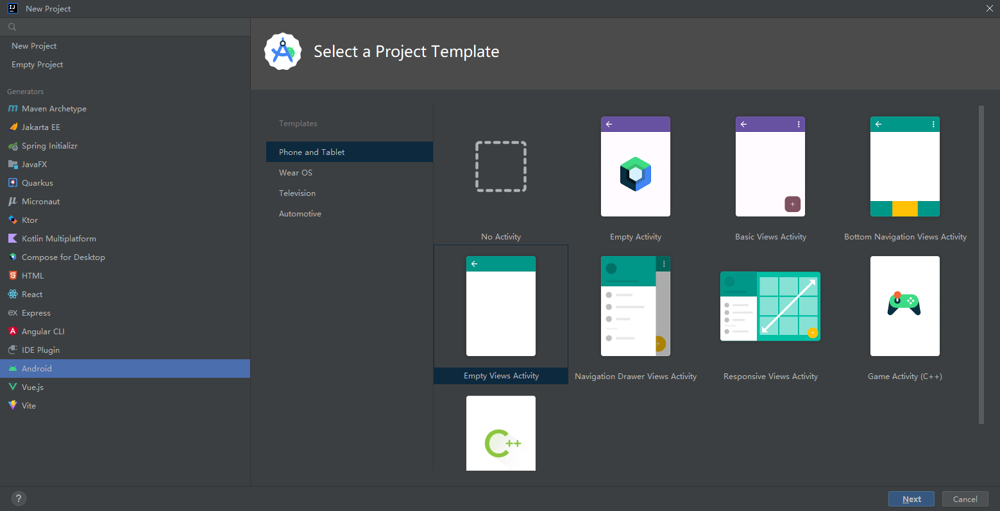

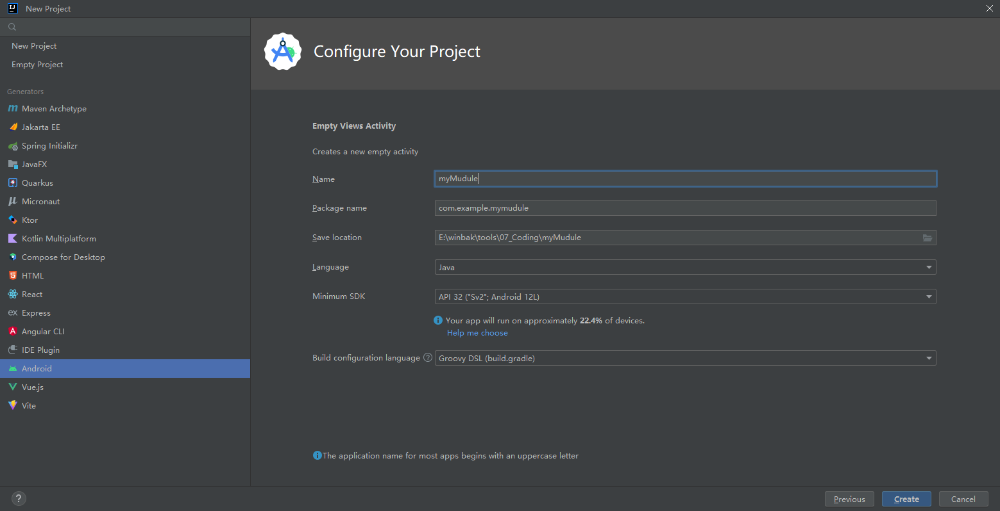


给build.gradle添加必须的依赖

```java
    implementation 'top.canyie.pine:core:0.2.6'
    implementation 'top.canyie.pine:xposed:0.0.9'
```

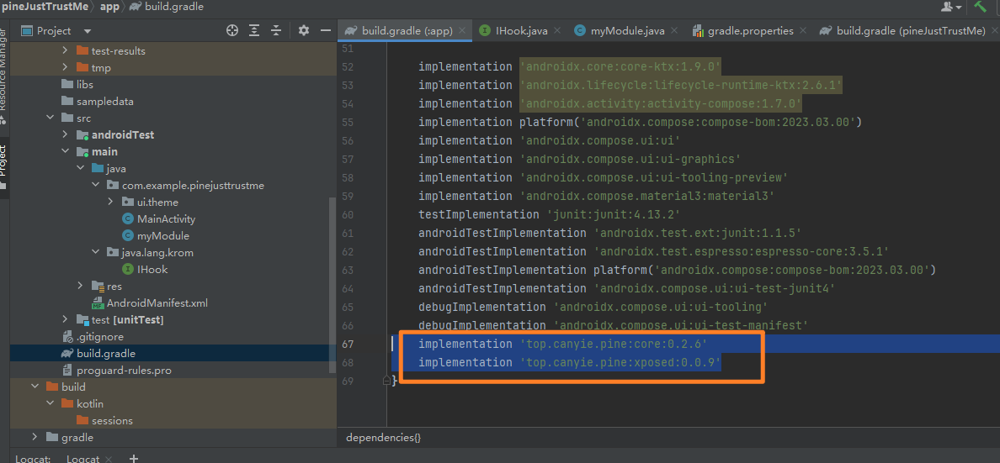


### 编写代码

手动创建package java.lang.krom 以及接口类 IHook

```java
package java.lang.krom;


import android.content.pm.PackageManager;

public interface IHook {
    void onStart(Object app) throws NoSuchFieldException, NoSuchMethodException, PackageManager.NameNotFoundException;


}
```

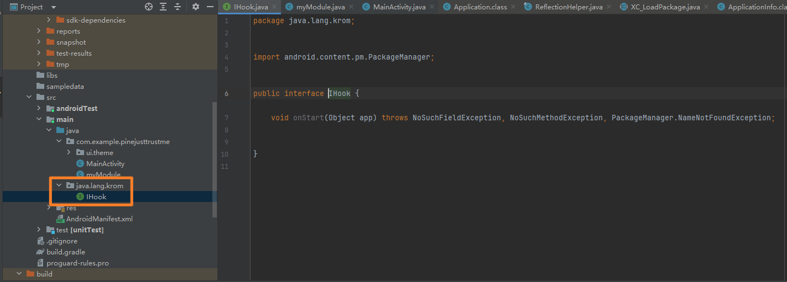


手动创建module，这里我建立的是myModule.java

```java
package com.example.pinejusttrustme;

import android.app.Application;
import android.content.pm.ApplicationInfo;
import android.content.pm.PackageManager;
import android.util.Log;
import top.canyie.pine.BuildConfig;
import top.canyie.pine.Pine;
import top.canyie.pine.PineConfig;
import top.canyie.pine.xposed.PineXposed;

import java.io.File;
import java.lang.krom.IHook;

/**
 * myModule类实现了IHook接口，用于处理模块的启动和加载逻辑。
 */
public class myModule implements IHook {
    public static String TAG = "myModule";

    /**
     * onStart方法在模块启动时被调用，用于加载模块和执行相关逻辑。
     * @param app 本质是android.app.Application
     */
    @Override
    public void onStart(Object app) {
        try {
            Log.i(TAG, "onStart!!!");
            Log.i(TAG, app.toString());

            // 指定模块路径
            String modulePath = "/data/local/tmp/JustTrustMe-debug.apk";
            //指定Pine框架策略
            PineConfig.debug = true;
            PineConfig.debuggable = BuildConfig.DEBUG;

            // 加载Xposed模块
            PineXposed.loadModule(new File(modulePath));
            Pine.disableJitInline();

            // 获取应用程序相关信息，核心是Object app可以获取上下文，也就是等价于Application所有必须的信息。
            // 有意思的是app类的classloader是dalvik.system.PathClassLoader，
            ClassLoader pathClassLoader = app.getClass().getClassLoader();
            Application application = (Application) app;
            ApplicationInfo appInfo = application.getPackageManager().getApplicationInfo(application.getPackageName(), PackageManager.GET_META_DATA);

            // 执行PineXposed的xposed加载方法。本质上是pine框架用一套机制把xposed的module加载进来,然后指定想要加入插件的上下文。
            // 虽然不能像xposed直接调度XC_LoadPackage.LoadPackageParam；但通过Object app已经可以获取到应用的上下文了，因此可以用pine框架内的方法动态生成一个专门针对该应用的LoadPackageParam并加载module内的hook。
            PineXposed.onPackageLoad(appInfo.packageName, appInfo.processName, appInfo, true, pathClassLoader);
            Log.i(TAG, "END!!!");
        } catch (Exception e) {
            e.printStackTrace();
        }
    }
}
```


修改AndroidManifest.xml中的meta-data属性，确保和自己想要加载的module是一致的。

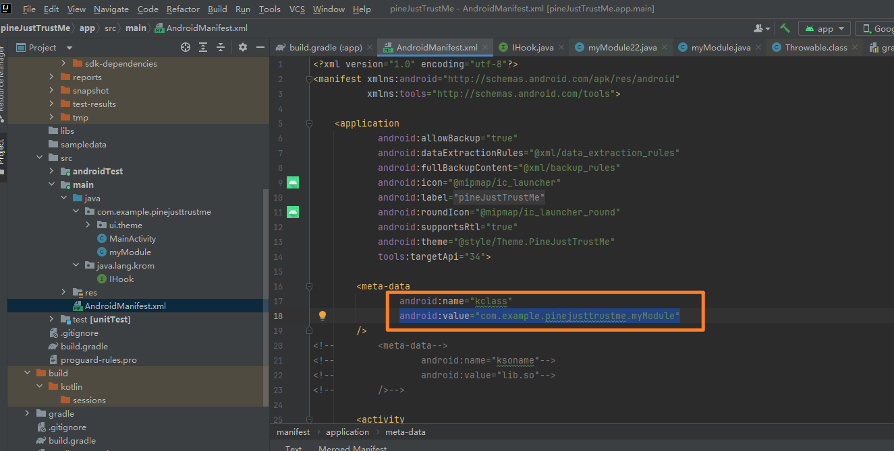


### 编译、上传和配置

编译并上传应用

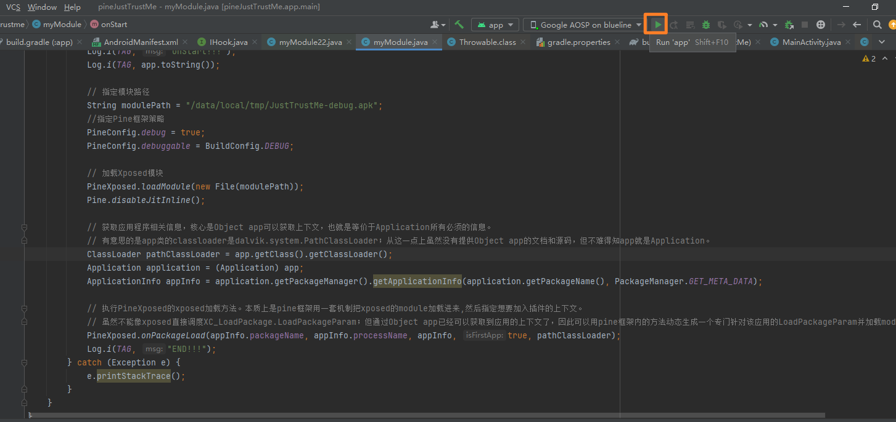


打开自带管理应用miktool，添加想要加载插件的应用。


勾选模块，保存设置。就大功告成了。

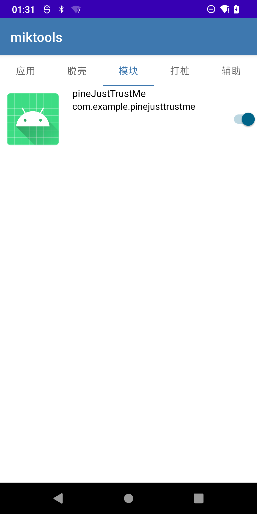

通过logcat可以看到插件已经在工作了。

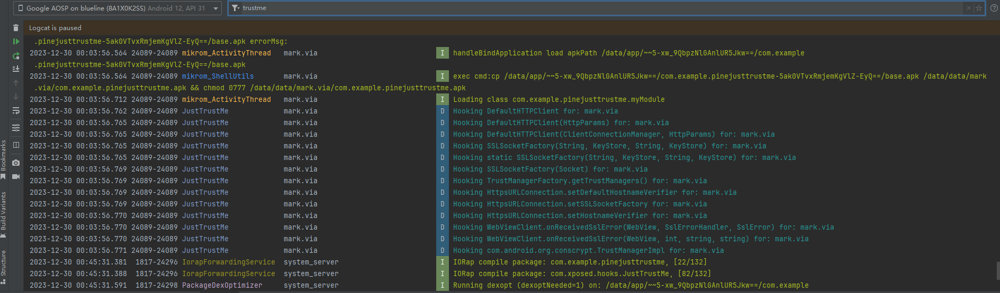

加上代理后，打开应用访问https的百度毫无压力。

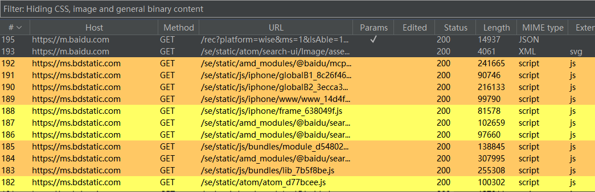


## 中途踩过的一些坑

### 路径权限问题

最开始我是上传到/sdcard/Download/目录，结果发现会不断提示权限错误。直到更换到其他目录才解决。

```bash
adb push .\JustTrustMe-debug.apk /sdcard/Download/
```


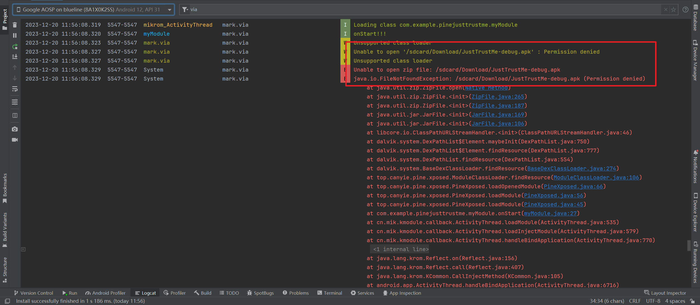


### 搞不清app是什么对象

尝试用反射看了好久还是一头雾水

```
package com.example.pinejusttrustme;

import android.content.pm.ApplicationInfo;
import android.util.Log;
import top.canyie.pine.BuildConfig;
import top.canyie.pine.Pine;
import top.canyie.pine.PineConfig;
import top.canyie.pine.xposed.*;


import java.io.File;
import java.lang.krom.IHook;
import java.lang.reflect.Field;


public class myModule implements IHook {
    public static String TAG = "myModule";

    @Override
    public void onStart(Object app)  {
        Log.i(TAG,"onStart!!!");
        
        String modulePath = "/sdcard/Download/JustTrustMe-debug.apk";
        PineConfig.debug = true;
        PineConfig.debuggable = BuildConfig.DEBUG;

        PineXposed.loadModule(new File(modulePath));
        Pine.disableJitInline();
        try{

            for(Field filed: app.getClass().getDeclaredFields()){
                filed.setAccessible(true);
                Log.i(TAG,"GET!!!"+filed.getName());
                Log.i(TAG, String.valueOf(filed.get(app)));
            }
        } catch (Exception e) {
            e.printStackTrace();
        }

        Log.i(TAG,"Obj END!!!");

//        PineXposed.onPackageLoad(app.packageName, processName, appInfo, isFirstApp, classLoader);

    }

}

```

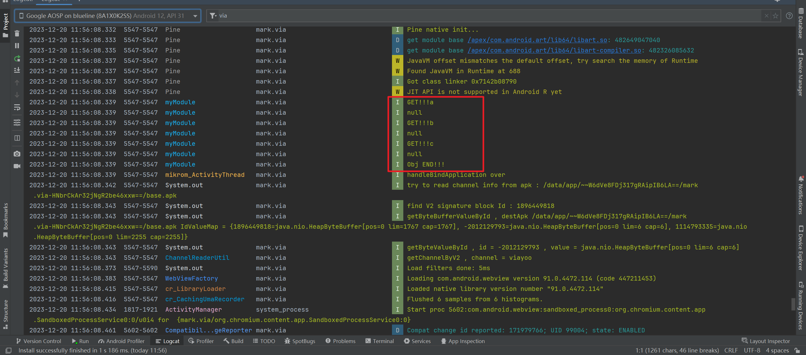

直到获取它的Classloader，发现是dalvik.system.PathClassLoader；

```java
ClassLoader pathClassLoader = app.getClass().getClassLoader();
```

那么它的上下文应该也可以取到application的context，本质上安卓是上下文关系，只要你能取到上下文，就能取到所有你想要的东西；最后我大胆尝试直接把app当作application，发现是可以直接调取application的所有方法，这才明白了app就是Android的android.app.Application。

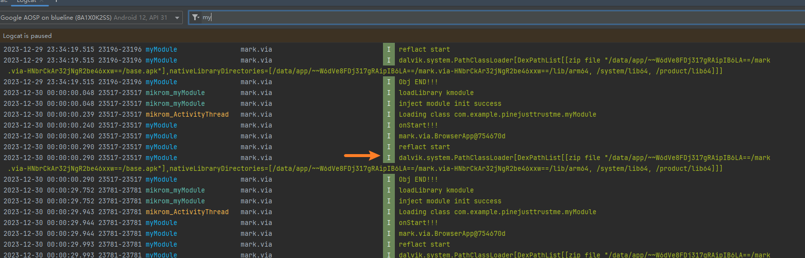


### pine加载插件的方式

最初认为是和xpose一样先要有XC_LoadPackage.LoadPackageParam对象，但这个对象在pine中是通过PineXposed.onPackageLoad()方法来获取的。

此前一直搞不清到底传进来的app是什么东西，想当然认为就是和XC_LoadPackage.LoadPackageParam差的不多的东西，结果吃了亏。

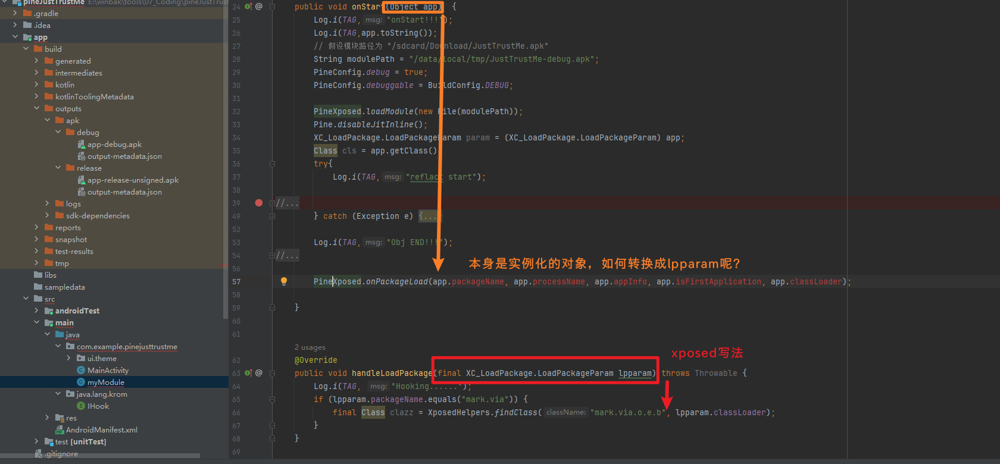

这个就是是外部文件读入module的方式。如果要自己写hook，除了pine原生以外，也可以通过自定义module的方式加载。
虽然不能像xposed直接调度XC_LoadPackage.LoadPackageParam；但通过Object app已经可以获取到应用的上下文了，因此可以用pine框架内的方法动态生成一个专门针对该应用的LoadPackageParam并加载module内的hook。

我个人的理解是XC_LoadPackage.LoadPackageParam这个对象包含了所有的应用信息，所有xposed才有那么奇怪的equals去进行判断：

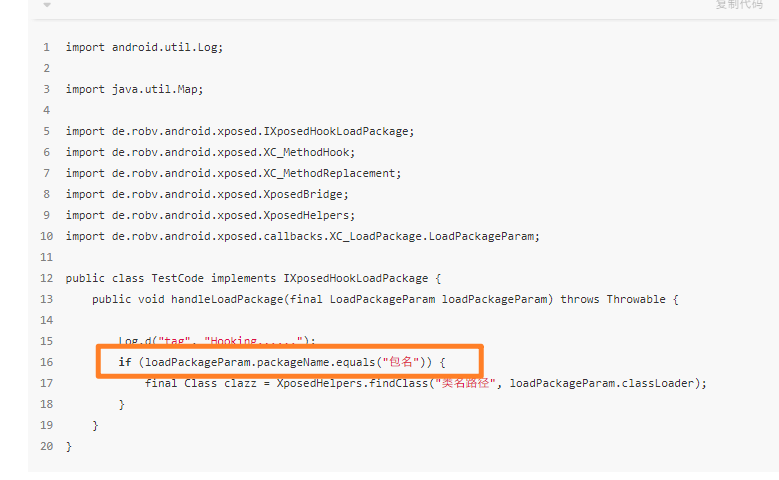

但在mikrom+pine这里是完全不必要的，我们只需要让XC_LoadPackage.LoadPackageParam仅包含我们想要进行module操作的应用就对了。所以才是通过传入的app对象来获取appinfo等必要信息去生成LoadPackageParam对象。