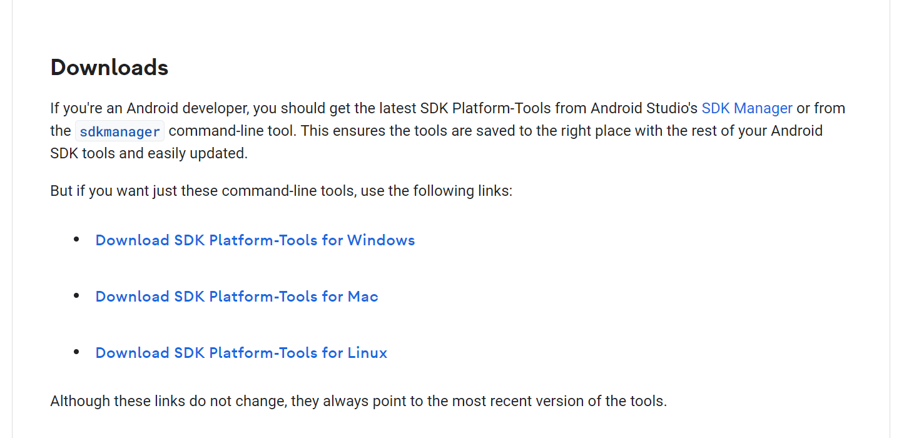
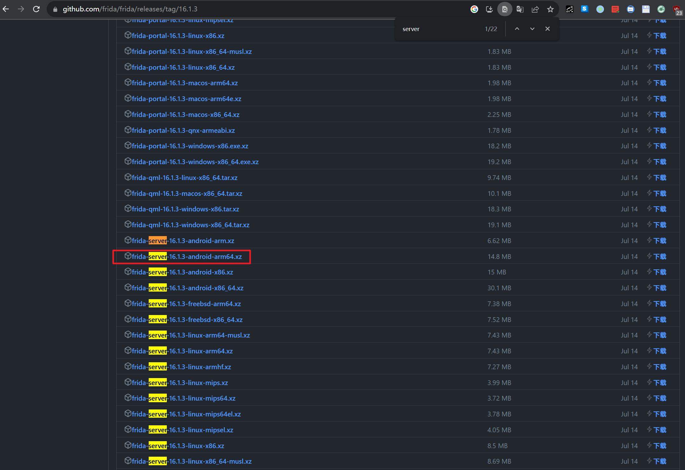
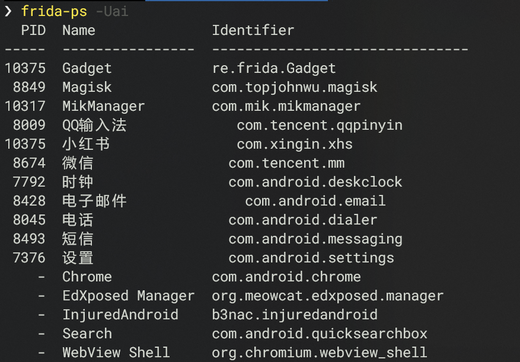
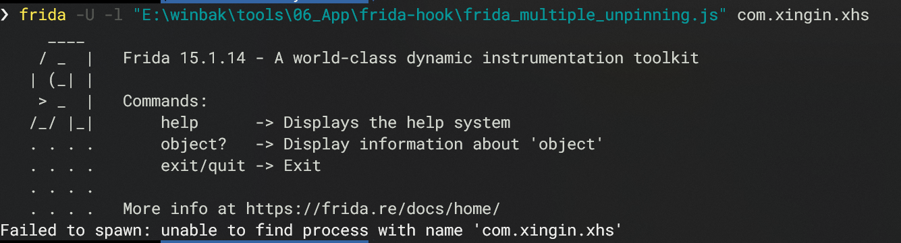
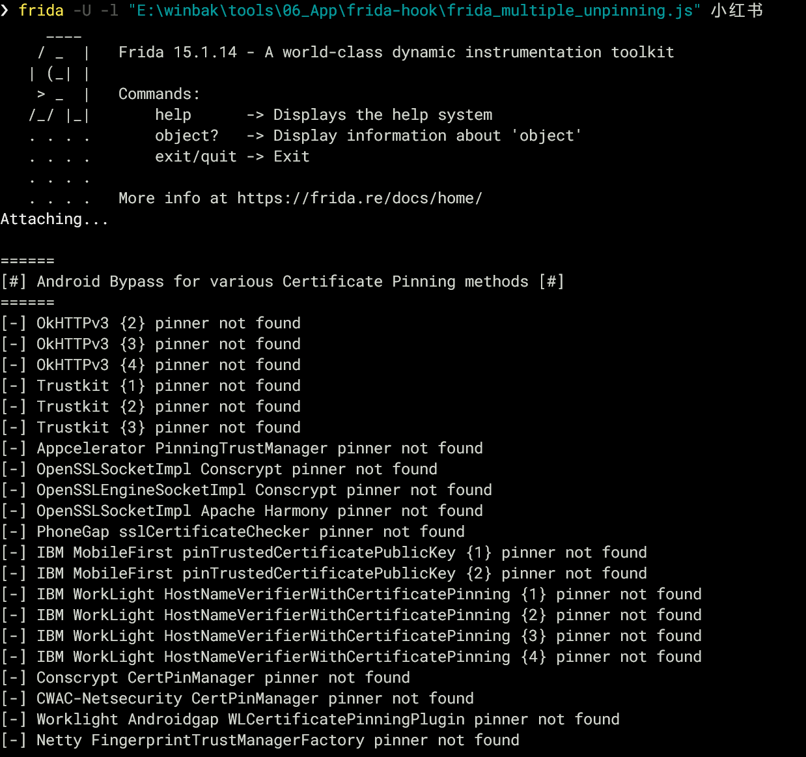
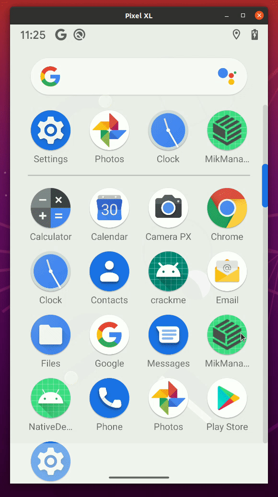
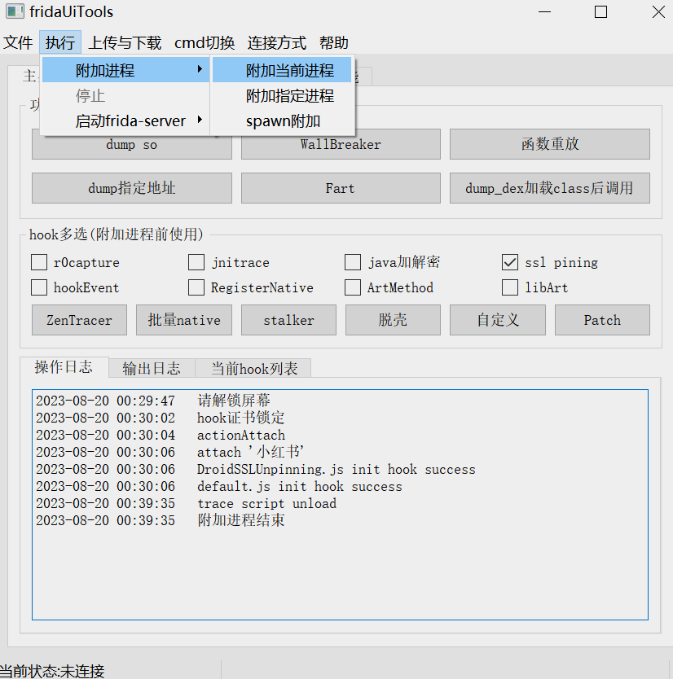

# 安卓入门

## 准备工作

1. 电脑。
2. 解锁bl刷入原生系统的安卓机，并且root。

## Frida客户端安装配置


先有python后有天。没有Python和pip就装。然后安装工具，速度很慢是正常的，最好挂代理。

```python
pip install frida

pip install frida-tools
```

安装成功后，检查一下

```shell
frida-ps
```

PS：安装过程中存在warning

参考官方文档[Troubleshooting](https://frida.re/docs/troubleshooting/)

比如给朋友的MacOS装的时候遇到过，有可能是系统变量配置路径问题参考[#issues1355](https://github.com/frida/frida/issues/1355)

## ADB安装配置

看这个[SDK Platform Tools release notes](https://developer.android.com/tools/releases/platform-tools)



安装完成后，查看设备连接情况。

```shell
adb devices
```


PS：如果连接不上，可能是端口问题。配置一下就好。如果是使用模拟器，不同的模拟器，可能会默认指定**5017**之类的端口，以及使用模拟器安装目录下的adb工具，具体需要查看官方手册。（所以强烈不推荐使用模拟器）

```bash
adb forward tcp:5037 tcp:5037
```


## Frida服务端安装配置

先查看当前的客户端版本

```shell
frida --version
```


要hook安卓，就需要下载对应版本的服务端。注意与客户端版本号对应，注意平台，注意指令集。

https://github.com/frida/frida/releases/tag/16.1.3



把下载的文件解压，然后上传到安卓机

```shell
adb push ./frida服务端文件名 /你想要的安卓机器的目录的绝对路径
#常见情况
adb push ./frida服务端文件名 /data/local/tmp/
```

修改权限并运行

```bash
adb shell
su
cd /data/local/tmp/
chmod 777 frida-server
./frida-server
```


bypass小技巧，修改文件名防检测

```bash
mv /data/local/tmp/frida-server /data/local/tmp/f@vbiuao
/data/local/tmp/f@vbiuao
```


启动服务后，在自己电脑客户端查看连接情况，有进程列表就是正常的

```bash
frida-ps -U 
```


指定写有hook代码的js文件和想要hook的进程，进程名可以在`frida-ps -U `上看到。

其中frida客户端启动，分为spawn和attach两种。spawn是在进程启动前，就运行hook。attach是在进程启动后，中途运行hook。


attach的方式不容易应用出错或者闪退，但容易hook失败，以下是attach的启动方式：

```bash
frida -U -l "E:\xxx\abcd.js"  com.xx.messenger(你想hook的进程名)
```


spawn的启动需要参数`-f`，而`--no-pause`则是让hook到函数时不会强制暂停进程。

```bash
frida -U --no-pause -f com.xx.messenger -l hook.js
```


查看进程名



如果你使用Identifier进行hook失败



那就使用Name再试一次




## 更简便的方式

刷入mikrom，原生集成了frida。

安装[MikManager](https://github.com/dqzg12300/MikManager)

```bash
adb install ./apk
```

可以通过app启动frida




下载安装**[fridaUiTools](https://github.com/dqzg12300/fridaUiTools)**

可以很方便地联动frida使用内置的hook脚本




