# codeQL使用篇

先从t4rrega师傅那偷个图，给大伙儿看看SpringMVC是咋回事[Spring MVC框架安全浅析](https://xz.aliyun.com/t/10590#toc-6)

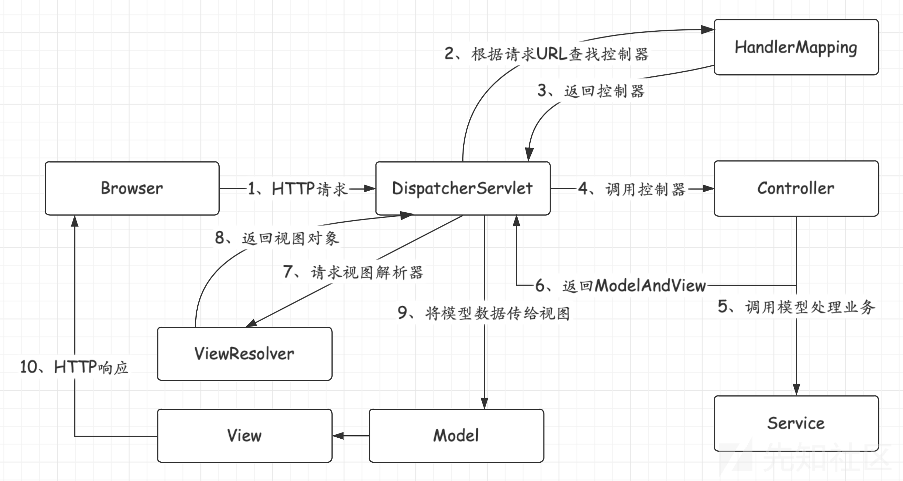

我们再来进一段controller代码了解SpringBoot，获取参数部分也可以参考[SpringBoot获取参数的几种方式](https://www.jianshu.com/p/ee150654f712)

```java
    @RequestMapping(value = "/onlinePreview")
	//这个就是控制器注册的接口Mapping了
    public String onlinePreview(String url, Model model, HttpServletRequest req) {
        //String url即springboot一种简单获取GET参数的方式
        //Model model即MVC里的M，后续处理响应时会用到
        //HttpServletRequest req在这里获取的request对象，可以很方便地通过getParameter()方法在后续层层调用的函数中随时获取当前Controller所有GET/POST参数里想要的那个。
        String fileUrl;
        try {
            fileUrl = new String(Base64.decodeBase64(url), StandardCharsets.UTF_8);
        } catch (Exception ex) {
            String errorMsg = String.format(BASE64_DECODE_ERROR_MSG, "url");
            return otherFilePreview.notSupportedFile(model, errorMsg);
        }
        FileAttribute fileAttribute = fileHandlerService.getFileAttribute(fileUrl, req);
        model.addAttribute("file", fileAttribute);
        FilePreview filePreview = previewFactory.get(fileAttribute);
        logger.info("预览文件url：{}，previewType：{}", fileUrl, fileAttribute.getType());
        return filePreview.filePreviewHandle(fileUrl, model, fileAttribute);
    }
```


简述一下codeQL是如何查找漏洞的

简述一下codeQL是如何查找漏洞的

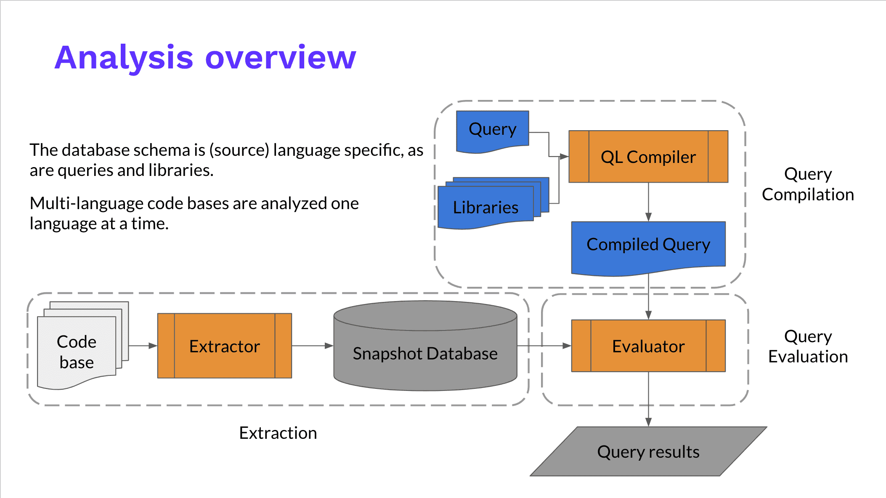

### 先了解一下 source 和 sink的概念

>在代码自动化安全审计的理论当中，有一个最核心的三元组概念，就是 (source，sink 和 sanitizer)。
source 是指漏洞污染链条的输入点。比如获取 http 请求的参数部分，就是非常明显的 Source。
sink 是指漏洞污染链条的执行点，比如 SQL 注入漏洞，最终执行 SQL 语句的函数就是 sink(这个函数可能叫 query 或者 exeSql，或者其它)。
sanitizer 又叫净化函数，是指在整个的漏洞链条当中，如果存在一个方法阻断了整个传递链，那么这个方法就叫 sanitizer。

只有当 source 和 sink 同时存在，并且从 source 到 sink 的链路是通的，才表示当前漏洞是存在的。

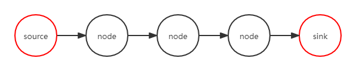


如果在SpringMVC下，则可以理解Source为Controller获取并处理了http请求的用户控制参数，调用的处理参数方法则是一个个node，sink即一系列调用后会用到某个可恶意利用的方法来处理该可控参数，并最终层层返回到Controller，Controller会把结果再交给Model和View去响应用户的请求。

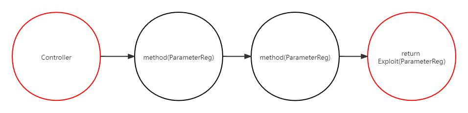


来一段QL代码看看是怎么样实现的，这段代码来自(https://github.com/github/codeql/tree/master/java/ql/src/Security/CWE/CWE-022)用于挖掘CWE-022以及相似类型的漏洞，即路径注入类漏洞。对CWE漏洞分类不太了解的同学，可以参考官方[**CWE VIEW: Software Development**](https://cwe.mitre.org/data/definitions/699.html)，实在不懂英语的可以看看国家精简版[**CNNVD漏洞分类指南**](http://www.cnnvd.org.cn/web/wz/bzxqById.tag?id=3&mkid=3)。

```java
/**
 * @name Uncontrolled data used in path expression
 * @description Accessing paths influenced by users can allow an attacker to access unexpected resources.
 * @kind path-problem
 * @problem.severity error
 * @precision high
 * @id java/path-injection
 * @tags security
 *       external/cwe/cwe-022
 *       external/cwe/cwe-023
 *       external/cwe/cwe-036
 *       external/cwe/cwe-073
 */

import java/*导入java库，指示QL语句查询的语言类型是java*/
import semmle.code.java.dataflow.FlowSources/*字面意思，在数据流中寻找源头用的*/
import semmle.code.java.security.PathCreation/*字面意思，在数据流中寻找路径用的*/
import DataFlow::PathGraph/*数据流分析库*/
import TaintedPathCommon/*作者自己写的路径污染库，为污点分析的路径建立一个非常基本的查询模型。*/

class ContainsDotDotSanitizer extends DataFlow::BarrierGuard {
  ContainsDotDotSanitizer() {
  	//包含".."的净化函数
    //匹配方法名为contains()的且参数中包含字符串".."的，意思就是遇到contains(str,"..")的过滤防护就不视为漏洞路径。
    this.(MethodAccess).getMethod().hasName("contains") and
    this.(MethodAccess).getAnArgument().(StringLiteral).getValue() = ".."
  }

  override predicate checks(Expr e, boolean branch) {
      //调用checks（）可以尝试获取此方法访问的限定表达式。且此处分支为false
    e = this.(MethodAccess).getQualifier() and branch = false
  }
}

class TaintedPathConfig extends TaintTracking::Configuration {
  TaintedPathConfig() { this = "TaintedPathConfig" }
  
   // isSource就是寻找入口用的，会自动根据框架比如SpringBoot去找对应的输入入口
  override predicate isSource(DataFlow::Node source) { source instanceof RemoteFlowSource }
  // isSink找执行点用的
  override predicate isSink(DataFlow::Node sink) {
    exists(Expr e | e = sink.asExpr() | e = any(PathCreation p).getAnInput() and not guarded(e))
  }
  // isSanitizer净化函数查看是否符合切断条件，符合直接切断数据流，不视为漏洞路径。它是作用于Node上的。
  override predicate isSanitizer(DataFlow::Node node) {
    exists(Type t | t = node.getType() | t instanceof BoxedType or t instanceof PrimitiveType)
  }
  // 进一步净化函数查看是否存在防护过滤，符合直接切断数据流，不视为漏洞路径。它是作用于BarrierGuard的，即一个验证某些表达式的防护措施。
  override predicate isSanitizerGuard(DataFlow::BarrierGuard guard) {
    guard instanceof ContainsDotDotSanitizer
  }
}

// 接下来的查询就是查找符合条件的结果，sink符合条件 AND node能连接source和sink，
from DataFlow::PathNode source, DataFlow::PathNode sink, PathCreation p, TaintedPathConfig conf
where
  sink.getNode().asExpr() = p.getAnInput() and
  conf.hasFlowPath(source, sink)
select p, source, sink, "$@ flows to here and is used in a path.", source.getNode(),
  "User-provided value"

```


```java
/**
 * Models a very basic guard for the tainted path queries.
 */

import java
import semmle.code.java.controlflow.Guards
import semmle.code.java.security.PathCreation

private predicate inWeakCheck(Expr e) {
  // None of these are sufficient to guarantee that a string is safe. 就是说下面这四种过滤其实也是放屁，很多程序员都没写对，只是不想查那么多，所以下面的guarded()调用会过滤掉包含这四种检查的路径。
  exists(MethodAccess m, Method def | m.getQualifier() = e and m.getMethod() = def |
    def.getName() = "startsWith" or
    def.getName() = "endsWith" or
    def.getName() = "isEmpty" or
    def.getName() = "equals"
  )
  or
  // Checking against `null` has no bearing on path traversal. 排除掉null防止bug，和我们本来找路径穿越的目的没什么关系。
  exists(EqualityTest b | b.getAnOperand() = e | b.getAnOperand() instanceof NullLiteral)
}

// Ignore cases where the variable has been checked somehow, 这里说的是除了少部分特别明显的路径污染，大部分都给忽略，估计就是怕误报太多
// but allow some particularly obviously bad cases.
// predicate 表示当前方法没有返回值。
// exists子查询，是CodeQL谓词语法里非常常见的语法结构，它根据内部的子查询返回true or false，来决定筛选出哪些数据。
predicate guarded(VarAccess e) {
    //  存在（创建模拟路径->寻找输入）|| 存在（寻找条件块CB的子表达式 = 表达式c AND 表达式c = 输入点的值的路径 AND 条件块CB是受控的 AND NOT 缺陷检查）
    //  说人话就是，看看这个输入点到全路径过程是不是受控制的，且不包含过滤检查。
  exists(PathCreation p | e = p.getAnInput()) and 
  exists(ConditionBlock cb, Expr c |
    cb.getCondition().getAChildExpr*() = c and
    c = e.getVariable().getAnAccess() and
    cb.controls(e.getBasicBlock(), true) and
    // Disallow a few obviously bad checks. 关闭少部分明显的过滤检查
    not inWeakCheck(c)
  )
}

```


最后查询出来就是这样的

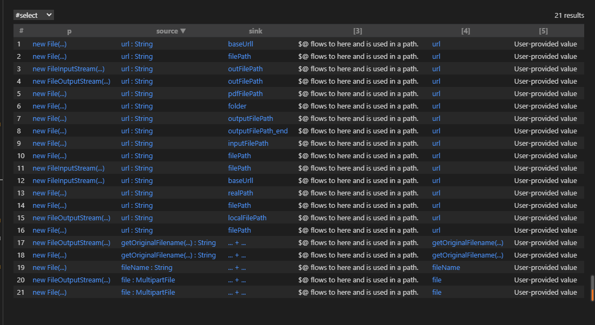


实际上审计的时候最好切到alert视图来看污点追踪流程。

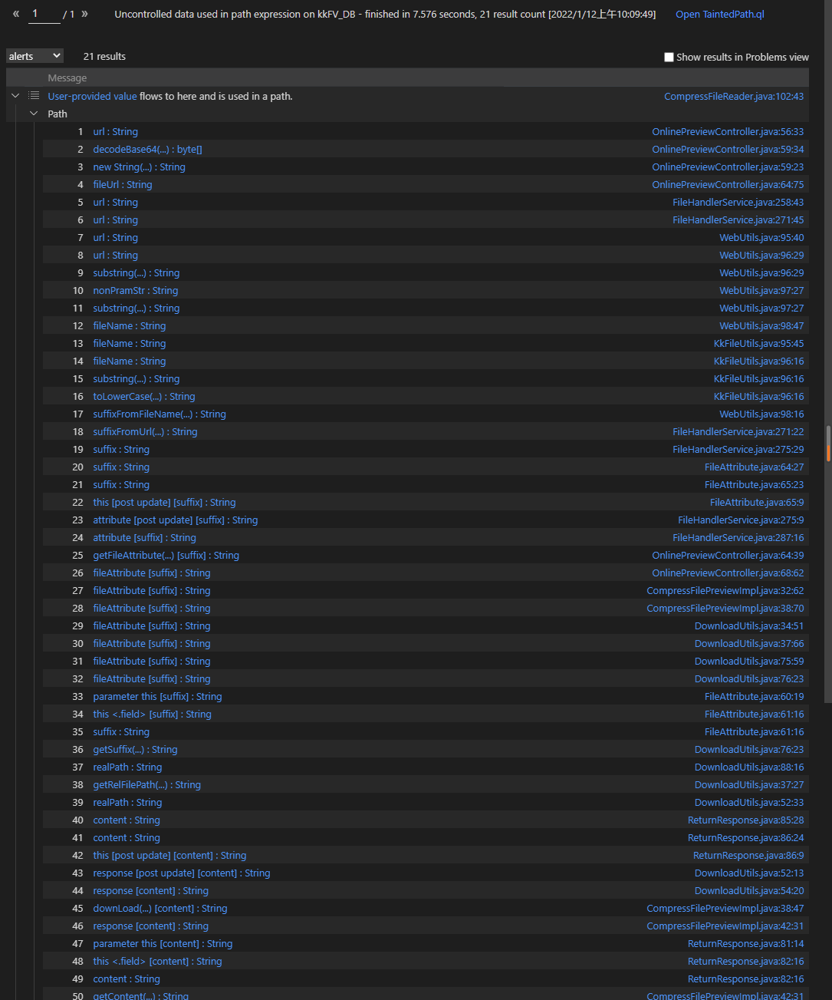


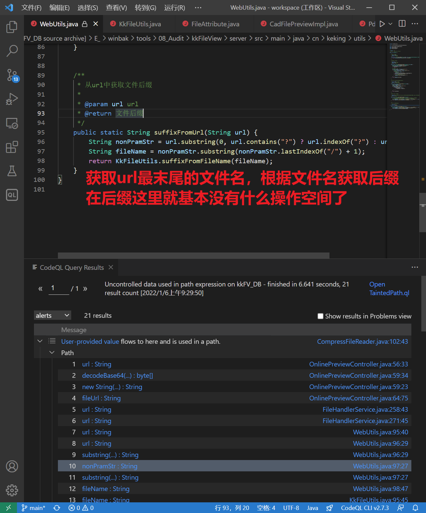

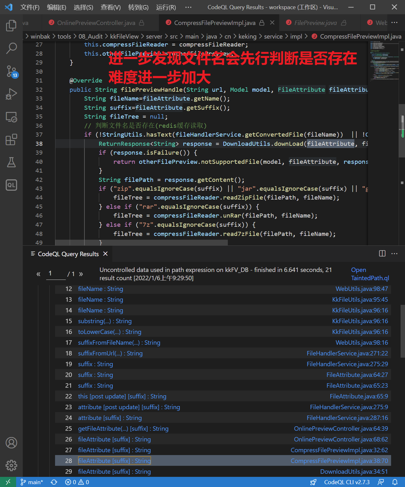


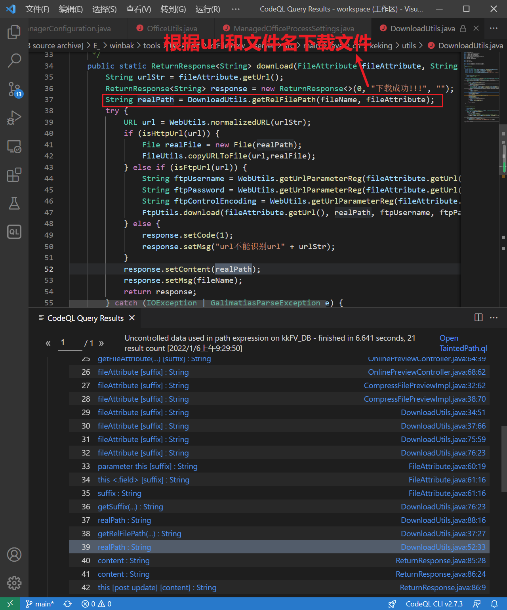


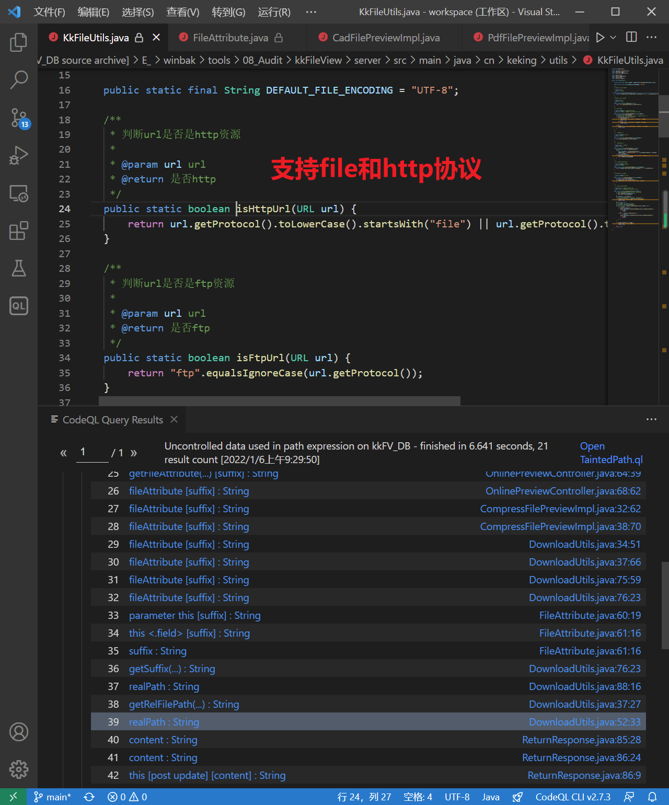


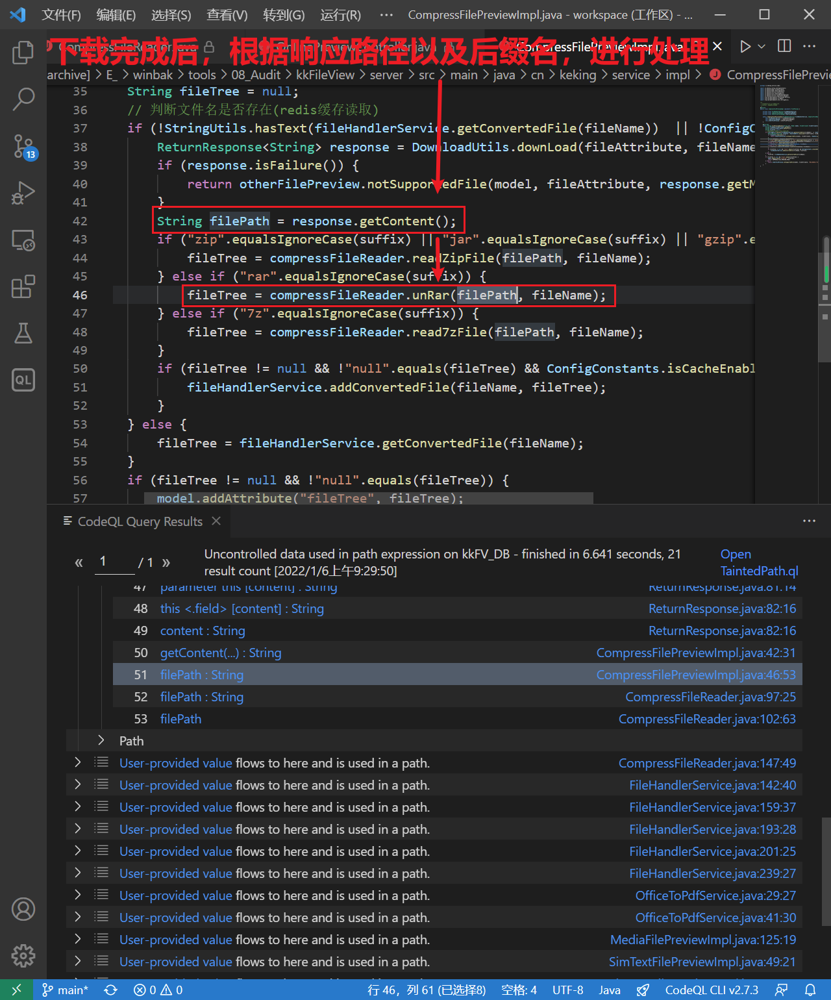


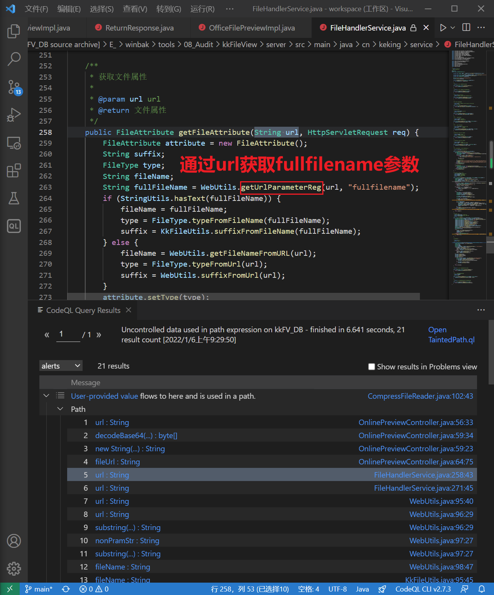
