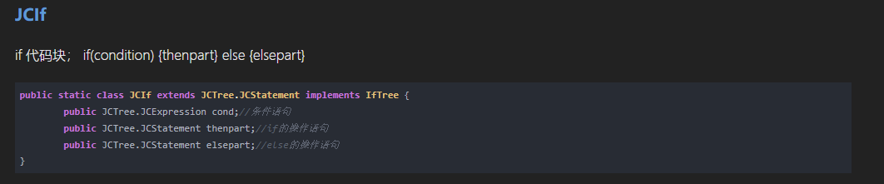

# codeQL语法篇（一）

---

---

### 如何理解QL语言

看看java库都能查些什么[CodeQL library for Java](https://codeql.github.com/docs/codeql-language-guides/codeql-library-for-java/)

导入java库（里面包含了许多qll文件，也可以自定义qll导入，类似C的头文件）

```
import java
```

这玩意定义了5种主要的类

| Classes                                                     | such as                                                      |
| ----------------------------------------------------------- | ------------------------------------------------------------ |
| program elements（用于表示程序元素的类）                    | classes 、methods 、Type、Variables等（类、方法、类型、变量等） |
| AST nodes（用于表示AST节点的类）                            | statements and expressions（状态、表达式）                   |
| metadata（用于表示元数据的类）                              | annotations and comments（注解）                             |
| computing metrics（用于计算指标的类）                       | cyclomatic complexity and coupling（复杂度，循环、耦合）     |
| navigating the program’s call graph（“函数调用关系图”的类） | -                                                            |


[分析函数调用关系图(call graph)的几种方法](https://developer.aliyun.com/article/245864)介绍了C/C++中几个例子，显然这里CodeQL是偏重静态源码分析。


---

---

### 难点备忘

#### 解释一下AST node:

expressions，对应的可能是AST里的JCExpression，表达式语句，继承JCExpression都是表达式语句，子类有：JCAssign，JCBinary，JCBreak，JCFieldAccess，JCIdent，JCLiteral等；

```sql
from Expr e
where e.getParent() instanceof ReturnStmt
select e
```

因为instanceof ReturnStmt，所以获得的是每一个return点的查询谓词表达式，结果对应的是每一个return点的返回值。

以下为AST中的定义：


statements，对应的可能是AST里的JCStatement，子类有：JCBlock、JCReturn、JCClassDecl、JCVariableDecl、JCTry、JCThrow等；

```sql
import java

from Stmt s
where s.getParent() instanceof IfStmt
select s
```

因为instanceof IfStmt，所以查找其父级为 if 语句的语句，结果对应的是每一个if分支的起始点

以下为AST中的定义：



---

#### 解释一下call graph：

Java的CodeQL库提供了两个抽象的类来表示程序的调用图。Callable和Call。前者只是Method和Constructor的共同超类，后者是MethodAccess、ClassInstanceExpression、ThisConstructorInvocationStmt和SuperConstructorInvocationStmt的共同超类。简单地说，Callable是可以被调用的东西，而Call是可以调用Callable的东西。

我们可以使用谓词Call.getCallee来找出一个特定的调用表达式指的是哪个方法或构造函数。例如，下面的查询可以找到对名为println的方法的所有调用。

```sql
import java

from Call c, Method m
where m = c.getCallee() and
    m.hasName("println")
select c
```

反过来说，Callable.getAReference会返回一个指代它的Call。因此，我们可以用这个查询找到那些从未被调用的方法和构造函数。

```sql
import java

from Callable c
where not exists(c.getAReference())
select c
```

---

---

### 实战操作

极其牛逼的文章[CodeQL workshop for Java: Unsafe deserialization in Apache Dubbo](https://github.com/githubuniverseworkshops/codeql/tree/main/workshop-2021)，我是照着上面进行操作和分析，发觉过程和注解写得极其详细，入门极佳，遂进行部分翻译

#### Section 1: 寻找反序列化污染点（Sink）

查询所有方法，Method method表示获取当前项目中所有的方法

```sql
import java

from Method method
select method
```


查询所有方法调用，MethodAccess call表示获取当前项目当中的所有方法调用（方法调用中是包含参数的或者void的，这样我们可以更方便地通过谓词指定调用的形式。忽略没有意义的参数）

```sql
import java

from MethodAccess call
select call
```


Parameter parameter 参数类，Parameter表示获取当前项目当中所有的参数

此处暂无例子，待补充

---


使用where进行谓词修饰，根据定义`MethondAccess`是获取方法与它的参数列表，`getMethod`是从一个类型中获取内容，`Method`是一种被调用的东西的特殊类型。（这个说法非常抽象，只能说官方所有文档表达的就是：我都封装和抽象好了，你不需要管那些底层细节，直接参考我的范例去用就可以了，为什么这么用。逻辑突然就不言自明了）

```sql
import java

from MethodAccess call, Method method
where call.getMethod() = method
select call, method
```


为此，我稍微深入研究了一下where call.getMethod() = method的谓词修饰有什么意义，以及MethodAccess、MethodAccess.getMethod() 、 Method有什么区别。

通过这张图可以知道MethodAccess、MethodAccess.getMethod() 、 Method有什么区别，不过让人困惑的是where call.getMethod() = method的谓词修饰有什么意义？

放到实际项目代码中看，我推测：

(1)CodeQL生成的AST数据库仅包含主体源码，依赖包、JDK的源码并不会被转译成AST，虽然查询MethodAccess可以查到对依赖包、JDK的调用，但AST数据库里没有找到对应的定义，因此等式右边对不上，被剔除。

(2)CodeQL生成的AST数据库包含的主体源码中，开发者定义了未被主体源码内部使用的方法声明，这些声明可能是作为依赖封装给外部使用的，因而等式左边对不上，被剔除。

不过也有办法解决依赖包、JDK的源码并不会被转译成AST的问题，可以手动导入字节码，但这样分析层数就太多了，机器撑不住。最终这个分析还是只能到此为止，知道能用就行，深究不下去。


查询所有read开头的方法名

```sql
import java

from MethodAccess read, Method method
where
  read.getMethod() = method and
  method.getName().matches("read%")
select read
```


获取所有read开头的方法名 || 方法声明类型的类的父类&超类符合名字org.apache.dubbo.common.serialize.ObjectInput || 修饰词（或者说调用所有read开头的方法名的对象）

原文翻译：查询ObjectInput.readXXX 方法反序列化限定符参数（即 this 参数或 . 之前的对象）。

- MethodAccess.getQualifier() 返回方法调用的限定符。

- 限定符是程序中的一个表达式，由 CodeQL 类 Expr 表示。

- 在 from 子句中引入一个新变量来保存这个表达式，并在 select 子句中输出该变量。

```sql
from MethodAccess read, Method method, Expr qualifier
where
  read.getMethod() = method and
  method.getName().matches("read%") and
  method.getDeclaringType().getASourceSupertype*().hasQualifiedName("org.apache.dubbo.common.serialize", "ObjectInput") and
  qualifier = read.getQualifier()
select read, qualifier
```


但是这样无限地加谓词条件，多几个AND之后很快可读性和可维护性就飞速下降了，所以我们可以将这些谓词进行封装

```sql
import java

predicate isDeserialized(Expr qualifier) {
  exists(MethodAccess read, Method method |
    read.getMethod() = method and
    method.getName().matches("read%") and
    method.getDeclaringType().getASourceSupertype*().hasQualifiedName("org.apache.dubbo.common.serialize", "ObjectInput") and
    qualifier = read.getQualifier()
  )
}

from Expr arg
where isDeserialized(arg)
select arg
```


#### Section 2: 寻找DubboCodec中的解码请求body方法的实现（Source）

继承org.apache.dubbo.remoting.Codec2接口的类通常用于处理用户输入，类似找sink的我们可以通过谓词修饰找到它们。

创建一个名为 DubboCodec 的 CodeQL 类，找到接口 org.apache.dubbo.remoting.Codec2。使用 RefType.hasQualifiedName("package", "class") 来识别具有指定包名和类名的类。
在特征谓词中，使用特殊变量 this 来引用我们正在描述的 RefType。

```sql
import java

/** The interface `org.apache.dubbo.remoting.Codec2`. */
class DubboCodec extends RefType {
  DubboCodec() {
    this.hasQualifiedName("org.apache.dubbo.remoting", "Codec2")
  }
}
```


创建一个名为DubboCodecDecodeBody的CodeQL类，用于识别直接被继承的超类，包括DubboCodec的类上名为DecodeBody的方法。

使用 Method.getDeclaringType() 识别方法的声明类型。使用 RefType.getASuperType() 识别该类型的超类。使用 instanceof 断言其中一个超类是 DubboCodec。

```sql
/** A `decodeBody` method on a subtype of `org.apache.dubbo.remoting.Codec2`. */
class DubboCodecDecodeBody extends Method {
  DubboCodecDecodeBody() {
    this.getDeclaringType().getASupertype*() instanceof DubboCodec and
    this.hasName("decodeBody")
  }
}
```


decodeBody 方法应该将第二个和第三个参数视为不受信任的用户输入。在你的 DubboCodecDecodeBody 类中添加一个成员谓词来查找这些 decodeBody 方法的参数。

- 创建一个谓词Parameter getAnUntrustedParameter() { ... }在该类中。这有结果类型Parameter。
- 在谓词中，使用特殊变量result来指代被 "返回 "或被谓词识别的值。
- 在谓词中，使用特殊变量this来指代DubboCodecDecodeBody方法。
- 使用Method.getParameter(int index)来获取第i个索引参数。索引是从0开始的，所以我们在这里想要索引1号和索引2号参数，也就是第二和第三个参数。
- 使用Quick Evaluation来运行你的谓词。

```sql
class DubboCodecDecodeBody extends Method {
  DubboCodecDecodeBody() {
    this.getDeclaringType().getASupertype*() instanceof DubboCodec and
    this.hasName("decodeBody")
  }

  Parameter getAnUntrustedParameter() { result = this.getParameter([1, 2]) }
}
```


