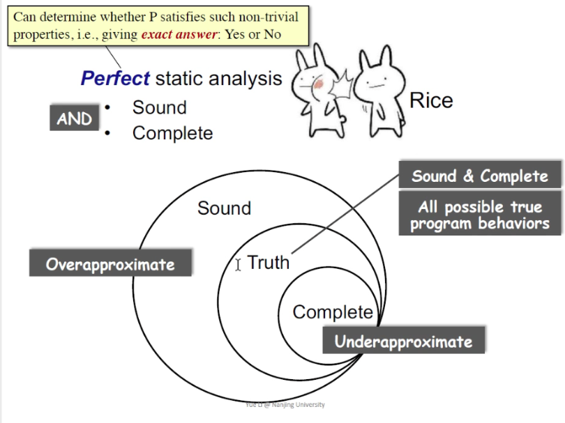
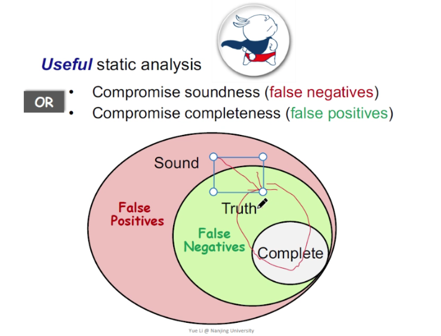
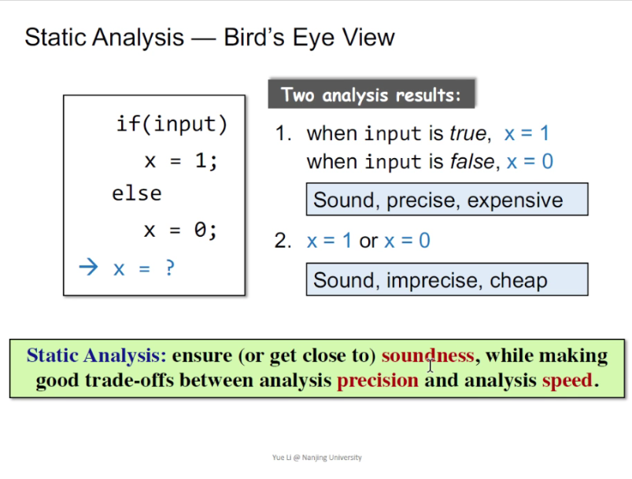
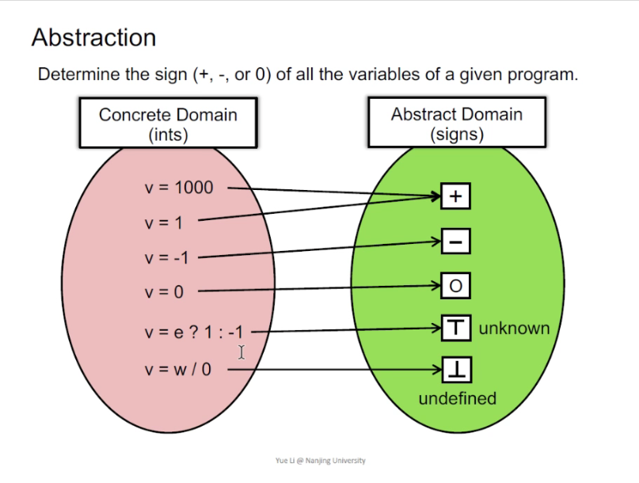

# 南大软件分析01

莱斯定律（大米定律）

> Any non-trivial property of the behavior of programs in a r.e. language is undecidable.
>
> r.e. (recursively enumerable) = recognizable by a Turing-machine
>
> non-trivial property 是比如空指针等有趣的东西
>
> 
>
> 不存在一个方法能够100%准确判断程序是否有哪些具体缺陷。

用下图理解就是，没有一个完美的静态分析方法可以将过拟合和欠拟合逼近于0。

过拟合和欠拟合：类似举例就是sound就是可以误报，但是不能漏报。complete是可以漏报，但是不能误报。

Useful static analysis即向其中一方妥协，最常用的就是允许误报。

都是sound，开支不一样，包含上下文信息时开支大，所以要平衡sound、精度、速度

抽象即映射

静态分析可以从两个方面把握：首先是对data做abstraction（如第一节课的“+−O⊤⊥+−O⊤⊥”），然后做over-approximation。

事实上，对于绝大多数静态分析场景来说，我们要做的都是over-approximation，也可以称为may analysis，即输出结果包含的信息可能为真。

然而，还有一些场景是需要under-approximation，也可以称为must analysis，即输出结果必须包含的信息必须为真。无论如何，over-approximation和under-approximation的目的都是在各自的场景中实现safety of analysis，使结果符合该场景的需求。
